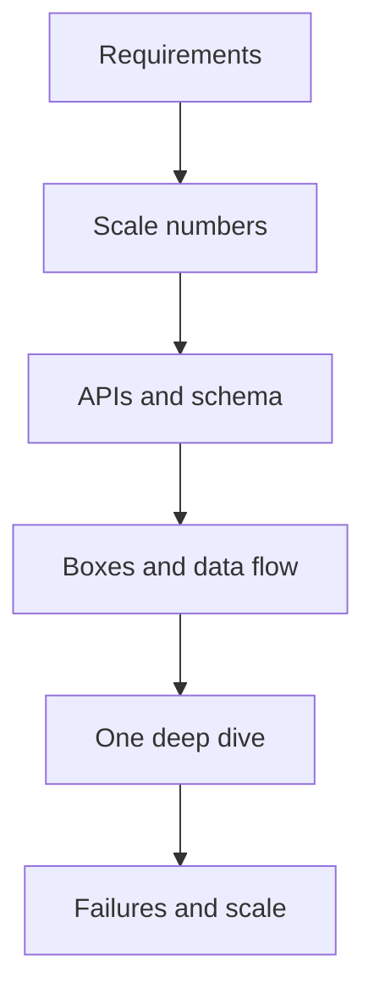

# How the Round Works

> [!abstract] An SDE-1 HLD round is a **conversation with a diagram**. Drive requirements, draw 6–8 boxes, pick a store/cache/queue with a reason, survive one deep dive. Perfection is not the bar. Coherence is.

## What SDE-1 vs SDE-2 actually means

| Level | They want |
|---|---|
| **SDE-1** | Requirements, a readable diagram, reasonable SQL/cache/queue, **one** deep dive, a failure mode. Wrong first guess is fine if you correct it. |
| **SDE-2** | You lead. Every box has a tradeoff. 2–3 deep dives (shard key, consistency, what dies). You name bottlenecks before they ask. |
| Senior | Multi-region, cost, migrations. Out of this crash course. |

> [!tip] The round is often 40–60 minutes, sometimes glued to DSA. If they say "how would you scale this" after a coding question, that **is** the HLD round. Same script, smaller surface.

## The script — use this every time

Call it whatever you want. The order is the thing.

1. **Requirements** (5–7 min) — functional 3–5 bullets, NFRs, explicitly out of scope.
2. **Scale** (2–4 min) — DAU → QPS (read and write **separately**) → storage. Rough is fine. Skip theatre if the system is tiny.
3. **API + schema** (5 min) — 4 endpoints, key tables/indexes. Do not polish JSON.
4. **Boxes** (10 min) — client → gateway/LB → services → cache/DB → queue/workers. Trace **one write** and **one read** out loud.
5. **Deep dive** (10–15 min) — the part the question is actually about. Invite them to pick if unclear.
6. **Break it** (5 min) — cache down, duplicate message, hot key, replica lag.

> [!warning] Do not open with "I'll use Kafka, Redis, and microservices." That is the #1 reject signal. Constraints first, tech second.

## Non-functional questions to ask every time

Write them on the board, don't just say them:

- Scale — users, QPS, data size, read:write
- Latency — p99 on the hot path
- Availability — 99.9% is ~8.7h down/year; 99.99% is ~52 min
- Consistency — strong / read-your-writes / eventual. **Per path**, not for "the system"
- Durability — can we lose a write?
- Security — auth, PII, rate limit as abuse control

Then **cut scope**: "Skipping admin, analytics dashboard, and payments unless you want them."

## How to draw

- 5–8 boxes. One sentence of responsibility each.
- Arrows labelled (HTTP / WS / enqueue).
- Do **not** draw a load balancer in front of every service. One at the edge, say the rest are horizontally scaled.
- Next to the DB, scribble the 4–6 columns that matter + which column is indexed / is the shard key.

## Decisions they want to hear

Say it as a pick, not a menu:

> "Postgres here because orders need a transaction. Redis cache-aside on the read path with a 5-minute TTL — stale is fine. Kafka after the write so notifications don't sit on the request."

Hedging ("we could use SQL or NoSQL") without a pick reads as not knowing.

## Red flags

- Jumping to tech before the product
- 20 boxes, no arrows
- Designing for 1B users when they said an internal tool
- Silent thinking for minutes
- Ignoring "what about failures?"
- Caching everything
- Sharding at 50 GB
- "Exactly-once" as a magic Kafka setting with no idempotent consumer

## Related Notes

- [[02 - Fundamentals]]
- [[12 - Mini Designs]]
- [[13 - Question Bank]]
