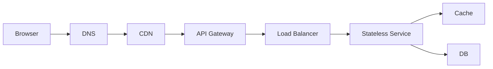

# Networking and APIs

> [!abstract] A request is DNS → TLS → HTTP → your gateway. Pick **REST by default**, gRPC inside the DC, and WebSockets only when both sides must talk continuously. Auth is JWT or session — pick one and know where it lives.

## What happens when you type a URL

1. **DNS** — name → IP. Cached at browser, OS, recursive resolver, then TLD / auth NS. TTL is why DNS changes take time. **Geo-DNS** can send `api.foo.com` to the nearest region.
2. **TCP** — 3-way handshake, reliable, ordered. Cost: extra RTT before HTTP (less painful with TLS 1.3 / HTTP/2 reuse).
3. **TLS** — HTTPS. Encrypts the pipe. Certificate proves you are talking to the right host.
4. **HTTP** — the actual request.

> [!tip] If they ask "walk a request from the browser," this sequence **is** the answer. Then LB, then service.

## TCP vs UDP

| | TCP | UDP |
|---|---|---|
| Guarantee | ordered, retransmit | best-effort |
| Use | APIs, DBs, HTTP | video/voice, DNS, games |
| Interview | default | "I'll use UDP for media, with an app-level retry if needed" |

## HTTP you must know

- Methods: GET (read, idempotent, cacheable), POST (create / non-idempotent unless you make it so), PUT (replace, idempotent), PATCH, DELETE.
- Status: 200, 201, 204, **301 vs 302** (permanent vs temporary redirect — URL shortener cares), 400, 401, 403, **404**, **409** conflict, **429** rate limited, 500, 503.
- **Idempotency** — same request twice = same effect. PUT/DELETE naturally; POST needs an **Idempotency-Key** (payments).
- HTTP/1.1: one request per connection (pipelining is a mess). HTTP/2: multiplex streams. HTTP/3: QUIC over UDP. You do not need to design HTTP/3. Know multiplexing exists.

**HTTPS** is HTTP over TLS. Say "all public traffic is TLS" and move on unless they push certificates.

## REST vs GraphQL vs gRPC

- **REST** — default for public APIs. Resources as URLs. Easy to cache, debug, put a CDN in front of.
- **GraphQL** — client asks for a shape. Good for many client types; easy to create a **nasty query** that joins the world. Don't lead with it.
- **gRPC** — protobuf + HTTP/2. Fast, typed, great **service-to-service**. Browsers don't speak it natively. Pattern: REST at the edge, gRPC inside.

> [!warning] Spending 12 minutes designing endpoints is an SDE-1 fail. Four endpoints, then architecture.

## Realtime: pick the dumbest thing that works

| Need | Pick |
|---|---|
| Client asks, server answers | HTTP |
| Client polls every few seconds (notifications badge) | **short polling** |
| Client waits, server answers when ready | **long polling** |
| Server pushes, client listens (scores, order status) | **SSE** |
| Both sides chat continuously | **WebSocket** |

SSE is still HTTP (works with ordinary LB, auto-reconnect). WebSockets are a persistent TCP connection: **sticky sessions** or a pub/sub (Redis) so any node can push, plus an L4 LB or a WS gateway.

> [!tip] "Realtime" in the prompt does **not** mean WebSockets. Order tracking can be SSE or even polling at 2s. Chat needs WS.

## Auth, in one page

- **Session cookie** — server stores session id (Redis). Easy to revoke. Needs sticky or shared store. CSRF is a thing for cookies.
- **JWT** — signed blob on the client. Stateless servers. **Hard to revoke** before expiry (need a denylist). Don't put secrets in the payload; it is only base64, not encrypted.
- **OAuth2 / SSO** — "login with Google." You are the client of an identity provider. Know authorization-code exists; don't derive the spec live.
- **API keys** — service-to-service or public API customers. Pair with [[08 - Reliability|rate limiting]].
- **mTLS** — both sides have certs. Internal mesh. Name-drop only.

Authorization ≠ authentication. AuthN = who you are. AuthZ = what you can do (RBAC).

## Pagination

- **Offset** (`LIMIT/OFFSET`) — simple, breaks when rows insert at the top (feed). Slow on large offsets.
- **Cursor** — "give me after `id=...`" / after a timestamp+id. Right default for feeds.

## A request through your system (the diagram they want)

CDN may sit only on static. Gateway does auth + rate limit. Details in [[04 - Load Balancing CDN and Gateway]].

## Related Notes

- [[04 - Load Balancing CDN and Gateway]]
- [[08 - Reliability]]
- [[11 - Services and Observability]]
