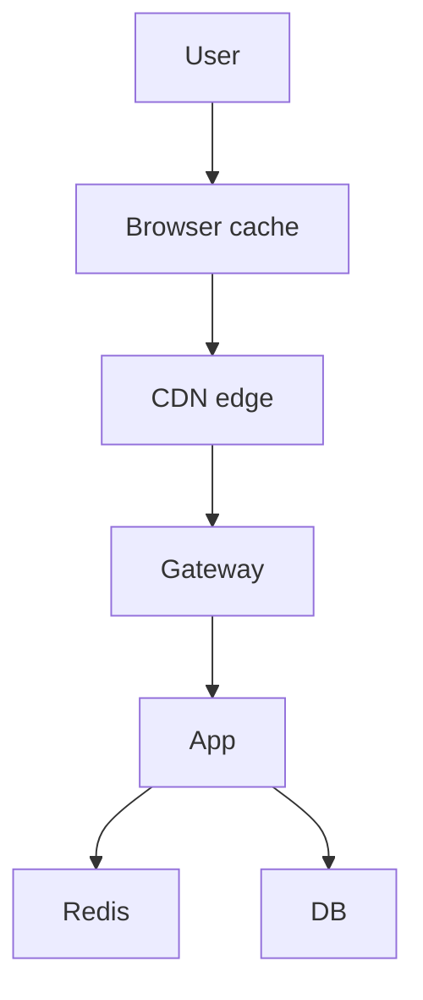

# Load Balancing, CDN, and Gateway

> [!abstract] Three boxes people mix up: a **load balancer** spreads work, a **reverse proxy / API gateway** is the front door (auth, routing, rate limit), a **CDN** is a cache close to the user. Draw one of each at most, then say the rest.

## Load balancer

You have many identical stateless servers. The LB picks one.

**L4 vs L7**

| | L4 (TCP) | L7 (HTTP) |
|---|---|---|
| Sees | IP:port | URL, headers, cookies, path |
| Speed | faster, dumber | can route `/api` vs `/static` |
| Use | WebSockets, non-HTTP, TLS passthrough | almost every HTTP API |

Rule of thumb: **HTTP APIs → L7. Persistent connections / WS → L4 or a dedicated WS gateway.**

**Algorithms** (know 4):

- **Round robin** — default. Bad if requests aren't equal.
- **Least connections** — better for mixed request cost.
- **Weighted** — bigger boxes get more.
- **Consistent hashing / sticky** — same client → same server (WS, in-memory sessions — try not to need this).

Health checks: if a box fails the probe, take it out. Without this the LB is a random outage machine.

**Active-passive vs active-active** — two LBs so the LB itself isn't an SPOF. Cloud ELB is this as a service; say "managed LB, multi-AZ" and move on.

## Reverse proxy vs LB vs API gateway

- **Reverse proxy** (nginx) — sits in front, terminates TLS, may cache, may be the LB.
- **Load balancer** — the spreading job. Often the same process.
- **API gateway** — reverse proxy **plus product features**: routing to microservices, auth, rate limit, request ID, maybe transform.

> [!tip] In an interview, one box at the edge labelled **API Gateway (auth, rate limit, routing)** is enough. Don't draw Kong *and* nginx *and* ELB unless asked.

Gateway is also where you put **TLS termination**, **WAF**, and **IP allowlists**.

## CDN

A CDN is a **globally distributed cache**. User in Pune hits a Mumbai edge, not your origin in `us-east`.

Use it for:

- Images, video segments, JS/CSS — always
- Public, cacheable API GETs with a TTL — sometimes
- HTML that changes every request — usually not

**Push vs pull:** pull (origin fetch on miss) is the default. Push is for "we know this video will explode, preload the edges."

**Cache-Control / TTL** — you own freshness. Purge on deploy if you must.

Netflix-style "we run our own CDN" is **not** an SDE-1 answer. "CloudFront / Cloudflare in front of S3" is.

## Where caching lives (so you don't put Redis in the CDN box)

Four layers. CDN ≠ Redis. Redis ≠ DB buffer pool.

## SSL at the edge

Terminate TLS at the LB/gateway so app servers see HTTP inside the VPC (or re-encrypt to the app — "TLS everywhere" if they care). You do not design certificate rotation in 45 minutes; mention HTTPS and go.

## Related Notes

- [[03 - Networking and APIs]]
- [[06 - Caching]]
- [[08 - Reliability]]
