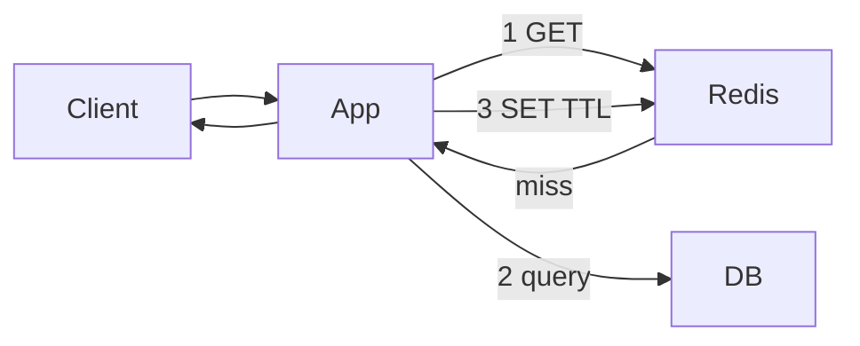

# Caching

> [!abstract] Cache is **not** "put Redis." It is: **what key, what TTL, who invalidates, what happens when Redis is on fire.** Default pattern: cache-aside. Default store: Redis. Default eviction: LRU + TTL.

## When to say the word

Read-heavy, same rows over and over, 20–50 ms DB vs ~1 ms Redis, DB CPU dying. **Do not cache data that changes every request.**

## Where

| Layer | What |
|---|---|
| Browser / client | Cache-Control. You don't own it fully. |
| CDN | Static + some public GET. [[04 - Load Balancing CDN and Gateway]] |
| Gateway | Rare. |
| **Redis (sidecar / cluster)** | Application data. This is the interview cache. |
| In-process (Caffeine) | Tiny, config, feature flags. Dies with the box. |

## Read/write patterns

**Cache-aside (lazy, default):**

1. Read cache. Hit → return.
2. Miss → DB → fill cache with TTL → return.
3. On write → **delete** the key (or update it). Deleting is safer than write-time update (less stale-shape bugs).

**Write-through:** write cache and DB together. Cache always warm, writes slower.

**Write-behind (write-back):** write cache, flush DB async. Fast writes, **you can lose data** if cache dies. Almost never the SDE-1 pick for source of truth.

**Refresh-ahead:** refresh before TTL dies for very hot keys.

## TTL vs explicit invalidation

- **TTL only** — simple, briefly stale. Fine for profiles, product pages.
- **Invalidate on write** — needed when stale is wrong (permissions, prices). Still keep a TTL as a safety net.
- **You cannot invalidate the CDN/browser as easily** as Redis. That's why private data doesn't live on the CDN.

Cache invalidation is the hard problem. Say so. Then pick TTL+delete-on-write.

## Eviction

When memory is full:

- **LRU** — default. Say this.
- **LFU** — hot forever stays; good for "always popular."
- **FIFO** — rarely better.
- **TTL expiry** is not eviction policy; both exist.

Redis: `maxmemory-policy allkeys-lru` is the line.

## Things that take you down

**Stampede / thundering herd:** hot key expires, 10k requests miss, all hit DB. Fixes: lock so one refreshes (Redis `SETNX`), slightly random TTLs, serve stale while one fills.

**Hot key:** one key is half the QPS (celebrity). Fixes: local in-process cache, replicate the key, split the key.

**Hot shard** on Redis cluster: same as DB hotspot.

**Redis down:** every request hits DB → cascading failure. Fixes: **circuit breaker** (fail small, maybe serve stale in-process), don't wait 5s per Redis timeout. Timeouts belong in [[08 - Reliability]].

**Cache stampede on deploy:** flush-all is a self-DDoS. Warm or TTL-out.

## Redis vs Memcached

| | Redis | Memcached |
|---|---|---|
| Structures | strings, hashes, lists, sets, **sorted sets**, bitmaps, streams | blob |
| Persistence | optional AOF/RDB | none |
| Use | cache **and** counters, leaderboards, locks, pub/sub | simple cache |

> [!tip] Interview Redis is not just GET/SET. Leaderboard = sorted set. Feed IDs = list or sorted set. Rate limit = INCR + TTL. Lock = SET NX EX.

## What to store (say the structure)

Don't say "I'll cache the events." Say "sorted set of event_id by popularity, payload in a hash, TTL 5 min."

## Related Notes

- [[04 - Load Balancing CDN and Gateway]]
- [[05 - Databases]]
- [[08 - Reliability]]
