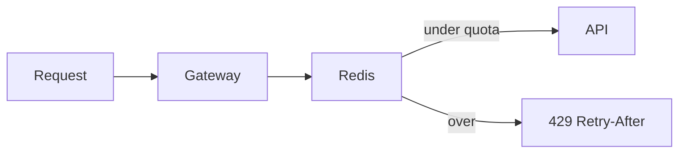

# Reliability

> [!abstract] Distributed systems fail **partially**. Timeouts, retries with jitter, idempotency, circuit breakers, and rate limits are how you fail small instead of hanging the whole site. Rate limiter is also a **standalone HLD question** — treat it as both a building block and a [[12 - Mini Designs|mini design]].

## Timeouts

Every outbound call (DB, Redis, HTTP, Kafka produce) has a timeout. Infinite wait is how one sick dependency takes you down.

Set them **shorter than the user SLA** and **shorter than the caller's timeout** (or you get retry amplification).

## Retries

Retry **transient** (timeout, 503, connection reset). Do **not** retry 400/401/404 or a POST that might have succeeded (unless idempotent).

**Exponential backoff + jitter.** Without jitter, all clients retry in lockstep → thundering herd.

Cap retries. Then fail.

## Circuit breaker

If `payment-svc` is erroring, **stop calling it** for a bit (open circuit), fail fast, maybe show "pay later." After a cooldown, a few **half-open** probes.

Without this, your thread pool dies waiting on a dead friend.

**Bulkhead** — separate thread pools / connections per dependency so one cannot eat all workers.

## Rate limiting (you will be asked to design this)

Protects: abuse, noisy neighbour, your own downstream.

**Where:** API gateway / edge. Optionally also per-service.

**Dimension:** per user, per IP, per API key, per endpoint. Often **all three** with different quotas.

**Algorithms:**

| Algorithm | Idea | Watch out |
|---|---|---|
| Fixed window | 100/min, counter resets on the clock | burst at window edge (2×) |
| Sliding window log | store every timestamp | memory |
| Sliding window counter | weighted previous+current window | good compromise |
| **Token bucket** | tokens refill at rate R, burst up to B | **the default answer** |
| Leaky bucket | constant egress | smooths, may delay |

**Distributed:** many gateway nodes. Local memory is wrong (limit is N×nodes). **Redis INCR + TTL**, ideally a **Lua script** so incr+expire is atomic. Token bucket: store tokens + last refill time in Redis.

Response: **429** + `Retry-After`.

Soft vs hard: warn / degrade vs drop.

Deep dive lives in [[12 - Mini Designs]].

## Load shedding / backpressure

When you are already dying, refuse work (503) rather than queue it into a latency death spiral. Pair with [[07 - Async Messaging|queue backpressure]].

## Health, deploy, graceful shutdown

- Liveness vs readiness probes so the LB stops sending before you SIGTERM.
- Drain connections on deploy.
- You don't need Kubernetes internals. "Rolling deploy, readiness, drain" is the SDE-1 sentence.

## Distributed lock (pointer)

The recipe (`SET NX EX` + token, fencing, lease vs lock, `SKIP LOCKED`) lives in [[14 - Coordination and Concurrency]]. Here you only need: **don't hold a Redis lock while a human pays** — use a row with `hold_until`.

## Idempotency (again, because they will ask)

User double-clicks Pay. Gateway retries. Worker redelivers.

**Idempotency-Key** on mutating APIs. Store key → response. Same key returns the same result, does not charge twice.

## Graceful degradation

Search down → keyword-less browse. Recs down → popular list. Redis down → serve from DB **with a circuit** so DB doesn't die too. Name what you **drop** when on fire.

## Related Notes

- [[06 - Caching]]
- [[07 - Async Messaging]]
- [[12 - Mini Designs]]
