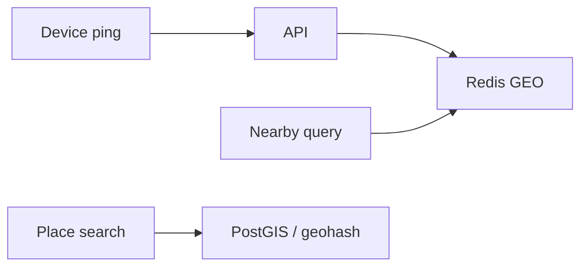

# Storage, Search, and Geo

> [!abstract] Files do not go in Postgres. Search is not `LIKE '%foo%'`. Nearby is not `SELECT * WHERE distance < 5` on every row. Three specialised stores: **object storage**, **inverted index**, **geo index**. Metadata stays in your OLTP DB.

## Object / blob storage (S3)

Videos, images, PDFs, dumps. Cheap, durable, "infinite." Your DB stores the **URL / key**, not the bytes.

**Never** stream a 200 MB file through the app server.

**Upload (presigned URL) — say this sequence:**

1. Client asks API for permission (auth, quota, mime).
2. API inserts `files(id, key, status=pending)` and returns a **presigned PUT URL**.
3. Client uploads **directly to S3**.
4. S3 event (or client callback) → API marks `status=ready`. Optional virus scan worker.

**Download:** presigned GET, or public object behind a [[04 - Load Balancing CDN and Gateway|CDN]].

**Multipart / chunking** — big files, retry per part, parallel parts.

**Dedup** — hash content, same blob one key (Dropbox-lite).

Durability: they replicate/erasure-code. In an interview, S3 is infinitely scalable. Don't shard S3.

## Search

`WHERE title LIKE '%pizza%'` scans the table and cannot rank.

**Inverted index:** word → list of doc ids. Tokenise, stem (`running` → `run`), skip stopwords.

**Elasticsearch / OpenSearch** is the box. Postgres `tsvector` / GIN is fine for *small* search; say when you outgrow it.

**Sync:** write to Postgres, **async** index via Kafka/CDC. Search is **eventually consistent**. That's OK. Don't dual-write in two sync calls.

**Ranking:** BM25 / popularity / recency. Don't invent ML unless they ask.

**Autocomplete:** different problem — prefix trie or ES completion suggester, plus a **top-K per prefix** computed offline. See [[12 - Mini Designs]].

## Geo / "nearby"

"Restaurants within 3 km" / "drivers near me."

Naive: haversine on every row. Dies immediately.

**Geohash:** encode lat/lon as a string prefix. Nearby points share a prefix. Query this cell + **neighbours** (edge of cell is the gotcha). Redis `GEO*` is geohash under the hood.

**Quadtree / R-tree / PostGIS:** Postgres can do this with a GiST index. Fine until write QPS is huge.

**H3** (hex cells): nicer neighbours than geohash corners. Name-drop if they live in mobility; not required.

**Hot path pattern:**

- Partners ping location every few seconds → **Redis GEO** (ephemeral).
- Places (restaurants) → PostGIS or geohash column + index (stable).

## Time-series / metrics store (light)

Metrics: not Postgres. Prometheus / dedicated TSDB / ClickHouse. Know "we don't OLTP our metrics." Logging: ELK / Loki. Traces: Jaeger. That's [[11 - Services and Observability]].

## Related Notes

- [[05 - Databases]]
- [[04 - Load Balancing CDN and Gateway]]
- [[12 - Mini Designs]]
