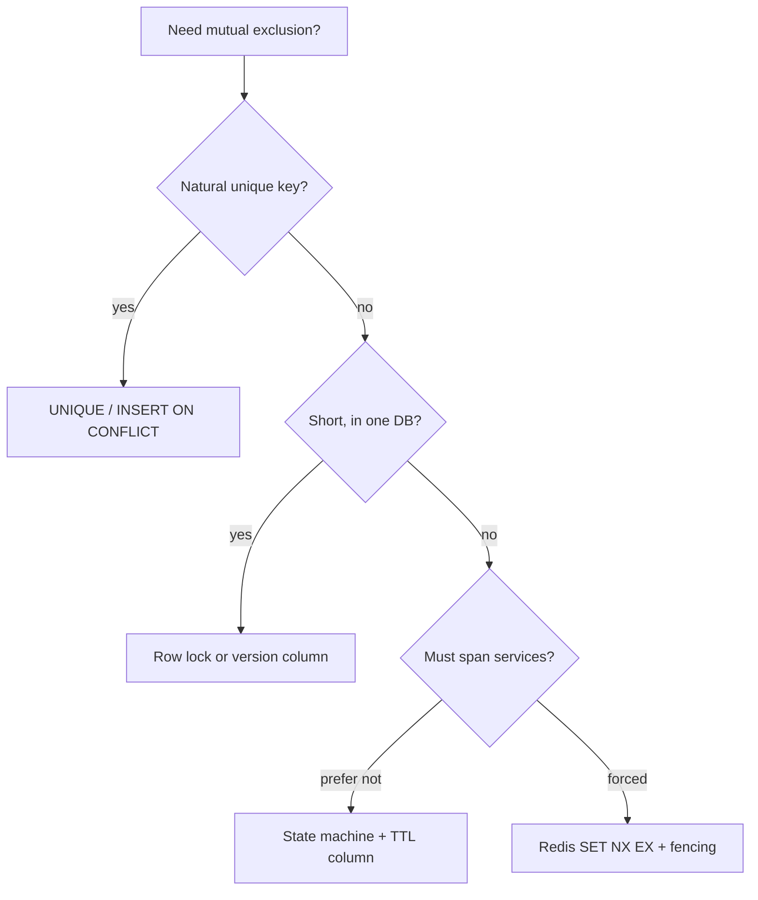

# Coordination and Concurrency

> [!abstract] "Don't let two people take the same seat / run the same job / increment the same stock." That is this page. A **distributed lock is the last tool**, not the first. Prefer a DB constraint or a row state. The crash course originally hid this in six lines in [[08 - Reliability]] — that was compression, not "locks don't matter."

This is the family you meant: locking, leasing, "only one winner," DB concurrency. **Not** geo-radius ([[09 - Storage Search and Geo]]). Nearby users is a query. Mutual exclusion is this note.

## The decision tree (say this in the interview)



1. **Unique constraint** — two inserts of the same `seat_id` on a booking table, one fails. This *is* a lock. Use it.
2. **Optimistic version** — `UPDATE … WHERE id=? AND version=3`. Lost update dies. Default for stock/profile.
3. **Pessimistic row lock** — `SELECT FOR UPDATE` in a transaction. Hold it **milliseconds**, not while the user stares at a payment page.
4. **DB state + TTL** — `status='held', hold_until=now()+10m`. A sweeper releases. Booking, ride offer, OTP.
5. **Redis lock** — only if the critical section is not in one database (cron across boxes, stampede, "exactly one worker").

> [!warning] "I'll take a Redis lock for 10 minutes while they pay" is how you strand inventory when the process dies and you forget expiry — or how you **double-sell** when expiry fires and the old holder still writes. See fencing below.

## Database concurrency (the SDE-1 slice)

Already sketched in [[05 - Databases]]. The missing pieces that actually get follow-ups:

**Lost update** — two tabs read qty=5, both write 4. Fix: `qty = qty - 1 WHERE qty > 0`, or `version` CAS, or `FOR UPDATE`.

**`SELECT FOR UPDATE`** — pessimistic. Nobody else can take that row until you COMMIT. **Deadlock** if txn A locks seat 1 then 2, txn B 2 then 1. Fix: lock in a **sorted id order**. Keep the txn tiny.

**`SKIP LOCKED`** — the job-queue trick. Workers `SELECT … FOR UPDATE SKIP LOCKED LIMIT 1`. Locked rows are skipped, not waited on. This is how you run many pollers on one `jobs` table without Redis. Name it if they ask "how do workers not steal the same job."

**Write skew** (one example, then stop): snapshot isolation lets two doctors both see "on call count = 1" and both go off duty. Each update is valid; the invariant "≥1 on call" dies. **Serializable** or an explicit constraint/lock on the invariant. You will not be examined on SSI internals.

**Advisory locks** (Postgres `pg_advisory_lock`) — app-level locks inside the DB. Rare in HLD. Prefer a row you can see.

**Hot row** — everyone updates the same counter. The lock *is* the bottleneck. Fix: shard the counter, or Redis INCR, or append events and sum.

MVCC, WAL, vacuum, SSI proofs: **out**. "Postgres uses MVCC so readers don't block writers" is the one sentence if they poke.

## Optimistic vs pessimistic (one table)

| | Optimistic (version / CAS) | Pessimistic (`FOR UPDATE`) |
|---|---|---|
| Conflict | rare | likely (same seat) |
| Hold time | none until write | duration of txn |
| Failure | retry the txn | wait / deadlock |
| Interview default | profile, likes | booking the last seat |

CAS is the same idea in Redis: `WATCH` / Lua "read tokens, write if still N."

## Distributed lock — the actual recipe

```
SET lock:job:nightly <token> NX EX 30
# do work
# release only if value still == token  (Lua: if get==token then del)
```

- **NX** — only one winner.
- **EX** — if you die, the lock dies. No expiry = forever.
- **Token** — random UUID. Never `DEL lock` blindly or you delete the *next* holder's lock.

**Where it belongs:** leader for a cron, cache stampede (one refill), "only one indexer on this shard."

**Where it does not:** checkout. Use the seat row.

### Failure modes they will poke

| Failure | What you say |
|---|---|
| Process dies | TTL saves you. Sweeper / `hold_until` if it's inventory. |
| Work longer than TTL | Lock expires, **two holders**. Renew (heartbeat) *or* shorter work *or* fencing. |
| Clock skew | Redis TTL is on the **server**. Don't use app clocks for expiry. |
| Two Redis nodes (split) | Two lock services → two winners. Don't run "two independent Redis" as the lock. |
| Deadlock | Lock keys in sorted order. Same as DB. |

**Fencing token** (the one extra idea worth adding): every time you acquire, you get a **monotonic number** (ZK zxid, `INCR fence`). Storage **rejects writes with an older fence**. So even if a dead holder's lock expires and it still thinks it is leader, its writes bounce. Redis `SET NX EX` **alone has no fencing**. That is why people say Redlock is slippery and ZooKeeper/etcd locks are "real" for correctness.

> [!tip] SDE-1 line: "Redis lock with TTL for the cron. For money, I would not trust it — I'd put a version/fence on the row so a late holder cannot commit."

**Redlock:** name-drop as "multi-Redis majority lock, controversial, I won't use it for payments." Do not implement it.

**ZooKeeper / etcd / Consul:** ephemeral node + watch = lock + liveness. "Someone else's Raft." Use when the lock *is* the product (leader election for a primary), not for a seat.

## Lease ≠ lock

A **lease** is a lock that is *expected* to be renewed. "You may be the leader for 10s; heartbeat or lose it." Kubernetes, Kafka partition leader, "this worker owns shard 7."

Same TTL idea. The extra word is **renew**. If you cannot renew, you **stop writing**.

## Semaphore (limit N, not 1)

Lock = 1. Semaphore = "at most 20 thumbnail workers." Redis: increment a counter with cap, or a list of tokens. Gateway concurrency limit is this, not a rate limit (rate is per time; concurrency is in-flight).

## Single-flight / request coalescing

100 requests miss the same cache key → **one** goes to DB, others wait. Stampede fix in [[06 - Caching]]. Same family as a lock, lifetime of one fetch.

## Leader election (cron / scheduler)

"Nightly bill-run must run once." Options, cheapest first:

1. Cloud scheduler hits **one** HTTP endpoint (they elect for you).
2. `jobs` table + `SKIP LOCKED`.
3. Redis lock around the job.
4. ZooKeeper/etcd if you already have a cluster.

Not Raft-on-the-whiteboard.

## Inbox (pair with outbox)

[[07 - Async Messaging]] has **outbox** (DB commit + publish). The twin:

**Inbox:** consumer writes `event_id` to an `inbox` table in the **same txn** as the side effect. Duplicate Kafka delivery → unique violation → skip. That is idempotency you can point at.

## What this page is not

Geo radius, user search radius, geohash neighbours — [[09 - Storage Search and Geo]].

Consensus internals, Redlock paper, TrueTime, CRDTs, write-skew catalogue, 2PL proofs — [[15 - Out of Scope]].

## Related Notes

- [[05 - Databases]]
- [[06 - Caching]]
- [[07 - Async Messaging]]
- [[08 - Reliability]]
- [[10 - Distributed Building Blocks]]
- [[12 - Mini Designs]] — booking, ride offer TTL
