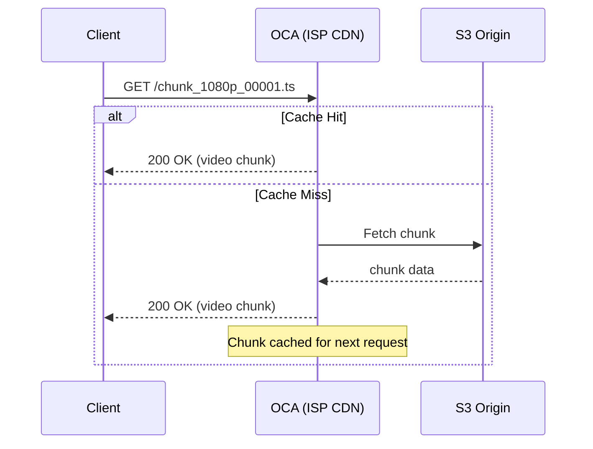
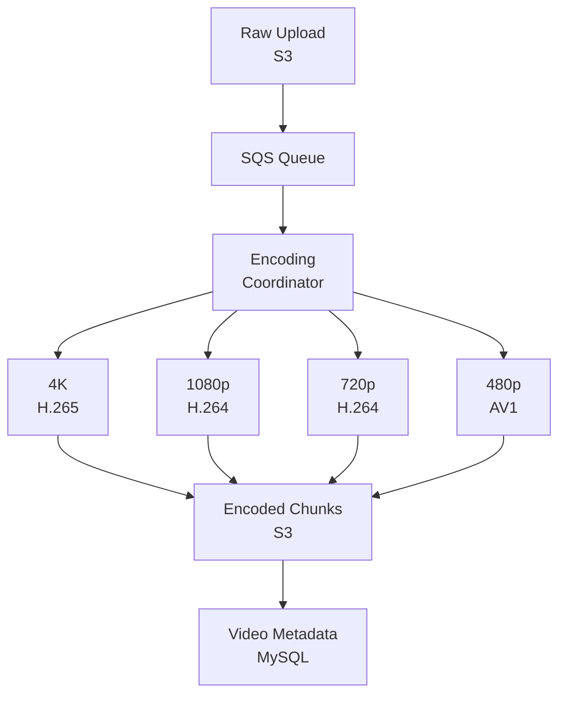
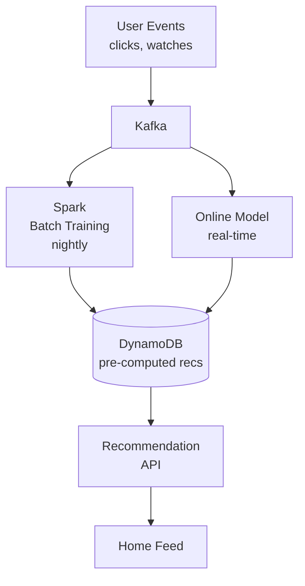

	# Netflix — High Level Design

> [!abstract] What we're designing
> A globally distributed video streaming platform serving **200M+ users** across 190 countries with personalised recommendations, near-zero buffering, and high availability.

---

## Core Requirements

### Functional
- Upload, encode, and store videos
- Stream video to any device with adaptive quality
- Personalised home feed and recommendations
- Search across the content catalogue
- User profiles, watch history, continue watching

### Non-Functional
- ==99.99% availability== — downtime costs millions
- Low latency video start (<2s globally)
- Horizontal scalability — traffic spikes on new releases
- Eventual consistency is acceptable for recommendations; **strong consistency required for billing**

---

## Scale Estimates

| Metric | Number |
|---|---|
| Daily Active Users | ~100M |
| Concurrent streams (peak) | ~15M |
| Avg video size (raw) | ~50 GB |
| Avg encoded size (all resolutions) | ~10 GB |
| Videos in catalogue | ~15,000 titles |
| Total storage | ~150 PB |
| Reads : Writes ratio | ~10,000 : 1 |

> [!tip] Key insight
> Netflix is **extremely read-heavy**. The entire architecture prioritises fast, cheap reads.
> Writes (uploads) are rare and can tolerate high latency.

---

## High Level Architecture

```mermaid
graph LR
    Client["📱 Client\n(Web / Mobile / TV)"]
    CDN["🌐 CDN\nOpen Connect"]
    AG["API Gateway\nLB + Auth"]
    STORE[("Encoded Chunks\nS3")]

    subgraph Microservices
        US["User"]
        VS["Video"]
        RS["Recommendation"]
        SS["Search"]
        BS["Billing"]
    end

    subgraph Databases
        UDB[("Cassandra")]
        VDB[("MySQL")]
        RDB[("DynamoDB")]
        Cache[("Redis")]
    end

    Client -->|stream| CDN
    CDN -->|cache miss| STORE
    Client -->|API| AG
    AG --> US & VS & RS & SS & BS
    US --> UDB & Cache
    VS --> VDB & Cache
    RS --> RDB
```

---

## Component Deep Dives

### 1. CDN — Open Connect

> [!info] Netflix built its own CDN
> Instead of paying Akamai/Cloudflare for exabytes of traffic, Netflix built **Open Connect** —
> physical appliances installed *inside* ISP data centres, holding popular content locally.

- **OCA (Open Connect Appliance)** — custom server with large HDD arrays, sitting in the ISP's rack
- Content is **proactively pushed** to OCAs overnight (off-peak) based on regional popularity predictions
- Client picks the closest OCA via **BGP Anycast**
- Cache miss on OCA → fetch from AWS S3 origin

---

### 2. Video Encoding Pipeline

> [!warning] Raw video is never served directly
> A single 2-hour movie at 4K raw is ~300 GB. Netflix serves it as adaptive bitrate chunks.

**Flow:**

1. Creator uploads raw file → lands in **S3 raw bucket**
2. Upload triggers an **SQS event** → consumed by encoding coordinator
3. **Encoding Farm** (thousands of EC2 workers) splits video into scenes and encodes in parallel
4. Each title is encoded into ==~1,200 files== — every combination of resolution × codec × bitrate × audio track × subtitle
5. Chunks (typically 4s segments) stored in **S3 encoded bucket**
6. Metadata (chunk URLs, duration, available qualities) written to **Video Metadata DB**

---

### 3. Adaptive Bitrate Streaming (ABR)

The client does not download the whole video. It uses **DASH** or **HLS**:

1. Client fetches a **manifest file** (`.m3u8` / `.mpd`) listing all available quality levels
2. Every 4 seconds, the client measures available bandwidth
3. Picks the highest quality chunk that can be downloaded in time
4. If bandwidth drops → seamlessly switch to lower quality mid-stream

> [!example] Quality ladder (simplified)
> | Resolution | Bitrate | Use case |
> |---|---|---|
> | 4K HDR | 16 Mbps | 4K TV, fast connection |
> | 1080p | 5 Mbps | Laptop, good WiFi |
> | 720p | 2.5 Mbps | Mobile, medium connection |
> | 480p | 1 Mbps | Mobile, weak signal |
> | 240p | 0.3 Mbps | Very poor connection |

---

### 4. Recommendation Service

> [!note] Recommendations drive ~80% of content watched on Netflix

**Signals used:**
- Watch history and completion rate
- Time of day, device type
- Ratings (explicit thumbs) and implicit (rewatch, pause/seek patterns)
- What similar users watched ([[Collaborative Filtering]])

**Architecture:**
- Batch layer: nightly model training on **Apache Spark** (processes billions of events)
- Serving layer: pre-computed recommendation vectors stored in **DynamoDB**
- Real-time layer: **Kafka** streams click events → lightweight online model adjusts ranking

---

### 5. Database Choices

| Service | Database | Why |
|---|---|---|
| User profiles | **Cassandra** | High write throughput, global replication, eventual consistency fine |
| Video metadata | **MySQL** | Structured, relational, strong consistency needed for catalogue |
| Recommendations | **DynamoDB** | Key-value lookup by user ID, massive scale, low latency |
| Sessions / cache | **Redis** | Sub-millisecond reads, TTL-based expiry |
| Billing | **MySQL (RDS)** | ACID transactions, strong consistency mandatory |
| Analytics / events | **Apache Kafka + S3** | Append-only event log, batch processed by Spark |

---

### 6. API Gateway

Single entry point for all client traffic. Responsibilities:

- **Authentication** — validate JWT, check session
- **Rate limiting** — per-user and per-IP
- **Routing** — forward to correct microservice
- **SSL termination**
- **Response caching** — popular responses cached at the edge

---

## Failure Modes & Mitigations

> [!danger] What breaks and how we handle it

| Failure | Mitigation |
|---|---|
| OCA goes down | Client retries next closest OCA via Anycast |
| Recommendation DB slow | Serve stale cache; degrade gracefully to genre-based fallback |
| Encoding worker crash | SQS message becomes visible again → another worker picks it up |
| Region-wide AWS outage | Multi-region active-active deployment; traffic fails over via Route 53 |
| Hot user (celebrity logs in) | Redis cache absorbs read spike; Cassandra fan-out limited by read replicas |

---

## Key Design Decisions

- **Eventual consistency** accepted everywhere except billing — simplifies scaling massively
- **Pre-computation** over real-time for recommendations — cheaper and faster at scale
- **Own CDN** (Open Connect) — $1B+ saved vs paying third-party CDN per-GB rates
- **Microservices** — independent scaling; recommendation service scales differently from billing
- **Chaos Engineering** (Netflix Chaos Monkey) — deliberately kills random services in production to prove resilience

---

## Related Notes

- [[Collaborative Filtering]]
- [[CAP Theorem]]
- [[Consistent Hashing]]
- [[CDN Design]]
