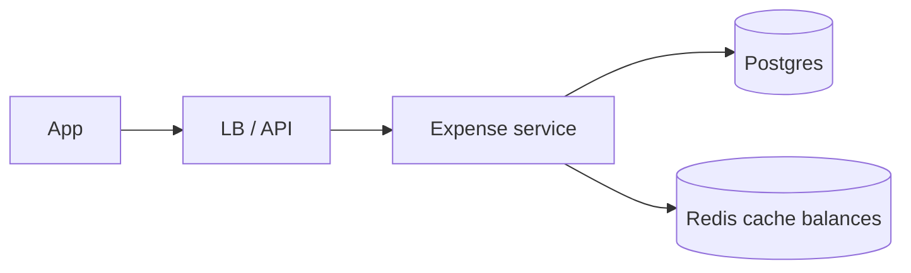
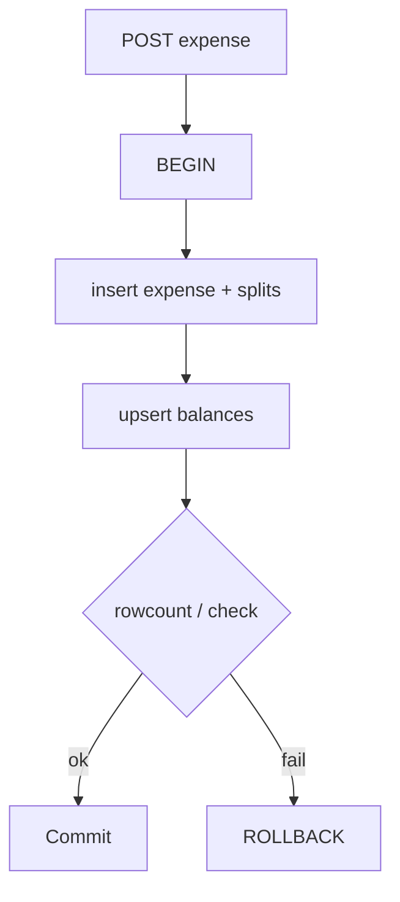

# Splitwise

> [!abstract] Interview walk. Deep dive is the **money graph**: expenses, splits, balances, settle — one transaction so rupees don’t vanish. Not Kafka. Script: [[01 - How the Round Works]].

## 1. Requirements

**Clarify first:** groups or also friend-to-friend? Simplify debts? Multi-currency? I’ll do **groups + equal/exact/percent split + settle**. Simplify is a follow-up.

### Functional

- User in many groups. Add expense: who paid, how it splits.
- See **net balance** per group (I owe / they owe me).
- **Settle** (A pays B in real life → record it).
- Expense history in a group.

### Non-functional

- Balances **strongly consistent** after add/settle. Stale feed of “activity” is fine.
- p99 add-expense < 200 ms. 99.9% on writes.
- Auth on every write. Amounts in **paise `BIGINT`**. No floats.

### Out of scope

- Bank rails / UPI capture (that’s [[07 - Wallet and Ledger]]).
- Receipt OCR, “simplify across all groups,” FX.

## 2. Estimations

Assume (say it): **1M DAU**, 2 expenses/user/day → 2M writes/day ≈ **20 QPS** avg, **~60 peak**. Reads 10× → **~600 QPS** peak.

Storage: expense ~200 B + 4 splits → ~1 KB. 2M/day × 365 × 2 yr ≈ **1.5 TB** with indexes. **One Postgres primary + read replicas.** Do not shard.

## 3. APIs

| Method | Path | Body / notes |
|---|---|---|
| `POST` | `/groups` | `{name}` |
| `POST` | `/groups/{id}/members` | `{user_id}` |
| `POST` | `/groups/{id}/expenses` | `{paid_by, amount_paise, splits[]}` + `Idempotency-Key` |
| `GET` | `/groups/{id}/balances` | nets for me vs each member |
| `POST` | `/groups/{id}/settle` | `{from, to, amount_paise}` |
| `GET` | `/groups/{id}/expenses?cursor=` | history |

`splits[]` = `{user_id, share_paise}` **or** type `equal|exact|percent` and server computes shares. **Sum(shares) must equal amount.**

## 4. Schema

```
users(id, name, email UNIQUE)
groups(id, name, created_by)
group_members(group_id, user_id, PK)
expenses(id, group_id, paid_by, amount_paise, note, created_at)
expense_splits(expense_id, user_id, share_paise, PK)
balances(group_id, user_lo, user_hi, amount_paise)
  -- amount > 0 means user_lo owes user_hi that much (canonical pair)
settlements(id, group_id, from_id, to_id, amount_paise, created_at)
```

Indexes: `expenses(group_id, created_at DESC)`, `balances(group_id)`.

**Why `user_lo < user_hi`:** one row per pair, signed amount. Update is one row, not two.

**Invariant:** for an expense, `SUM(splits.share) = expenses.amount`. CHECK or verify in the txn.

**Balance vs recompute:** denormalised `balances` updated **in the same txn** as the expense. Nightly: recompute from splits+settlements and diff.

## 5. High-level design



One service. Redis **cache-aside** on `GET balances`, **delete** on write. Postgres is SoR.

No queue on the add-expense path. Activity email = outbox **after** commit.

## 6. Core write (the transaction)

Add expense, A paid 1000, equal split A+B (500 each) → B owes A 500.

1. Auth; A,B in group.
2. Compute shares; reject if sum ≠ amount.
3. **One txn:**
   - insert `expenses` + `expense_splits`
   - for each split where `user ≠ paid_by`: `balances` upsert — debtor owes payer `share`
4. Commit. Invalidate Redis `bal:{group}`.

Settle B→A 500: insert `settlements`, decrement that pair’s `amount` (same txn). Don’t delete expense history.



## 7. Deep dive — balances and simplify

**Default:** pairwise nets. Good enough.

**Simplify (if they ask):** min-cash-flow on the group graph — NP-hard exact; greedy: max debtor pays max creditor. **Don’t replace history.** Store optional `simplified_edges` as a view. Source of truth stays expenses+settlements.

**Why not only expenses, no balances?** Every GET sums the world. Fine at 5 people; ugly at 50 people × 10k expenses. Denormalise the **net**.

**Friend-level (no group):** a dummy group or `balances` without `group_id`. Same txn.

## 8. Break it

| Failure | What you say |
|---|---|
| Double-tap add | Unique `Idempotency-Key` on expenses. |
| Split sum ≠ amount | 400, no write. |
| Two expenses same pair | One balance row; `UPDATE amount = amount + d` in txn. Lost update → `version` or single-row update. |
| Cache stale | Delete on write. Worst case: extra GET hits PG. |
| Simplify vs settle | Settle writes a **real** payment. Simplify is cosmetic. |

## One-minute close

Users, groups, expenses, splits. I upsert a **canonical pair balance** in the same transaction as the expense. Reads can cache. I will not put money in Redis as SoR. Settle is another row that reduces the pair.

## Related Notes

- [[HLD/Problems/README]]
- [[07 - Wallet and Ledger]] — cash movement; this is IOUs
- [[05 - Databases]]
- [[01 - How the Round Works]]
