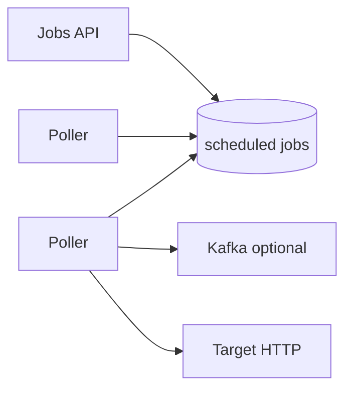
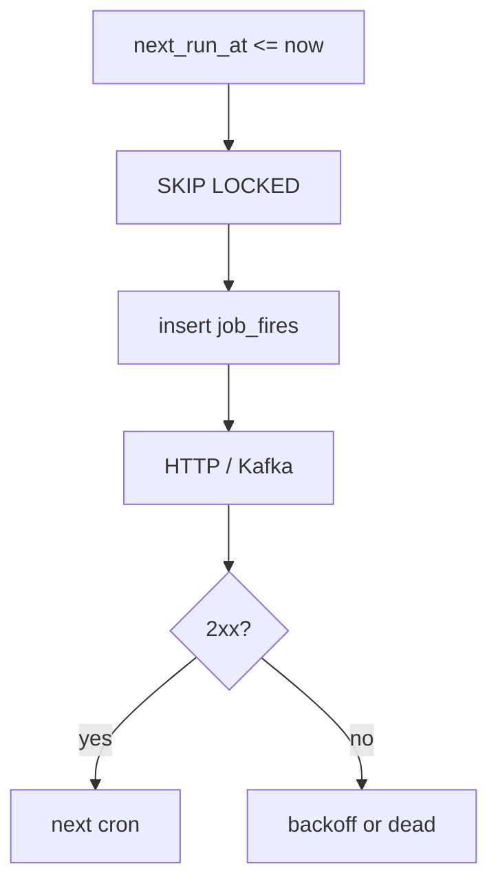

# Task Scheduler

> [!abstract] Interview walk. Cron / delayed jobs: **store the next fire, poll with `SKIP LOCKED`, dispatch once, retry with backoff.** Not “I’ll use Celery” as the design. Script: [[01 - How the Round Works]]. Locks: [[14 - Coordination and Concurrency]].

## 1. Requirements

**Clarify:** one-shot delay vs cron? HTTP callback vs queue? At-least-once is the default.

### Functional

- Create a job: cron (`0 9 * * *`) **or** `run_at`.
- Payload: URL + body **or** topic key (we pick **HTTP callback** + optional Kafka).
- Cancel. List by owner.
- On fire: invoke, record success/fail, cron computes **next**.
- Retries with backoff; then dead-letter.

### Non-functional

- Fire within **~1s** of schedule (not 1 ms). 99.9% eventually delivered.
- **At-least-once.** Idempotent consumers / `Idempotency-Key` on the target.
- Multi-instance pollers, **no double-dispatch** of the same fire.

### Out of scope

- Distributed cron across 20 regions, exactly-once end-to-end, user-facing workflow UI ([[05 - Jira]]).

## 2. Estimations

Assume **1M jobs**, 10% due in any minute → **~1.6k due/s** peak if clumped; spread cron → **hundreds/s**.

Row ~200 B → 1M jobs tiny. **Postgres + N pollers.** Redis ZSET is the alternative if they want sub-100ms and huge fanout — say both, pick PG for this round (same as Delhivery scheduler).

## 3. APIs

| Method | Path | Notes |
|---|---|---|
| `POST` | `/jobs` | `{cron \| run_at, url, payload, max_attempts}` |
| `GET` | `/jobs/{id}` | status, next_run_at, last_error |
| `DELETE` | `/jobs/{id}` | cancel |
| `GET` | `/jobs?owner=` | list |

Internal: poller is not a public API. Dispatch = HTTP POST to `url` with `{job_id, fire_id, payload}`.

## 4. Schema

```
jobs(
  id, owner_id, cron, timezone,
  next_run_at,   -- indexed, the poll cursor
  status,        -- active | paused | cancelled
  url, payload_json,
  max_attempts, attempt, backoff_sec,
  updated_at
)
job_fires(
  id, job_id, scheduled_for, started_at, finished_at,
  status,        -- pending | running | succeeded | failed | dead
  http_status, error
)
```

Index: `jobs(status, next_run_at)` **partial** `WHERE status='active'`.

`job_fires.id` is the **idempotency key** the target sees.

## 5. High-level design



- **API** — CRUD, computes first `next_run_at`.
- **Pollers** — every 200–500 ms: claim due rows, dispatch, write result.
- **Kafka** — if the target is *our* workers (`dd-scheduled-events-dispatch` style). HTTP if the client owns the endpoint.

Two pollers, one row: **`FOR UPDATE SKIP LOCKED`**. [[14 - Coordination and Concurrency]].

## 6. Core flow

**Create:** parse cron → `next_run_at`, insert `active`.

**Claim (one txn):**

```sql
SELECT id FROM jobs
WHERE status = 'active' AND next_run_at <= now()
ORDER BY next_run_at
LIMIT 50
FOR UPDATE SKIP LOCKED;
-- insert job_fires pending, set next_run_at = next cron OR + backoff
COMMIT;
```

Then **outside** the lock: HTTP/Kafka. Don’t hold the row during a 30s HTTP.

**After dispatch:** fire `succeeded` / `failed`. Cron: `next_run_at = next(cron)`. Fail: `next_run_at = now() + backoff`, `attempt++`, dead if `attempt >= max`.

Stale `running` (poller died): sweeper if `started_at` older than `timeout` → retry.



## 7. Deep dive — why not the other boxes

| Option | When | Why not default |
|---|---|---|
| Sleep in app | Never | Dies with the pod. |
| Redis ZSET + worker | Huge QPS, ms precision | Another SoR; crash/rebuild story. Fine if they push. |
| Delay Kafka / SQS delay | One-shot only | Cron is awkward; 15 min SQS cap folklore. |
| APScheduler in-process | Dev | Not multi-instance safe. |
| **PG + SKIP LOCKED** | This interview | ACID, crash-safe, several pollers, you already operate SQL. |

**Exactly-once fire?** No. At-least-once + `fire_id` unique on the consumer. Target must tolerate two POSTs.

**Clock:** poller uses **DB `now()`**, not three JVM clocks. Cron TZ stored on the job.

**Thundering herd** (midnight all crons): `ORDER BY next_run_at`, limit batch, jitter next_run by 0–5s on create if they care.

## 8. Break it

| Failure | What you say |
|---|---|
| Two pollers | `SKIP LOCKED` — second skips the row. |
| Poller dies after claim | Sweeper re-queues `running` past timeout. May double-call target. |
| Target 500 | Backoff. Don’t spin. |
| Target 200, we crash before update | Retry → duplicate. `fire_id`. |
| Cancel vs in-flight | `cancelled`; in-flight may still hit. Accept or check status before HTTP. |
| Catch-up after 2h downtime | Cap: fire once, set next from **now**, or catch-up N missed — **ask them**. Default: skip missed, fire next. |

## One-minute close

Jobs live in Postgres with `next_run_at`. Several pollers claim due rows with `SKIP LOCKED`, dispatch HTTP or Kafka, then write the fire and the next time. At-least-once. I don’t sleep in the request and I don’t hold a row lock across the HTTP call.

## Related Notes

- [[HLD/Problems/README]]
- [[14 - Coordination and Concurrency]]
- [[07 - Async Messaging]]
- [[Resume/Delhivery/05 - Pause Resume]] — same poller idea, different product
