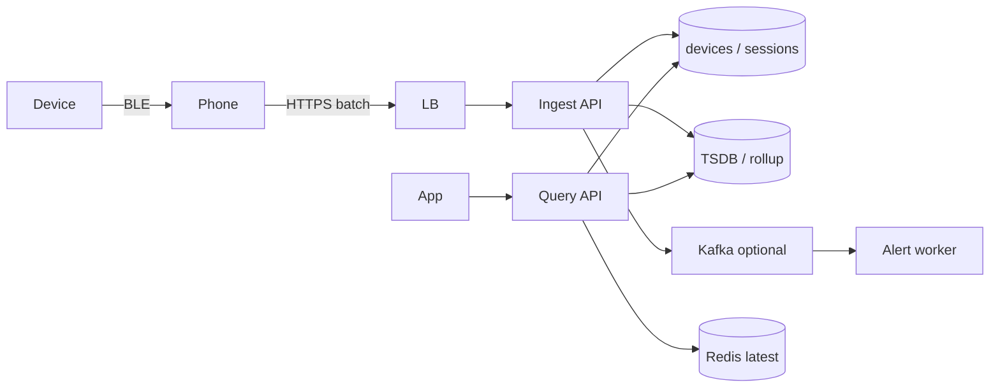
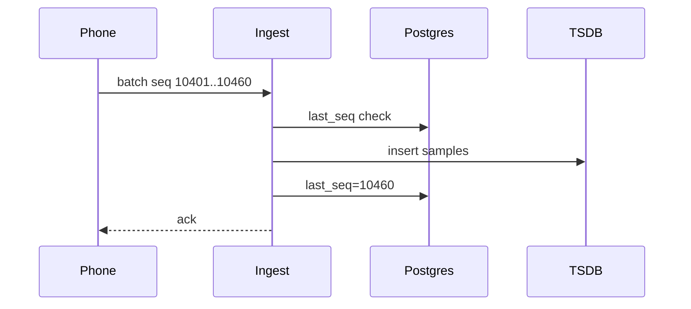

# Wearable Device

> [!abstract] Interview walk for **Temple-shaped** ingest: device → phone → API → **metadata in Postgres, samples in a time-series path**, idempotent seq, alerts after write. You do **not** design EEG. Script: [[01 - How the Round Works]].

## 1. Requirements

**Clarify:** live stream vs session upload? I’ll do **both**: batched samples while BLE is up, plus **file dump** of a workout (that file is [[04 - Multipart Upload]]).

### Functional

- Pair `user ↔ device` (one active device).
- Ingest samples: hr, temp, … with `device_ts` + `seq`.
- Start/end **session** (workout).
- App: last value, last 24h chart, session list.
- Alert if HR > threshold for N minutes (simple).

### Non-functional

- Write-heavy. **Don’t lose** a batch if the phone was in a tunnel (retry + idempotency).
- Latest HR p99 < 200 ms. Charts can be **rollups**, eventual 1–5 min.
- Strong: pairing, “this batch accepted.” Eventual: dashboard aggregates.
- PII / health — TLS, auth, don’t log raw payloads.

### Out of scope

- On-device DSP, firmware analog, BCI. Firmware **bytes** = multipart.
- Social feed of workouts.

## 2. Estimations

Assume **100k devices**, 1 Hz HR when worn 8h → ~3k samples/device/day → **3e8 samples/day**.

Raw row 32 B → **~10 GB/day**. 30 days raw ≈ 300 GB; **1 year raw is a TSDB problem**, not “one `samples` table forever in OLTP.”

Ingest QPS: 100k × 1 Hz **if all live** is fantasy. Phone **batches 10–60s** → ~2k–10k writes/s peak. Still too much for naive Postgres inserts of every beat **as the product grows** — so I **batch + rollup**.

Interview pick: **Postgres for users/devices/sessions**; **append samples to a time-series store** (Timescale / Cassandra / ClickHouse) or **S3 + 1-min rollup in PG** for the lite design.

## 3. APIs

| Method | Path | Notes |
|---|---|---|
| `POST` | `/devices/pair` | `{serial}` → bind to user |
| `POST` | `/sessions` | start `{device_id}` |
| `POST` | `/sessions/{id}/end` | |
| `POST` | `/ingest` | `{device_id, seq_from, samples:[{ts, hr, …}]}` **Idempotency-Key or seq** |
| `GET` | `/me/now` | latest HR |
| `GET` | `/sessions/{id}/series?from&to&step=1m` | chart |
| `POST` | `/sessions/{id}/dump/initiate` | raw file → multipart |

## 4. Schema

**OLTP (Postgres):**

```
users(id, …)
devices(id, serial UNIQUE, user_id, last_seq, last_seen_at)
sessions(id, user_id, device_id, started_at, ended_at, status)
alerts(id, user_id, session_id, kind, created_at)
```

`devices.last_seq` — **monotonic** from the phone. Ingest with `seq <= last_seq` → **200 drop** (retry).

**Samples (not OLTP long-term):**

```
samples(device_id, ts, seq, hr, extra)  -- hypertable / TSDB
rollups_1m(device_id, bucket, hr_avg, hr_max, n)
```

Latest: `devices.last_hr` + `last_hr_at` updated in ingest txn **or** Redis `device:{id}:now` with TTL.

## 5. High-level design



Phone is the **buffer** (offline queue). We never require the watch to speak HTTP.

Kafka **after** persist if alerts / fanout. Not in front of the write unless they 10× QPS.

## 6. Core ingest

```
POST /ingest
{ device_id, seq_from: 10401, samples: [ 60 points ] }
```

1. Auth: device belongs to user.
2. If `seq_from <= last_seq` → 200, no insert (idempotent).
3. If gap `seq_from > last_seq+1` → **409 gap** or **accept and mark hole** — ask them. Default: **accept**, store, `last_seq = max`. Phone may backfill.
4. Bulk insert samples; update `last_seq`, `last_hr`; bump Redis now.
5. 200 `{last_seq}`.

Session dump: same as multipart; `sessions` points at `s3_key` when `ready`.



## 7. Deep dive — where the beats live

| Store | Role |
|---|---|
| Postgres | Pairing, sessions, `last_seq`, billing-ish metadata |
| Redis | `now` card. Rebuild from TSDB if flush. |
| TSDB / 1-min rollup | Charts. Raw 1 Hz dropped after 7–30 days. |
| S3 | Workout file, firmware. |

**Alert:** worker reads latest buckets; if HR > X for 3 consecutive minutes → insert `alerts`, push. Don’t run this on the ingest request.

**Clock:** device_ts can skew. Store **device_ts and server_received_at**. Charts use device_ts; “last seen” uses server.

## 8. Break it

| Failure | What you say |
|---|---|
| Phone retries same batch | `seq` / idempotency → no double insert. |
| Redis down | `GET /now` from `devices.last_hr`. Slower, correct. |
| TSDB down | Ingest **fails** (or spool to Kafka/local). Don’t pretend PG has 1 Hz. Lite: write rollup-only to PG and accept loss of raw. |
| Pair two users | `devices.user_id` unique active; unpair first. |
| 100 Hz sensor | Batch + rollup immediately. Never 100 Hz as PG rows. |
| Alert spam | Hysteresis + cooldown row. |

## One-minute close

The watch talks to the phone. The phone POSTs **idempotent batches**. I keep pairing and sessions in Postgres, samples in a time-series path, latest in Redis-or-column. Charts read 1-minute rollups. A workout file is multipart. I didn’t design the sensor.

## Related Notes

- [[HLD/Problems/README]]
- [[04 - Multipart Upload]]
- [[09 - Storage Search and Geo]]
- [[09 - Inventory and Flash Sale]] — different; this is append-only not scarce qty
