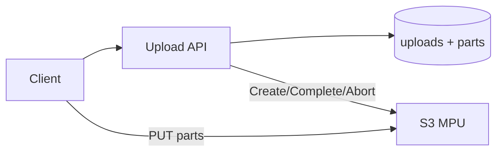
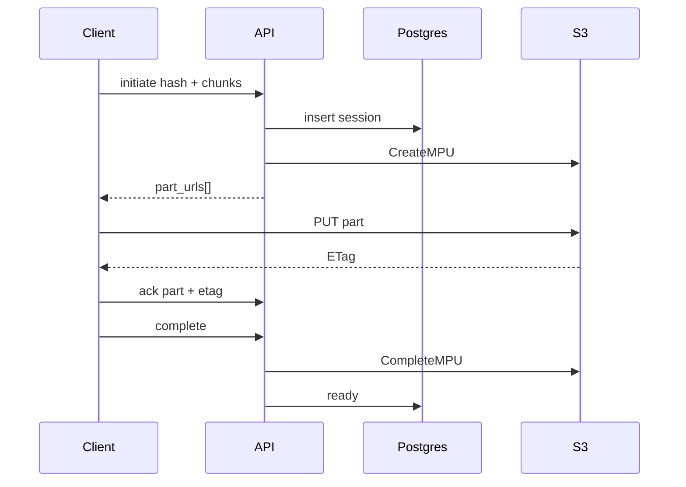

# Multipart Upload

> [!abstract] Interview walk. **Bytes never hit the API.** Initiate → presigned part URLs → S3 PUT → ack ETag per part → complete. Metadata in Postgres. Script: [[01 - How the Round Works]]. S3: [[09 - Storage Search and Geo]].

## 1. Requirements

**Clarify:** max size? resume? I’ll assume **up to ~5 GB**, resume yes, browser/mobile.

### Functional

- Client sends **file hash, size, chunk_count, chunk_size**.
- Initiate → **array of presigned PUTs** (one per part) + `upload_id`.
- Client uploads **directly to S3**, then **acks each part** with ETag.
- Complete → assemble → file ready. Abort / expire zombies.
- Download later: presigned GET (don’t deep-dive).

### Non-functional

- App p99 is **small JSON** (< 100 ms). Upload bandwidth is S3.
- Durable parts until complete or TTL (~24h–7d).
- Strong: “this part is recorded,” “file is ready.”
- Auth + quota on initiate.

### Out of scope

- Transcode, virus-scan internals (box after `ready`). Dropbox delta sync.

## 2. Estimations

Assume **100k uploads/day**, avg 200 MB, 8 MB chunks → ~25 parts. Initiate 100k/day ≈ **1 QPS**; part acks ~25× ≈ **25 QPS**. Trivial for PG.

Storage **bytes**: S3. Metadata: 25 rows × 100k × 200 B ≈ **0.5 GB/day** parts table if you keep them — TTL delete after `ready`.

Peak: workday 3×. Still one API + one bucket.

## 3. APIs

| Method | Path | Body |
|---|---|---|
| `POST` | `/uploads/initiate` | hash, size, chunk_count, chunk_size, filename |
| `POST` | `/uploads/{id}/parts/{n}/complete` | `{etag, size}` |
| `POST` | `/uploads/{id}/complete` | |
| `GET` | `/uploads/{id}` | pending parts (resume) |
| `POST` | `/uploads/{id}/abort` | |

## 4. Schema

```
uploads(
  id, user_id, filename, size_bytes, content_hash,
  chunk_count, chunk_size,
  s3_key, s3_upload_id,
  status,  -- initiated | uploading | completing | ready | failed | aborted
  expires_at
)
upload_parts(
  upload_id, part_number,  -- PK, parts 1..N
  size_bytes, etag, status,  -- pending | uploaded
  acked_at
)
```

Resume / dedup: unique-ish `(user_id, content_hash)` while not `ready`. If already `ready` → skip bytes.

## 5. High-level design



S3 **multipart**: CreateMPU → presign `UploadPart` → CompleteMPU with `{partNumber, etag}[]`.

## 6. Core flows

**Initiate:** validate (part ≥ 5 MB except last, ≤ 10k parts, size math). Insert upload + N pending parts. `CreateMultipartUpload`. Return `part_urls[]`.

**Client:** `slice` → PUT URL → save ETag → ack.

**Ack:** store etag, `uploaded`. Idempotent if same etag.

**Complete:** all parts uploaded → CAS `completing` → CompleteMPU → `ready`. Missing parts → 400.

**TTL cron:** abort stale MPU (S3 **bills** incomplete).



## 7. Deep dive

**Why ack per part?** Resume + CompleteMPU **needs ETags**. Client crash at 90% without acks = lost receipts.

**Array-at-initiate vs mint-per-part:** array is simple; presign TTL (15–60 min) dies on overnight pause → refresh URLs for pending parts.

**Hash:** SHA-256 of the file. Dedup + resume key. API does **not** re-hash 2 GB.

**Who concatenates?** S3, not a `cat` worker.

## 8. Break it

| Failure | What you say |
|---|---|
| Expired URL | GET upload, mint new URL for that part. Same MPU. |
| Ack lost, S3 has bytes | Client PUTs again or we lack ETag → PUT again. |
| Complete twice | CAS `ready`. 200 same file_id. |
| API down mid-CompleteMPU | Retry complete; if object exists, mark ready. |
| Steal presign | Short TTL. HTTPS. Don’t log full URLs. |

## One-minute close

Initiate writes a session and returns presigned part URLs. The browser uploads to S3 and acks ETags. Complete asks S3 to assemble. I never put the video through the app server.

## Related Notes

- [[HLD/Problems/README]]
- [[09 - Storage Search and Geo]]
- [[03 - Wearable Device]] — session dump uses this
- [[08 - Resource Sharing ACL]] — who may GET
