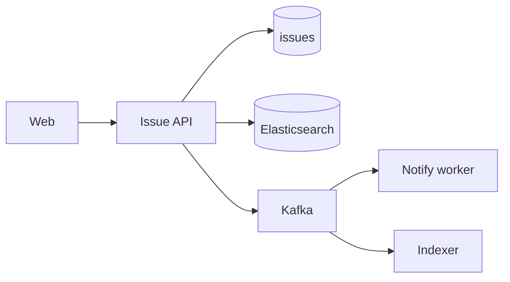
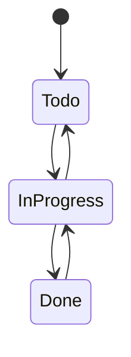

# Jira

> [!abstract] Interview walk (**HLD**, not the class diagram). Issues, workflow, comments, list/search. Attachments = [[04 - Multipart Upload]]. LLD state machine is a 2-minute overlay if they switch altitude. Script: [[01 - How the Round Works]].

## 1. Requirements

**Clarify:** Jira Cloud or “issue tracker”? I’ll do **projects, issues, transitions, comments, assign, list + search**.

### Functional

- CRUD project. CRUD issue: title, body, type, assignee, **status**.
- **Transition** only along a workflow (`Todo → In Progress → Done`, not Todo→Done if they forbid it — pick a simple 3-state machine).
- Comments. Watchers get notified (async).
- List issues in a project (filter status/assignee). Search text (“JQL-lite”: title/body).

### Non-functional

- Transition **strong** (no illegal skip, no lost update).
- List p99 < 200 ms. Search **eventual** (index lag 1–2 s OK).
- Notifications off the request path.
- 99.9%. Authz: project role (admin/member).

### Out of scope

- Full JQL, boards as a separate product, 50 workflow plugins, Confluence, 10k custom fields (say “JSON `fields` + 10 indexed”).

## 2. Estimations

Assume **50k users**, 5k projects, **10M issues**, 20M comments.

List QPS **2k**, writes **200**. Search 500.

Issue row ~2 KB → 10M ≈ **20 GB** + comments 40 GB. **Postgres + ES for search.** No shard.

## 3. APIs

| Method | Path | Notes |
|---|---|---|
| `POST` | `/projects` | |
| `POST` | `/projects/{key}/issues` | `{title, type, assignee?}` → status=`Todo` |
| `GET` | `/issues/{id}` | |
| `POST` | `/issues/{id}/transition` | `{to_status}` |
| `POST` | `/issues/{id}/comments` | |
| `GET` | `/projects/{key}/issues?status&assignee&cursor=` | list |
| `GET` | `/search?q=` | ES |

## 4. Schema

```
projects(id, key UNIQUE, name)
project_members(project_id, user_id, role)
issues(
  id, project_id, number,  -- unique (project_id, number)  PROJ-184
  title, body, type, status, assignee_id,
  reporter_id, version, updated_at
)
issue_comments(id, issue_id, user_id, body, created_at)
watchers(issue_id, user_id, PK)
workflow_edges(project_id, from_status, to_status)  -- or global default
```

Indexes: `issues(project_id, status, updated_at DESC)`, `issues(assignee_id, status)`.

`version` — optimistic lock on transition.

## 5. High-level design



Write: PG commit → outbox → Kafka → ES + email/push.

Read list: **Postgres**. Search: **ES**. Don’t `LIKE '%bug%'`.

## 6. Core flows

**Create:** next `number` = `MAX+1` per project **or** a `projects.next_issue` counter in the same txn (avoid gap-fights with `UPDATE … RETURNING`).

**Transition:**

```sql
UPDATE issues SET status=:to, version=version+1
WHERE id=:id AND version=:v AND status=:from;
-- 0 rows → 409
```

Check `(from, to)` in `workflow_edges` **before** or in app. Illegal → 400.

**Comment:** insert; enqueue notify watchers + assignee.



## 7. Deep dive — search vs list vs LLD

**List** is relational filters — PG + composite index.

**Search** is inverted index — ES. Lag OK. If ES down, list still works; search 503 or degrade to title `ILIKE` for ops.

**Watchers:** rows + Observer in LLD talk. HLD: table + Kafka.

If they say “do LLD”: `Issue`, `Workflow.canTransition`, `Comment`. Same states. Don’t draw 20 patterns.

**Custom fields:** `issues.fields JSONB` + GIN if they push; don’t normalise 200 columns.

## 8. Break it

| Failure | What you say |
|---|---|
| Two transitions | `version` 409; client refreshes. |
| ES 2 min stale | Say it. List is live. |
| Notify twice | Kafka at-least-once; notify idempotency `(issue_id, comment_id, user_id)`. |
| Attach 2 GB | Presign. Not this service’s body. |
| Cross-project move | Renumber / new key — skip unless they ask. |

## One-minute close

Issues live in Postgres with a versioned status and a tiny workflow table. Lists hit indexes. Search is Elasticsearch, filled async. Comments fan out notify on a queue. If they want classes, the workflow **is** the LLD.

## Related Notes

- [[HLD/Problems/README]]
- [[11 - Collaborative Workspace]] — docs, not tickets
- [[08 - Resource Sharing ACL]] — tree perms; here project role is flat
- [[04 - Multipart Upload]]
