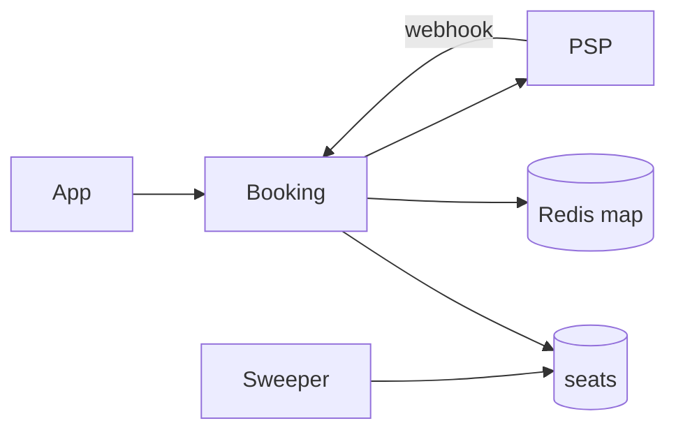
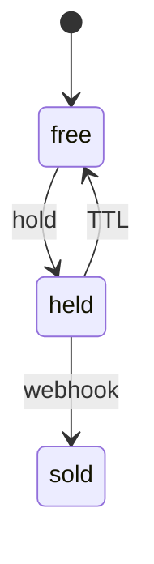

# Seat Booking

> [!abstract] Interview walk. BookMyShow-lite: **one seat, two buyers**. Hold with TTL, never lock across payment. Script: [[01 - How the Round Works]]. Isolation: [[14 - Coordination and Concurrency]].

## 1. Requirements

**Clarify:** movie vs train vs rooms? Same skeleton. I’ll do **show + seats + hold + pay + confirm**.

### Functional

- Browse shows / seat map.
- Hold 1..N seats ~10 min.
- Pay; on success seats **sold**. On timeout, free.
- My bookings.

### Non-functional

- **Never double-sell.** Strong on seat rows.
- Browse can be **stale** (“you clicked, gone”).
- Hold+pay path p99 < 300 ms for the API (not PSP).
- 99.9% on confirm.

### Out of scope

- Dynamic pricing ML, partner cinema CMS. Wallet deep-dive → [[07 - Wallet and Ledger]].

## 2. Estimations

Assume **100k DAU**, 2 booking attempts → 200k writes/day ≈ **2–6 QPS** avg. **Flash premiere** 5k users / 10 s on one show → **500 QPS** on **those seat rows** (hot). Still PG if we lock **seats not the show row**.

Seats: 1k shows/day × 200 seats × 90 days ≈ 18M rows. Fine.

## 3. APIs

| Method | Path | Notes |
|---|---|---|
| `GET` | `/shows/{id}/seats` | cache OK |
| `POST` | `/bookings` | `{show_id, seat_ids[]}` + Idempotency-Key → hold |
| `POST` | `/bookings/{id}/pay` | PSP session |
| `POST` | `/psp/webhook` | confirm |
| `GET` | `/bookings/{id}` | |

## 4. Schema

```
shows(id, movie_id, screen_id, starts_at)
seats(
  id, show_id, seat_label,
  UNIQUE(show_id, seat_label),
  status,          -- free | held | sold
  hold_until,
  held_by_booking_id
)
bookings(id, user_id, show_id, status, hold_until, amount_paise, idempotency_key UNIQUE)
booking_seats(booking_id, seat_id)
```

Index `(show_id, status)`.

## 5. High-level design



Redis for **map browse**. SoR = `seats.status`.

## 6. Core hold

**Short txn** (ms), not open during payment:

```sql
UPDATE seats
SET status='held', hold_until=now()+interval '10 minutes',
    held_by_booking_id=:bid
WHERE id = ANY(:ids) AND show_id=:sid AND status='free';
-- rowcount MUST = len(ids) else ROLLBACK
```

Insert booking `held`. Return pay URL.

**Webhook paid:** `UPDATE seats SET status='sold' WHERE held_by_booking_id=:bid AND status='held'`. 0 rows → don’t confirm (expired / stolen).

**Sweeper:** `held AND hold_until < now()` → `free`.



## 7. Deep dive — isolation

**Not** `SELECT FOR UPDATE` for 10 minutes. That’s **state + TTL**. [[14 - Coordination and Concurrency]].

`FOR UPDATE` only if you read-then-branch **in the same ms txn**. Lock seat ids **sorted** (deadlock).

Redis `SET NX` on a seat: extra. Unique/status already mutex. Don’t hold Redis 10 min as SoR.

**All-or-nothing** multi-seat: one UPDATE, compare rowcount.

Browse cache: 5–15 s TTL. 409 on hold is UX.

## 8. Break it

| Failure | What you say |
|---|---|
| Two users, last seat | One UPDATE wins. |
| Double-click | Idempotency-Key. |
| Pay after expiry | Webhook 0 rows → refund, no sell. |
| Webhook vs sweeper | Confirm `WHERE status='held' AND booking_id=?`. |
| Redis lock 10 min | Process death / TTL vs PSP late → double-sell. **Don’t.** |

## One-minute close

Seats are Postgres rows. Hold is atomic `free→held` plus a clock. Payment webhook flips to sold only if we still own the hold. Cache may lie; the UPDATE does not.

## Related Notes

- [[HLD/Problems/README]]
- [[09 - Inventory and Flash Sale]] — qty not unique seat
- [[07 - Wallet and Ledger]]
- [[12 - E-commerce Checkout]]
- [[14 - Coordination and Concurrency]]
