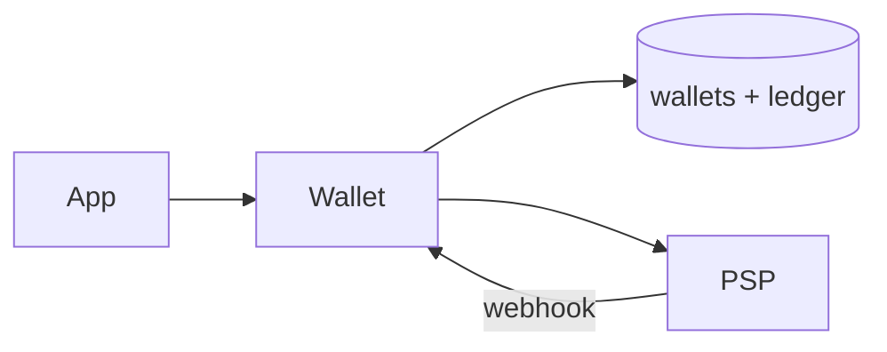
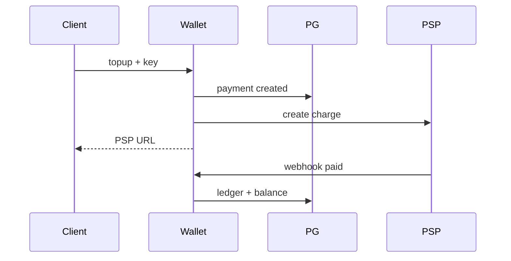

# Wallet and Ledger

> [!abstract] Interview walk. Internal wallet, not PCI. **Ledger + balance in one txn**, PSP webhook is SoR for topup, `Idempotency-Key`. Script: [[01 - How the Round Works]].

## 1. Requirements

**Clarify:** P2P? Merchant pay? I’ll do **balance, topup via PSP, P2P, history**.

### Functional

- Get balance + ledger (cursor).
- Topup: create payment, user pays PSP, **credit on webhook**.
- Transfer A→B in-app.
- Never store cards.

### Non-functional

- **Strong** on money. paise `BIGINT`. No floats.
- p99 transfer < 200 ms. 99.99% on posted entries (talk nines, one primary + replica + backups).
- At-least-once webhook → **exactly-once credit** via unique keys.
- Durability: committed ledger survives crash.

### Out of scope

- KYC, FX, building UPI. Splitwise IOUs → [[01 - Splitwise]].

## 2. Estimations

**2M DAU**, 3 money ops/day → 6M writes/day ≈ **70 QPS** avg, **200 peak**. History reads 5×.

Ledger row 100 B × 6M × 365 ≈ **200 GB/year**. One PG. Shard `user_id` only if they invent 50k QPS.

## 3. APIs

| Method | Path | Notes |
|---|---|---|
| `GET` | `/wallet` | balance |
| `GET` | `/wallet/ledger?cursor=` | |
| `POST` | `/wallet/topup` | `{amount}` + Idempotency-Key |
| `POST` | `/psp/webhook` | signed |
| `POST` | `/wallet/transfer` | `{to_user, amount}` + key |

## 4. Schema

```
wallets(id, user_id UNIQUE, balance_paise CHECK >=0, currency, version)
ledger_entries(
  id, wallet_id, amount_paise,  -- signed
  type, payment_id, created_at
)
payments(
  id, from_wallet_id, to_wallet_id, amount_paise,
  status,  -- created | pending_psp | posted | failed | reversed
  idempotency_key UNIQUE,
  psp_ref
)
psp_events(event_id UNIQUE, payment_id)  -- webhook dedupe
```

Index `ledger(wallet_id, created_at DESC)`.

## 5. High-level design



Notify “you got paid” = outbox after commit. Not on the money path.

## 6. Core flows

**Topup:** insert `payments` (`created` / conflict on key → return old). PSP charge with `payment.id`. Status `pending_psp`. **No credit yet.**

**Webhook success:** if already `posted` → 200. Else **one txn:** ledger `+amount`, `balance +=`, `posted`.

**P2P:** lock wallets `ORDER BY id`, both balances, two ledger rows, `posted`. `balance + delta >= 0` or 402.



## 7. Deep dive — “PSP paid, we died”

Webhook retries. Handler **must** short-circuit `posted`. Do **not** credit on browser `/success`.

Balance column **and** ledger: same txn. Nightly `SUM(ledger)=balance`.

Optimistic `version` or `FOR UPDATE` on the wallet row. Transfer deadlock: **sort wallet ids**.

Redis INCR is **not** the bank.

## 8. Break it

| Failure | What you say |
|---|---|
| Double-tap | Unique idempotency_key. |
| Duplicate webhook | `posted` / `psp_events`. |
| PSP timeout, unknown | Stay `pending`; **reconcile job** pulls PSP. Don’t guess. |
| Reverse | New opposite ledger; `reversed`. No DELETE. |

## One-minute close

Append-only ledger is SoR; balance is denormalised in the same transaction. Topup waits for the webhook. Retries don’t print money.

## Related Notes

- [[HLD/Problems/README]]
- [[01 - Splitwise]]
- [[06 - Seat Booking]]
- [[12 - E-commerce Checkout]]
- [[05 - Databases]]
