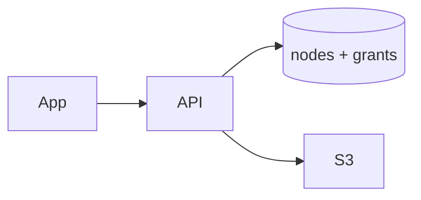
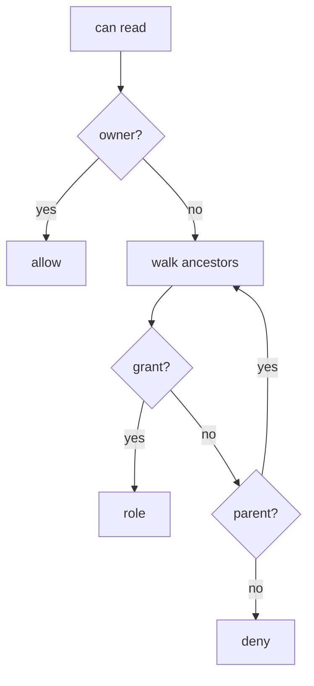

# Resource Sharing ACL

> [!abstract] Interview walk. Drive/Dropbox **share file or folder**. Grants + inherit. Bytes are [[04 - Multipart Upload]]. Script: [[01 - How the Round Works]].

## 1. Requirements

**Clarify:** Google-docs live edit? That’s [[11 - Collaborative Workspace]]. Here: **store + share + download**.

### Functional

- Folders and files (tree). Owner.
- `share(user, role)` on a node: viewer / editor / owner.
- Children inherit unless a closer grant overrides.
- Revoke. “Shared with me” list.
- Download only if `can(read)` → presigned GET.

### Non-functional

- Authz **every** read/write. Deny = **404** (no leak).
- List folder p99 < 200 ms for typical depth (< 20).
- Grant change visible quickly (seconds if cached).

### Out of scope

- Org SCIM, public link 15 edge cases (one `links` table if they ask). OT/CRDT.

## 2. Estimations

**1M users**, 10M nodes, 5M grants. List QPS 2k, grant writes 50.

Nodes 1 KB × 10M ≈ 10 GB. **Postgres.** Materialised ACL only if they say “share `/` with 1M files.”

## 3. APIs

| Method | Path | Notes |
|---|---|---|
| `POST` | `/folders` | `{parent_id, name}` |
| `POST` | `/files/initiate` | multipart |
| `POST` | `/nodes/{id}/grants` | `{grantee_id, role}` |
| `DELETE` | `/nodes/{id}/grants/{uid}` | |
| `GET` | `/nodes/{id}` | 404 if no read |
| `GET` | `/folders/{id}/children` | |
| `GET` | `/shared-with-me` | |

## 4. Schema

```
nodes(
  id, parent_id, kind,  -- file | folder
  owner_id, name,
  UNIQUE(parent_id, name),
  s3_key
)
grants(resource_id, grantee_id, role, UNIQUE(resource_id, grantee_id))
```

Owner SoR = `nodes.owner_id`. Grants = extras.

Cycle: reject parent in descendants.

## 5. High-level design



One service. Redis `acl:{user}:{node}` optional TTL 30s, bust on grant.

## 6. Core authz

`can(user, node, action)`:

1. `owner_id == user` → yes.
2. Walk **node → parent → root**.
3. First grant for user at that level **wins** (closest override).
4. Role → action.



**Shared with me:** `SELECT * FROM grants WHERE grantee_id=?`. Don’t scan the tree.

## 7. Deep dive — walk vs materialise

| | Walk ancestors | `acl(node, user, role)` table |
|---|---|---|
| Share folder | 1 insert | insert × descendants |
| Read | ~depth lookups | 1 row |
| Move/revoke | cheap | rewrite subtree |

**Default: walk.** Closure table if they hate recursion. Materialise when share-root is huge.

Jira project role is **flat**. This is **tree inherit**.

## 8. Break it

| Failure | What you say |
|---|---|
| Share folder, revoke | Delete grant; cache TTL. |
| Move into self | Reject. |
| File grant vs parent | Closest wins. |
| 403 vs 404 | **404**. |

## One-minute close

Tree of nodes, owner on the row, everyone else in `grants`. Read walks up until a grant hits. I don’t copy ACL onto every child until they force a million-file share.

## Related Notes

- [[HLD/Problems/README]]
- [[04 - Multipart Upload]]
- [[05 - Jira]]
- [[11 - Collaborative Workspace]]
