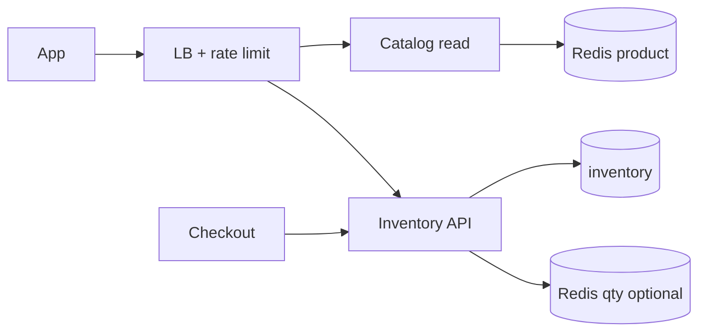
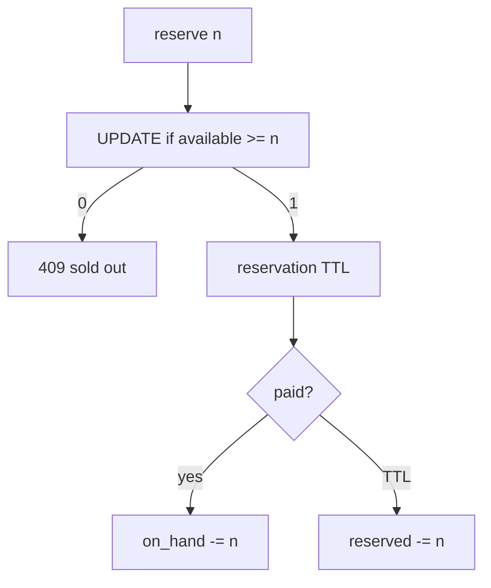

# Inventory and Flash Sale

> [!abstract] Interview walk. Blinkit / limited SKU / **10k people, 200 stock**. Deep dive is **not** the grocery catalog. It’s **don’t oversell a hot qty** + keep the app up. Script: [[01 - How the Round Works]]. Cousin of [[06 - Seat Booking]] (qty vs unique seat) — **not the same problem**.

## 1. Requirements

**Clarify:** dark store vs warehouse? Flash SKU or always-on? I’ll do **SKU qty per warehouse/dark-store**, browse, reserve on checkout start, flash at T=0.

### Functional

- Browse products (cached).
- `GET` availability `{sku, store}`.
- **Reserve** `n` units for a cart (short TTL).
- Confirm on pay → decrement committed; expire → release.
- Flash: sale starts at `t0`, cap `qty`.

### Non-functional

- **Never sell qty < 0.** Strong on the inventory row (or on a sharded counter that reconciles).
- Browse 10k QPS **stale OK**. Reserve p99 < 50–100 ms.
- Flash: 50k users smash one SKU for 30s. **Shed load**; fairness optional (queue).
- 99.9% browse; reserve may **429**.

### Out of scope

- Rider assignment, ETA map ([[09 - Storage Search and Geo]]). Full OMS → [[10 - Order Management]]. Checkout PSP → [[12 - E-commerce Checkout]].

## 2. Estimations

**1M DAU** grocery, 5 browses, 0.3 orders → browse **~150 QPS** avg / **500 peak**. Flash: **20k QPS** on **one product page** + **5k reserve/s** for 10s.

Catalog 100k SKUs × 200 stores = 20M inventory rows. PG fine. **Hot row** is one `(sku, store)`.

## 3. APIs

| Method | Path | Notes |
|---|---|---|
| `GET` | `/stores/{id}/products/{sku}` | cache 1–5s |
| `POST` | `/reservations` | `{sku, store_id, qty}` + key → hold |
| `DELETE` | `/reservations/{id}` | release |
| Internal | confirm from checkout | commit hold |

## 4. Schema

```
products(id, name, …)
stores(id, …)
inventory(
  store_id, sku_id,   -- PK
  on_hand,            -- physical
  reserved,           -- held
  version
)
reservations(
  id, store_id, sku_id, qty, user_id,
  status,  -- held | committed | expired
  hold_until, idempotency_key UNIQUE
)
flash_sales(id, sku_id, store_id, starts_at, qty_cap)
```

**Available** = `on_hand - reserved`. Don’t store available as SoR unless you update it in the same txn (then it’s denormalised).

## 5. High-level design



**Rate limit** per user + per SKU on reserve. Flash page: CDN/cache; **don’t** hit PG 20k/s for HTML.

## 6. Core reserve

```sql
UPDATE inventory
SET reserved = reserved + :n, version = version + 1
WHERE store_id=:s AND sku_id=:k
  AND on_hand - reserved >= :n;
-- 0 rows → sold out
```

Insert `reservations` `held` in **same txn**. Sweeper: expired → `reserved -= qty`.

Confirm: `reserved -= n`, `on_hand -= n`, reservation `committed`.



## 7. Deep dive — flash + hot row

**Seat booking** = unique row per seat. **This** = **counter**. Same isolation family, different schema.

**PG row lock** on one SKU: ~1–3k TPS then it **hurts**. Flash options (pick one, say why):

1. **Queue:** enqueue reserve; workers `SKIP LOCKED` or serialise per SKU. Fair, slower UX.
2. **Redis `DECR` + Lua** `if qty>=n then decr` — fast; **SoR problem**. Reconcile to PG every N ms / on confirm. If Redis dies, halt flash or fail closed.
3. **Shard the counter:** 10 buckets of 20 qty; user hashes to a bucket. Relieves one row. Leftover merge is messy.

**Interview default:** PG UPDATE for normal Blinkit minutes; for **named flash** add Redis stock **and** PG confirm, **fail closed** if Redis is empty/down. Rate limit 1 reserve/user/sku.

**Browse “3 left”:** cached, **wrong**. Reserve is truth.

Don’t put Kafka **in front** of reserve unless the product is “join the queue.” Kafka after confirm for “notify waitlist.”

## 8. Break it

| Failure | What you say |
|---|---|
| Two reserves, qty=1 | One UPDATE wins. |
| Redis 5, PG 0 | Confirm **PG**; Redis is a gate. Repair Redis from PG. |
| Sweeper vs confirm | Confirm `WHERE status='held' AND hold_until>now()`. |
| 20k QPS page | Cache. 429 reserve. |
| Negative qty | CHECK + predicate. |

## One-minute close

Inventory is `(store, sku)` with `on_hand` and `reserved`. Reserve is an atomic “enough left?” update plus a TTL row. Flash is the same update under a rate limiter; if one row melts, I queue or shard the counter — I don’t trust the product-page cache for stock.

## Related Notes

- [[HLD/Problems/README]]
- [[06 - Seat Booking]]
- [[10 - Order Management]]
- [[12 - E-commerce Checkout]]
- [[14 - Coordination and Concurrency]]
- [[08 - Reliability]]
