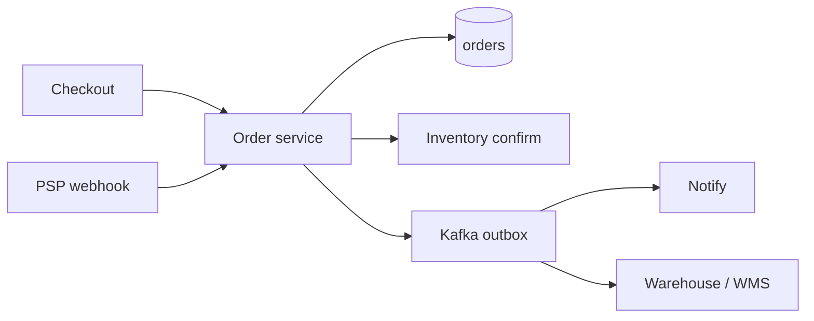
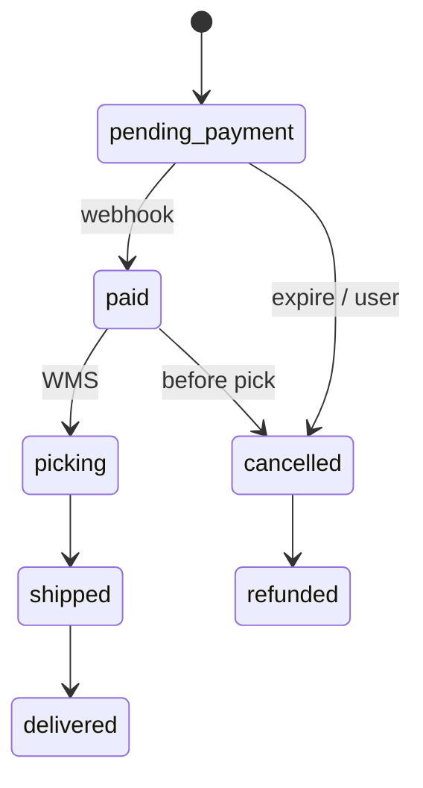

# Order Management

> [!abstract] Interview walk. **OMS** = life of an order **after** the customer said yes: reserve, pay, confirm, pick, ship, cancel. Not the cart UI ([[12 - E-commerce Checkout]]) and not only qty ([[09 - Inventory and Flash Sale]]). Script: [[01 - How the Round Works]].

## 1. Requirements

**Clarify:** grocery / commerce / food? I’ll do **commerce OMS**: one order, many lines, warehouse fulfill.

### Functional

- Create order from a **checkout session** (idempotent).
- States: `pending_payment` → `paid` → `picking` → `shipped` → `delivered` / `cancelled` / `refunded`.
- Lines: sku, qty, **price snapshot**.
- Cancel if not shipped. Partial ship if they ask (lite: all-or-nothing).
- Admin / warehouse: mark picked, add AWB.

### Non-functional

- State transitions **legal only**. Strong on order + inventory commit.
- List “my orders” p99 < 200 ms.
- Downstream (email, WMS) **eventual** via outbox.
- 99.9%.

### Out of scope

- Cart, promo engine, rider live-map. Returns as a full product (one `returned` state).

## 2. Estimations

**200k orders/day** ≈ **2–5 QPS** create, 20 QPS status reads. 2 yr × 200k × 1 KB ≈ **150 GB**. One PG.

Events: few per order → Kafka cheap.

## 3. APIs

| Method | Path | Notes |
|---|---|---|
| `POST` | `/orders` | from checkout_id + Idempotency-Key |
| `GET` | `/orders/{id}` | |
| `GET` | `/orders?cursor=` | my orders |
| `POST` | `/orders/{id}/cancel` | |
| `POST` | `/orders/{id}/transition` | warehouse `{to}` |
| Internal | payment webhook | `paid` |

## 4. Schema

```
orders(
  id, user_id, status, address_json,
  amount_paise, checkout_id UNIQUE,
  idempotency_key UNIQUE, version, created_at
)
order_lines(
  order_id, sku_id, qty, unit_paise,  -- snapshot
  PK(order_id, sku_id)
)
order_events(id, order_id, from_status, to_status, at, actor)  -- audit
shipments(id, order_id, awb, status)
```

Index `(user_id, created_at DESC)`, `(status)` for warehouse queues.

## 5. High-level design



Checkout **creates** `pending_payment`. OMS **owns** the state machine. Inventory reserve already held at checkout; OMS **commits or releases**.

## 6. Core flows



**Create (idempotent):** same key → same `order_id`. Snapshot line prices from checkout (don’t re-price).

**Paid:** CAS `pending_payment → paid` + inventory **commit** (see flash-sale note) **same txn** if same DB; else order `paid` + outbox `CommitStock`. If stock commit fails → `paid` but `needs_manual` — **don’t hide it**. Prefer same DB.

**Cancel:** legal set only; release reserved/commit refund payment (`reversed` ledger).

**Ship:** add shipment; `picking → shipped`.

## 7. Deep dive — why OMS ≠ checkout ≠ inventory

| System | Owns |
|---|---|
| Checkout | Cart, address, tax, start PSP, create order id |
| Inventory | `on_hand` / `reserved` |
| **OMS** | **Status, lines snapshot, who may cancel, events** |
| Wallet | Capture / refund |

**Price snapshot** on lines: catalog changes tomorrow; the order does not.

**Outbox:** `order_events` in the **same txn** as status. Worker publishes Kafka. No “update PG then fire-and-forget HTTP to WMS.”

Partial fulfill: `order_lines.shipped_qty` — only if they ask.

## 8. Break it

| Failure | What you say |
|---|---|
| Double create | Unique checkout_id / key. |
| Paid + stock gone | Hold should have reserved. If not: cancel+refund, don’t ship air. |
| Illegal skip | 400 + `workflow` (same idea as Jira). `version` 409. |
| WMS twice | Transition idempotent; shipment unique awb. |
| Kafka down | Outbox sits; order still `paid`. |

## One-minute close

An order is a versioned state machine plus frozen line items. Checkout mints it; payment and warehouse only move **legal** edges. Inventory commit and status change want one transaction or an outbox. My-orders is a PG index, not ES.

## Related Notes

- [[HLD/Problems/README]]
- [[12 - E-commerce Checkout]]
- [[09 - Inventory and Flash Sale]]
- [[07 - Wallet and Ledger]]
- [[05 - Jira]] — same transition idea
