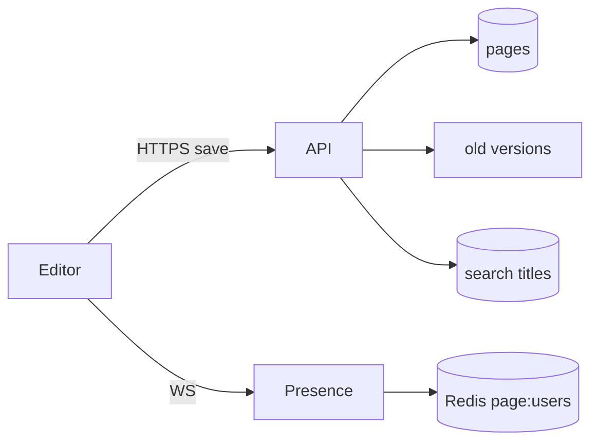
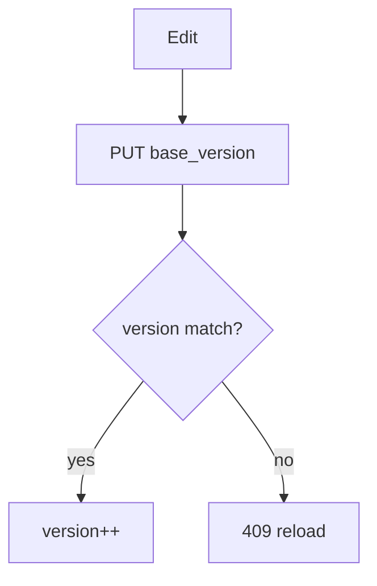

# Collaborative Workspace

> [!abstract] Interview walk. Notion / Google-Docs-lite: **docs, tree, share, presence, versions**. Not Jira tickets ([[05 - Jira]]). Not only ACL ([[08 - Resource Sharing ACL]]). Live cursors if they pull — don’t invent a CRDT unless they insist. Script: [[01 - How the Round Works]].

## 1. Requirements

**Clarify:** Google Docs typing or Notion blocks? I’ll do **workspace → pages (tree) → block body, comments, share, last-write + versions, presence**.

### Functional

- Workspaces, pages with `parent_id` (sidebar tree).
- Edit page body (blocks JSON or text).
- Share page/workspace (roles).
- Comments on a block.
- Version history (restore).
- See who is on the page (presence).

### Non-functional

- Save p99 < 300 ms. **Read-your-writes** for the editor.
- Presence ~1–2 s eventual.
- Share authz on every read (404).
- Search titles eventual (ES optional).
- 99.9% on save.

### Out of scope

- Pixel-perfect OT for 50 cursors in one paragraph (name it, park). Video call. Jira-like workflows.

## 2. Estimations

**200k DAU**, 10 opens, 20 saves/user/day → saves **~40 QPS** avg, **150 peak**. Presence heartbeats 1/10s × 20k open pages → **2k/s** — **Redis**, not PG.

Page row 20 KB × 5M ≈ 100 GB. Versions: keep last 50 diffs or snapshots hourly. PG + S3 for old snapshots.

## 3. APIs

| Method | Path | Notes |
|---|---|---|
| `POST` | `/workspaces/{id}/pages` | `{parent_id, title}` |
| `GET` | `/pages/{id}` | body + ACL |
| `PUT` | `/pages/{id}` | `{body, base_version}` optimistic |
| `GET` | `/pages/{id}/versions` | |
| `POST` | `/pages/{id}/restore` | `{version}` |
| `POST` | `/pages/{id}/comments` | |
| `GET` | `/pages/{id}/presence` | or WebSocket |
| Share | same as ACL APIs | |

## 4. Schema

```
workspaces(id, name)
pages(
  id, workspace_id, parent_id, title,
  body_json, version, updated_by, updated_at
)
page_versions(id, page_id, version, body_json, created_at, created_by)
comments(id, page_id, block_id, user_id, body, created_at)
-- grants: reuse ACL model on page/workspace
```

Index `(workspace_id, parent_id)`, `(workspace_id, updated_at DESC)`.

## 5. High-level design



**Save = HTTP PUT** with `base_version`. WS for presence (and optional “someone else saved — reload”).

Don’t stream every keystroke to PG.

## 6. Core save

```sql
UPDATE pages
SET body_json=:body, version=version+1, updated_at=now()
WHERE id=:id AND version=:base;
-- 0 rows → 409 conflict; client merges or last-reload
INSERT page_versions (…);
```

Hot versions in PG; freeze to S3 every N.

**Presence:** WS connect → `SADD page:{id} user`, heartbeat 15s, TTL. Disconnect → remove. `GET` / pubsub to others on that page.



## 7. Deep dive — concurrency vs ACL vs Jira

**Two typers:** SDE-1 answer = **optimistic version + 409**. Better: field/block-level version (Notion blocks). **OT/CRDT** = “if this is the product, a sync service; I won’t derive Jupiter OT on the board.”

**ACL:** workspace grant inherits to pages — [[08 - Resource Sharing ACL]]. Same walk-ancestors.

**Jira** is issues + workflow. **This** is a blob of blocks + tree + presence. Don’t reuse `status`.

**Search:** index title (+ async body) on save outbox.

**Offline:** client queues PUTs; on 409 show diff. Don’t pretend CRDT offline unless they ask.

## 8. Break it

| Failure | What you say |
|---|---|
| Two saves | 409; don’t silent overwrite. |
| WS die | Presence TTL expires. Doc still on last PUT. |
| Redis flush | Everyone looks offline until heartbeat. Docs safe. |
| Fat body 5 MB | Reject or S3 body + pointer. |
| Share revoke mid-edit | Next PUT 404. |

## One-minute close

Pages are versioned rows. Save is an optimistic PUT, not 50 WebSocket ops per second to SQL. Presence is Redis + WS. Sharing is the grants tree. If they want simultaneous characters in one line, I name OT/CRDT and keep the rest of the system.

## Related Notes

- [[HLD/Problems/README]]
- [[08 - Resource Sharing ACL]]
- [[05 - Jira]]
- [[04 - Multipart Upload]] — images in a page
- [[03 - Networking and APIs]] — WS vs HTTP
