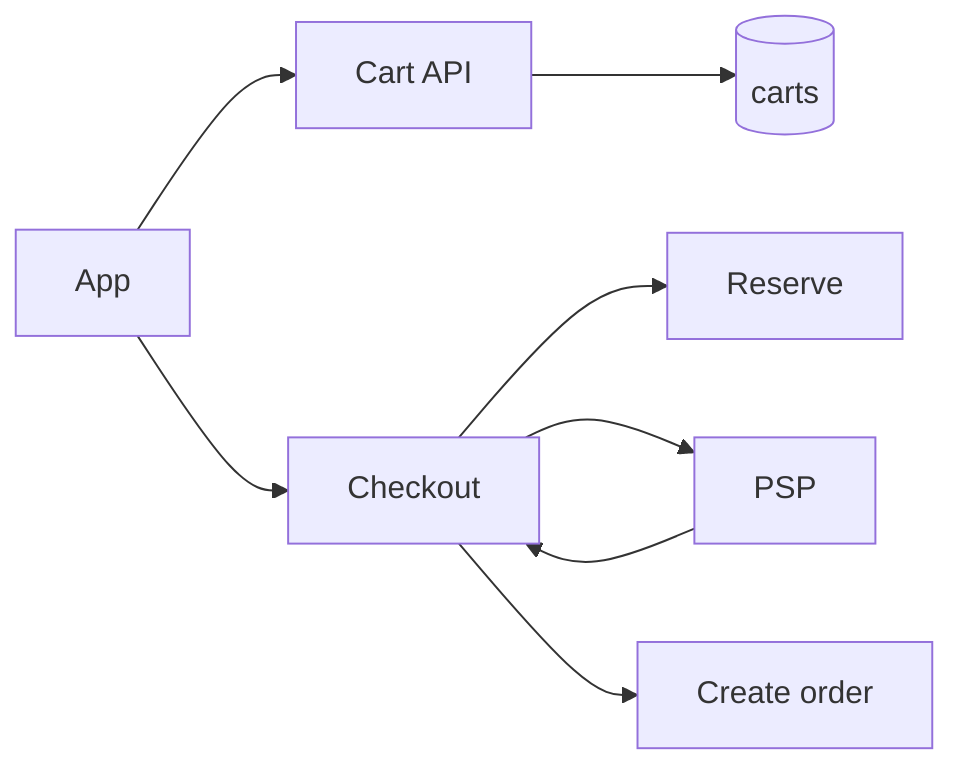
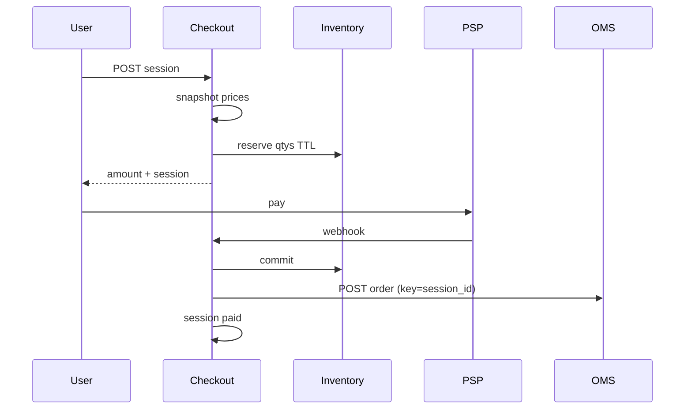

# E-commerce Checkout

> [!abstract] Interview walk. **Cart → address → price snapshot → reserve stock → PSP → order**. This is the **funnel**. After `paid`, [[10 - Order Management]] owns the machine. Qty math: [[09 - Inventory and Flash Sale]]. Money: [[07 - Wallet and Ledger]]. Script: [[01 - How the Round Works]].

## 1. Requirements

**Clarify:** guest cart? Single store? I’ll do **logged-in cart, one address, coupons lite, pay, thank-you**.

### Functional

- Cart: add/update/remove SKU+qty.
- Checkout session: freeze **lines + prices + tax + ship**.
- Reserve inventory for the session TTL.
- Start PSP; webhook → create/confirm order.
- Idempotent place-order.

### Non-functional

- Cart reads fast (cache OK if we accept rare stale price until checkout).
- **Price and stock truth at place-order**, not at add-to-cart.
- Strong: reserve + payment + order id. No double charge, no double order.
- p99 start-pay < 300 ms.

### Out of scope

- Full OMS warehouse, flash-sale page design (link those notes). Multi-seller settlement.

## 2. Estimations

**500k DAU**, 2 cart ops, 0.2 checkouts → cart **~10–30 QPS**, checkout **1–3 QPS**. Carts 100k active × 2 KB. PG + Redis cart optional.

## 3. APIs

| Method | Path | Notes |
|---|---|---|
| `POST` | `/cart/items` | `{sku, qty}` |
| `GET` | `/cart` | live catalog prices **or** cached |
| `POST` | `/checkout/sessions` | address_id, coupon → snapshot + reserve |
| `POST` | `/checkout/sessions/{id}/pay` | PSP |
| `POST` | `/psp/webhook` | |
| `GET` | `/checkout/sessions/{id}` | status |

## 4. Schema

```
carts(id, user_id UNIQUE)
cart_items(cart_id, sku_id, qty, PK)
checkout_sessions(
  id, user_id, status,  -- open | reserved | paid | expired | aborted
  address_json, amount_paise,
  expires_at, idempotency_key UNIQUE
)
checkout_lines(
  session_id, sku_id, qty, unit_paise,  -- FROZEN
  PK
)
-- orders created on paid → OMS
```

Cart is **mutable**. Session lines are **immutable** after create.

## 5. High-level design



## 6. Core flow



**Session create:** re-read catalog price; if cart price drifted → 409 “price changed” or accept new snapshot (pick one, say it). Reserve `n` per line ([[09 - Inventory and Flash Sale]]). Fail any SKU → no session.

**Webhook:** session still `reserved` and not expired → commit stock + `POST /orders` with `Idempotency-Key=session_id` + session `paid`. Expired → refund, no order.

**Don’t** create the OMS order at add-to-cart.

## 7. Deep dive — three SoRs

| Step | SoR |
|---|---|
| What I intend to buy | `cart_items` |
| What I agreed to pay | `checkout_lines` snapshot |
| What I legally bought | `orders` + ledger capture |

**Why snapshot:** flash sale / price change between cart and pay.

**Idempotency:** session key + order `checkout_id UNIQUE`. Webhook 2× → one order.

**Guest cart:** `cart_id` in cookie; merge on login (sum qty, cap). Mention, don’t build.

**Coupon:** apply at session create; store `coupon_code` on session; don’t re-apply on webhook.

## 8. Break it

| Failure | What you say |
|---|---|
| Double place | Unique session → one order. |
| Paid, reserve expired | Refund; 409. |
| Paid, OMS insert fails | Webhook retry; unique checkout_id. |
| Cart Redis vs PG | PG SoR; Redis optional. |
| Tax mismatch | Compute once at session; store `amount_paise`. |

## One-minute close

Cart is a scratchpad. Checkout **freezes prices and reserves stock**. Payment webhook commits stock and mints **one** order keyed by the session. After that I stop talking checkout and talk OMS.

## Related Notes

- [[HLD/Problems/README]]
- [[09 - Inventory and Flash Sale]]
- [[10 - Order Management]]
- [[07 - Wallet and Ledger]]
- [[06 - Seat Booking]] — same hold-then-pay shape
