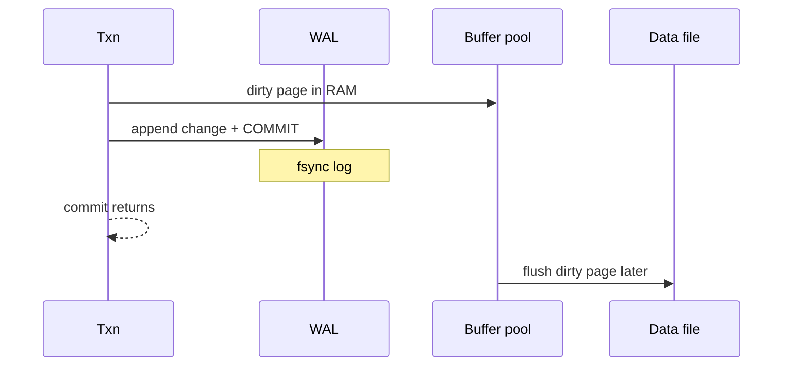

# Storage Engine and Disk I/O

> [!abstract]
> - Bottom layer: how a row **sits on disk**, how it gets into **RAM**, how a crash does not lose a committed write
> - Disk is in **pages** (4–16 KB). You never update “one byte of a row” on disk — you rewrite a page
> - RAM cache of pages = **buffer pool**. Changed pages sitting there = **dirty**
> - Durability is the **WAL**, not the data file. ARIES is how you come back from a crash
> - Ten-minute slice: [[05 - Databases]]

---

## Page layout (slotted pages)

### Why pages exist

- Disk and the OS think in **blocks**
- The engine thinks in **pages** — usually **8 KB** (Postgres) or **16 KB** (InnoDB)
- A read or write of a row is “bring this page in, maybe dirty it, maybe flush it later”
- You do **not** `pwrite` three bytes in the middle of a 200-byte row

### Slotted page (the usual picture)

```
┌──────────────────────────────────────────┐
│ page header (LSN, free-space, flags)     │
├──────────────────────────────────────────┤
│ slot 0 → | slot 1 → | slot 2 → |  …      │  line pointer array, grows ↓
│                                          │
│              free space                  │
│                                          │
│         ← tuple / row data grows         │
└──────────────────────────────────────────┘
```

- **Header**
    + checksum, page LSN (last WAL that touched this page)
    + lower / upper pointers into free space
    + page type (heap, btree, …)
- **Line pointers (slots)** — fixed-size, grow **down** from the header
    + each slot: offset + length (+ flags: dead, redirected)
    + the slot number **is** the last part of a physical RID: `(page_id, slot)`
- **Tuples** — variable-length, grow **up** from the bottom
    + header + null bitmap + columns
- Free space is the **gap in the middle**
    + delete a row → mark the slot dead, the gap can be reused
    + this is how you avoid rewriting the whole page on every delete

> [!tip] Why slots, not “just append rows”
> - A row can grow (UPDATE makes it longer)
> - A row can move (another page) — the slot can become a **redirect**
> - Indexes point at `(page, slot)`, not a byte offset that would break on every compact

### Fragmentation

- Lots of dead slots + tiny holes → page is “full” but mostly garbage
- Vacuum / purge reclaims the holes
    + not a first-class note here
    + one sentence if they poke: “dead tuples sit until vacuum; that’s why updates bloat”

---

## Buffer pool

### What it is

- An in-memory cache of **pages**
- The engine’s answer to “do not hit the disk for every query”
- Size is a knob
    + Postgres `shared_buffers` — often 25% of RAM, **not** 90%
    + the OS page cache still matters (same idea as Kafka)
    + InnoDB `innodb_buffer_pool_size` — this **is** the cache; give it most of RAM

### Hit vs miss

- **Hit** — page already in the pool → pin it, read/write, unpin
- **Miss** — evict a victim, read the page from disk into that frame
- Pin count > 0 → **cannot evict** (someone is looking at it)

### Dirty pages

- A page in RAM that does **not** match the copy on disk
- `UPDATE` dirties the page in the pool
    + it does **not** immediately `fsync` the data file
    + it **does** append to the WAL first (below)
- A **checkpoint** / background flusher writes dirty pages back
- Crash with dirty pages in RAM
    + those bytes are gone
    + WAL + ARIES put them back

### Eviction

| Policy | How | What you say |
|---|---|---|
| **LRU** | Evict the page that was unused the longest | Simple. Scan-resistant? Bad — a seq scan can evict the working set. |
| **Clock sweep** | Approximate LRU with a reference bit; a hand sweeps and clears bits | Postgres / InnoDB flavour. Cheap, good enough. |
| Midpoint / 2Q | New pages enter a “young” region; only promoted if reused | Stops a one-pass scan from murdering the cache. |

> [!warning] Seq scan vs the pool
> - A 100 GB table scan can evict **every** hot page if eviction is naive LRU
> - Grown-up engines have **ring buffers** / “don’t let a scan take the whole pool”
> - Interview: “the buffer pool is why we care about working set fitting in RAM”

---

## Write-Ahead Logging (WAL)

### The rule

- **Log first, data page later**
- Before a dirty page is allowed to hit the data file, the WAL records that describe that change must be **on stable storage** (`fsync` of the log)



### Why this is faster than “fsync every page”

- WAL is **append-only**, sequential
- Data pages are random (page 8, page 4001, page 12)
- One sequential `fsync` of the log commits many random page changes that flush **later**

### Force / steal (the exam words)

| Policy | Meaning | What engines actually do |
|---|---|---|
| **Force** | On commit, flush **data pages** too | Slow. Almost nobody. |
| **No-force** | On commit, only the **WAL** is durable | Default. Dirty pages flush later. |
| **No-steal** | A dirty page of an **uncommitted** txn may not be written to the data file | Safer undo, less RAM flexibility. |
| **Steal** | Buffer pool **may** evict (write) a dirty page of an uncommitted txn | Default. Undo must be able to roll that page back. |

- Postgres / InnoDB: **steal + no-force**
    + commit is a WAL `fsync`
    + uncommitted dirty pages **can** reach disk (steal)
    + therefore recovery must **undo** those
    + and **redo** committed work whose data pages never flushed (no-force)

> [!tip] Interview line
> - “Committed means the WAL is on disk, not that the heap page is”
> - Replica / CDC / PITR all **tail this log**
> - Debezium is “someone else reading our WAL” — [[06 - Ecosystem Resilience and Design Patterns]]

### Checkpoints

- Periodically: flush a batch of dirty pages, write a **checkpoint record** in the WAL
- Recovery does not replay from the beginning of time
    + start from the last checkpoint
    + redo forward
    + undo uncommitted

---

## ARIES (crash recovery)

### What crashed

- RAM is gone
- Data files are a mix of
    + old pages
    + stolen dirty pages from **uncommitted** txns
    + missing pages from **committed** txns (no-force)
- WAL on disk is the truth of what was intended

### Three passes


| Pass | Walks | Does |
|---|---|---|
| **Analysis** | WAL forward from last checkpoint | Rebuild the dirty-page table and the list of **loser** (uncommitted) txns. Figure out where redo must start. |
| **Redo** | WAL forward | Replay **every** logged change whose page is stale (page LSN < log LSN). Recreate the state **at the moment of the crash** — including losers’ dirty pages. “Repeating history.” |
| **Undo** | WAL backward, losers only | Roll back uncommitted txns. Writes **compensation log records** (CLRs) so a crash *during* undo does not undo twice. |

> [!info] Why redo *everything*, including losers
> - Steal already put some loser bytes on disk
> - Redo brings you to a known point
> - Undo then cleanly rolls losers back
> - This is the ARIES trick vs “only redo winners”

### What you do **not** say

- You will not implement ARIES on a whiteboard
- You **will** say: WAL + steal/no-force + three passes
- “We lost committed data” = WAL was not `fsync`’d (or the disk lied)

---

## Related Notes

- [[README]]
- [[02 - Indexing]] — those B+ pages live in the same pool
- [[08 - Replication]] — replicas apply WAL
- [[02 - Low-Level Storage and Performance IO]] — Kafka’s page cache is the OS cousin of this pool
- [[11 - Interview Questions]]
