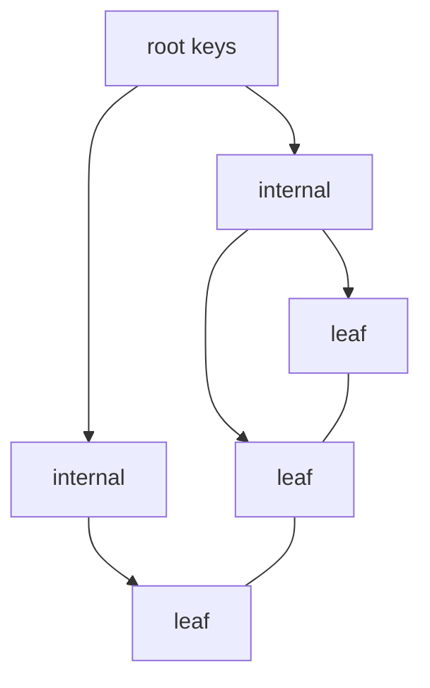

# Indexing

> [!abstract]
> - An index is an **extra data structure**. It buys reads. It costs **writes + disk**
> - Relational default: **B+ tree** (equality **and** range)
> - Write-heavy LSM stores: **memtable → SSTable → compact**
> - Hash: `O(1)` equality, **useless** for `WHERE created_at >`
> - Clustered = the table **is** the index order. Secondary = a pointer back
> - Ten-minute slice: [[05 - Databases]]

---

## The trade

- Without an index, lookup is a **full table scan**
- With an index
    + `WHERE id =` or `WHERE created_at BETWEEN` can jump
    + every `INSERT` / `UPDATE` of a keyed column must **maintain** the tree / LSM
- Index what you **query**, not every column
- Unique constraint **is** an index (email login)

---

## B+ trees

### Shape

- Internal nodes: **keys + child pointers only** — high fanout, few levels
- All **data / row pointers live in the leaves**
- Leaves are a **doubly-linked list**
    + range scan = find the left leaf, then walk `next`
    + this is why B+ beats a B-tree (data in internals) for `WHERE created_at >`

### Height

- Fanout hundreds (a 8 KB page holds many `(key, child)` pairs)
- A billion rows is still ~3–4 levels
- First levels sit in the **buffer pool** — a point lookup is often **one disk I/O** (the leaf)

### Insert and split

- Find the leaf
- If there is room → put the key there (ordered)
- If the leaf is full → **split**
    + make two leaves
    + copy/promote a separator key to the parent
    + parent full → split up, maybe a new root (**height + 1**)
- This is the write cost people mean by “B-tree random writes”
    + page split = dirty two leaves + a parent
    + plus WAL for each

### Fill factor

- Leave **slack** on a page so the next insert does not immediately split
- Bulk load can pack tight; OLTP wants ~70%
- Too tight → split storm on a sequential key
- Too loose → waste RAM / disk

### Range scans

- Linked leaves = sequential walk after the first seek
- This is the whole point vs hash

> [!tip] Interview: “why B+ not hash for `created_at`”
> - Hash has no order
> - B+ leaf chain **is** the order

---

## LSM trees

### Why they exist

- B+ updates **in place** → random page I/O on write
- LSM **appends**
    + write-heavy stores (Cassandra, RocksDB, LevelDB, ES Lucene flavour)
    + Kafka is a log, not an LSM — don’t mix them

### The path

- **Memtable**
    + in-memory sorted structure (skip list / tree)
    + every write is an append to the **commit log** (WAL) + insert here
    + read can hit this first
- **SSTable**
    + immutable sorted file on disk
    + flush the memtable → a new SSTable
    + never update in the middle — a newer file **shadows** an older key
- **Compaction**
    + merge files in the background
    + drop overwritten keys and **tombstones**
    + fewer files → cheaper reads
    + costs CPU + disk write amplification

### Reads

- May look in memtable + **several** SSTables
- **Bloom filters** skip files that definitely don’t have the key
    + [[10 - Distributed Building Blocks]]
- That is why LSM reads can be slower than a warm B+

### Tombstones

- Delete = write `key → null` (same idea as Kafka compaction)
- The key is gone only after compaction drops it

> [!tip] One sentence
> - Write-heavy firehose → **LSM**
> - Point-read transactional → **B+**
> - Depth of the product pick: [[10 - Engine Choice]]

---

## Hash indexes

- `O(1)` equality: `WHERE email =`
- **No** range, **no** `ORDER BY` that uses the index, **no** prefix scan
- In-memory: Redis is this
- On disk: some engines have hash indexes; you almost never ask for one by name in Postgres (B+ is the default and does equality fine)

---

## Clustered vs non-clustered

| | Clustered | Non-clustered (secondary) |
|---|---|---|
| What it is | The **table’s physical order** *is* this index | Extra structure: key → **pointer** |
| Postgres | Heap is **not** clustered by default. `CLUSTER` is a one-shot rewrite. PK is just a unique B+. | Every index is “secondary” on a heap |
| InnoDB | Primary key **is** clustered. Rows live in the PK B+. | Secondary stores `(sec_key → PK)` then you look up the PK |
| Range on the cluster key | Sequential I/O | Jump around the heap / PK |

- **Heap** (Postgres default)
    + rows land wherever there is free space
    + indexes hold TIDs `(page, slot)`
- **Index-organized / clustered** (InnoDB PK)
    + the row **is** in the leaf
    + a secondary lookup is **two** trees (sec → PK → row)
- Covering secondary (below) can skip the second hop

> [!warning] Random PK on a clustered table
> - UUID v4 as InnoDB PK = random inserts all over the B+
> - page splits everywhere
> - Snowflake / ULID / `bigserial` keep inserts at the **right edge**
> - [[10 - Distributed Building Blocks]]

---

## Composite, covering, the rest

### Composite + leftmost prefix

- Index `(user_id, created_at)`
- Helps
    + `WHERE user_id = ?`
    + `WHERE user_id = ? AND created_at > ?`
    + `WHERE user_id = ? ORDER BY created_at`
- Does **not** help
    + `WHERE created_at > ?` alone
- Leftmost prefix is the rule they want

### Covering / index-only scan

- The index contains **every column the query needs**
- Engine never fetches the heap / clustered row
- `SELECT user_id, created_at FROM … WHERE user_id = ?` on `(user_id, created_at)` can be index-only
- Postgres needs a **visible** heap page (visibility map); if not, it still peeks
    + say “index-only when the VM says the page is all-visible”

### Unique / partial / GIN / GiST

- **Unique** — constraint + index
- **Partial** — `WHERE deleted_at IS NULL` — smaller, matches the query
- **GIN / GiST** — arrays, JSONB, full text, geo
    + “Postgres can do this” is enough unless they push
    + geo depth: [[09 - Storage Search and Geo]]

---

## Secondary indexes on a **sharded** DB

- A secondary lookup is “which shard has `email = ?`”
- You don’t know → **scatter-gather** every shard
- That’s why “search” is often **Elasticsearch**, not `LIKE %foo%` on the sharded OLTP
- Local secondary index (per shard) only helps if the shard key is already in the query
- Depth: [[09 - Sharding]]

---

## Related Notes

- [[README]]
- [[01 - Storage Engine and Disk IO]] — splits dirty pages in the buffer pool
- [[05 - Query Execution and Optimization]] — which access path the CBO picks
- [[09 - Sharding]]
- [[10 - Engine Choice]]
- [[11 - Interview Questions]]
