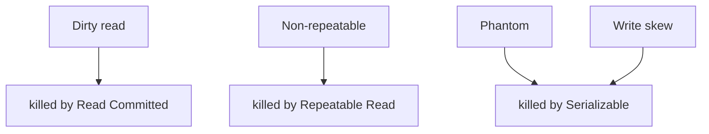

# Isolation and Anomalies

> [!abstract]
> - The **I** in ACID: what you are allowed to **see** while someone else is writing
> - Four named levels. Each one kills one more anomaly and costs more
> - Postgres default = **Read Committed**
> - Snapshot isolation ≠ Serializable. **Write skew** is the gap
> - How locks/versions implement this: [[03 - Concurrency Control]]

---

## ACID (one line each)

| Letter | Meaning | Not |
|---|---|---|
| **A**tomic | All statements in the txn happen, or none | “The whole microservice is atomic” |
| **C**onsistent | Constraints hold at commit (PK, FK, CHECK) | Business correctness of the *product* |
| **I**solated | Concurrent txns don’t see each other’s dirt (to the level you set) | “Nobody else exists” |
| **D**urable | After commit, a crash does not eat it — [[01 - Storage Engine and Disk IO]] | “We also wrote Kafka” |

- Consistent here is **the database’s constraints**, not CAP-C
- CAP-C is [[02 - Fundamentals]]

---

## The four levels

| Level | You can still see | Typical use |
|---|---|---|
| **Read Uncommitted** | Dirty reads | Almost nobody. Analytics dump if they truly don’t care. |
| **Read Committed** | No dirty. Still **non-repeatable** + **phantoms** | Postgres default. Most CRUD. |
| **Repeatable Read** | Same row again is the same. Still **phantoms** (SQL spec). InnoDB RR is stronger (next-key). | Report that must not see a mid-txn price change on a row it already read. |
| **Serializable** | Looks like txns ran **one at a time**. Phantoms gone. Write skew gone (if true SSI / 2PL serializable). | Money invariants, “at least one doctor on call” |

- Each step **up** is more blocking or more aborts (SSI retries)
- Don’t put Serializable on the whole app “to be safe”

---

## The anomalies (memorise the names)

### Dirty read

- T1 writes `qty = 4`, not committed
- T2 reads `4`
- T1 **rolls back** → qty is 5 again
- T2 made a decision on a ghost
- **Prevented by:** Read Committed and above

### Non-repeatable read

- T2 reads row `qty = 5`
- T1 commits `qty = 4`
- T2 reads the **same row** again → `4`
- Same txn, two answers
- **Prevented by:** Repeatable Read and above
- Read Committed **allows** this (each statement gets a new snapshot in Postgres)

### Phantom

- T2: `SELECT * FROM seats WHERE status='free'` → 3 rows
- T1 **inserts** a new free seat, commits
- T2 runs the same query → 4 rows
- Not “the row changed” — a **new row appeared** in the range
- **Prevented by:** Serializable (SQL spec). InnoDB Repeatable Read uses **gap / next-key locks** and mostly stops this too — say that if they poke MySQL

---

## Write skew (the one they use to see if you are senior)

### The story

- Invariant: **at least one** doctor on call
- Both Alice and Bob read “on-call count = 1” (themselves + nobody else — actually each sees the other still on)
- More honestly: both see “the other is on call, I can leave”
- Both `UPDATE me SET on_call = false` and commit
- Each update is valid in isolation
- Invariant is dead

### Why the lower levels allow it

- Neither txn updated the **same row**
- No lost update
- No dirty read
- Snapshot isolation is happy
- The constraint was on a **set**, not a row

### What kills it

- **Serializable** (Postgres SSI will abort one of them)
- An explicit lock / constraint on the invariant
    + `SELECT … FOR UPDATE` on a single “roster” row
    + `CHECK` that cannot be expressed easily — so you lock

> [!tip] HLD sentence
> - “If the invariant spans two rows, snapshot isolation can write-skew. I serializable that txn or lock a single row that *is* the invariant.”
> - Same one-liner lives in [[14 - Coordination and Concurrency]]

---

## What you pick on the board

| Situation | Isolation / tool |
|---|---|
| Read profile, update bio | Read Committed + `version` if two tabs |
| Decrement stock | Atomic `UPDATE … WHERE qty > 0` inside a txn |
| Seat hold | **Not** an open Serializable txn. State + TTL. |
| “≥1 on call” / two-row invariant | Serializable **or** lock the invariant row |
| Long analytics `SELECT` | Replica, not Serializable on primary |

- Postgres default RC is **fine** for most HLD
- You bump one txn, not the database

---

## Related Notes

- [[README]]
- [[03 - Concurrency Control]]
- [[14 - Coordination and Concurrency]]
- [[02 - Fundamentals]] — CAP-C is a different C
- [[11 - Interview Questions]]
