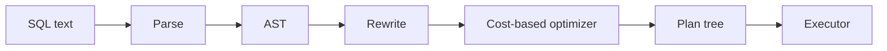
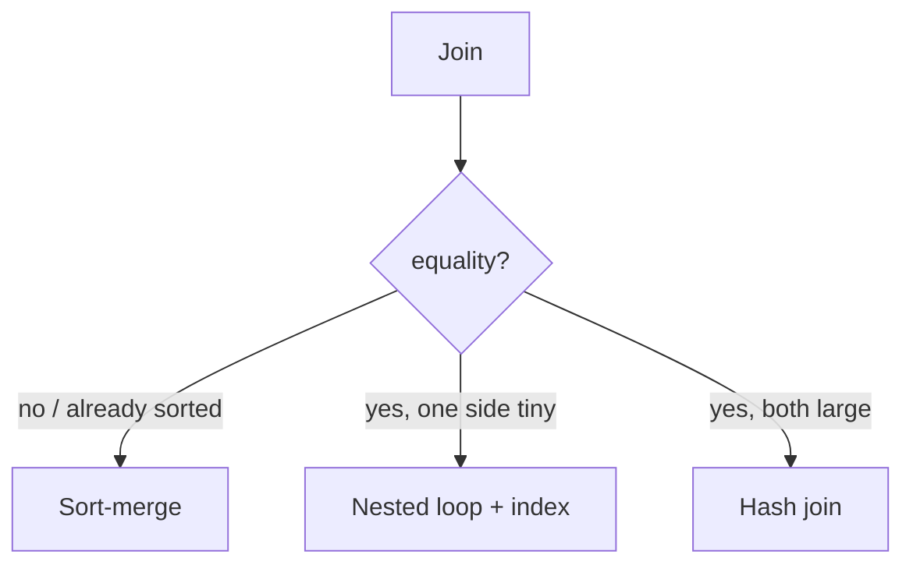

# Query Execution and Optimization

> [!abstract]
> - SQL is text. The engine turns it into a **tree of operators** and picks the **cheapest** tree it can estimate
> - Cost = estimated pages + CPU, from **statistics** (row counts, histograms)
> - Joins: nested loop, hash, sort-merge
> - Access path: seq scan vs index scan vs **index-only**
> - App-side killer: **N+1**
> - Interview move: `EXPLAIN`, not a guess

---

## From text to a plan

- **Parse** — tokens → **AST** (select list, from, where, join)
- **Rewrite** — view expansion, constant fold, subquery pull-up
- **CBO** — enumerate (some) legal plans, **cost** each, pick min
- **Executor** — pull tuples through the operators (or vectorised batches)

- You do not hand-write the AST in an HLD
- You **do** say “the optimizer picked a seq scan because the stats said 80% of the table matches”

---

## Cost-based optimizer

### What it uses

- **Cardinality** — how many rows will this filter return
- **Histograms** — distribution of a column (not just min/max)
    + `status` is 99% `done` → `WHERE status='open'` is selective
    + without a histogram the engine assumes uniformity and **lies**
- Table size, index height, cache hit guesses
- Cost units are made-up but **ordered**: random page >> sequential page >> CPU

### When the plan is stupid

- Stats are **stale** (`ANALYZE` / autovacuum)
- Correlation the histogram doesn’t capture (`city` + `zip`)
- Parameter the prepare didn’t see (`WHERE id = $1` looks like 1 row; you bound a popular id)

> [!warning] “I’ll add an index” is not a plan
> - If the predicate matches 40% of the table, a **seq scan is cheaper**
> - The CBO is allowed to ignore your index
> - That’s correct, not a bug

---

## Join algorithms

| Algorithm | How | Cost feel | When |
|---|---|---|---|
| **Nested loop** | For each row of outer, probe inner (often via **index**) | `O(N × cost of inner lookup)` | Small outer, or inner has an index on the join key |
| **Hash join** | Build a hash table of the **smaller** input, probe with the larger | `O(N+M)` memory for the build | Equality join, both sides big enough that NL is dumb |
| **Sort-merge** | Sort both on the join key, zip | `O(N log N + M log M)` or already-sorted (index) | Large joins, already ordered, or merge-friendly disk |

- Nested loop with a **seq scan inner** is the `O(N*M)` disaster they name
- Nested loop with an **index nested loop** is how `orders ⋈ users ON user_id` often runs
- Hash join **spills** to disk if the build side doesn’t fit RAM — still OK, just slower
- Sort-merge shines when both inputs come out of an index **already ordered**

---

## Access paths

| Path | What it does | When |
|---|---|---|
| **Sequential scan** | Read the heap front to back | Most of the table qualifies, or no useful index |
| **Index scan** | Walk the B+, then fetch heap TIDs | Selective predicate. Random heap I/O if the table is not clustered |
| **Bitmap index scan** | Collect TIDs, sort by page, then heap | Many matches — turns random into “each page once” |
| **Index-only scan** | Index has every needed column | Covering index + (Postgres) visibility map all-visible |

- Index scan is **not** always faster
- Index-only is the covering idea from [[02 - Indexing]]
- `ORDER BY` + `LIMIT` on an indexed column can stop early (no sort)

---

## N+1

- App: `SELECT * FROM users` then for each user `SELECT * FROM orders WHERE user_id=?`
- 1 + N round trips
- Fix
    + one `JOIN`
    + or `WHERE user_id IN (…)`
    + or a dataloader batch if you are in a GraphQL / ORM hole
- ORMs cause this by default — you still own it
- This is an **app** bug that shows up as “the DB is slow”

---

## EXPLAIN (what you say in the interview)

- `EXPLAIN` — estimated plan
- `EXPLAIN ANALYZE` — actually run, show real rows vs estimate
- Look for
    + seq scan on a huge table with a selective `WHERE` → missing / unused index
    + nested loop with huge inner
    + estimate 10 rows, actual 10 million → **stats**
- Don’t memorise Postgres node names beyond seq / index / hash / nested loop

---

## Related Notes

- [[README]]
- [[02 - Indexing]]
- [[07 - Data Modelling]]
- [[11 - Interview Questions]]
