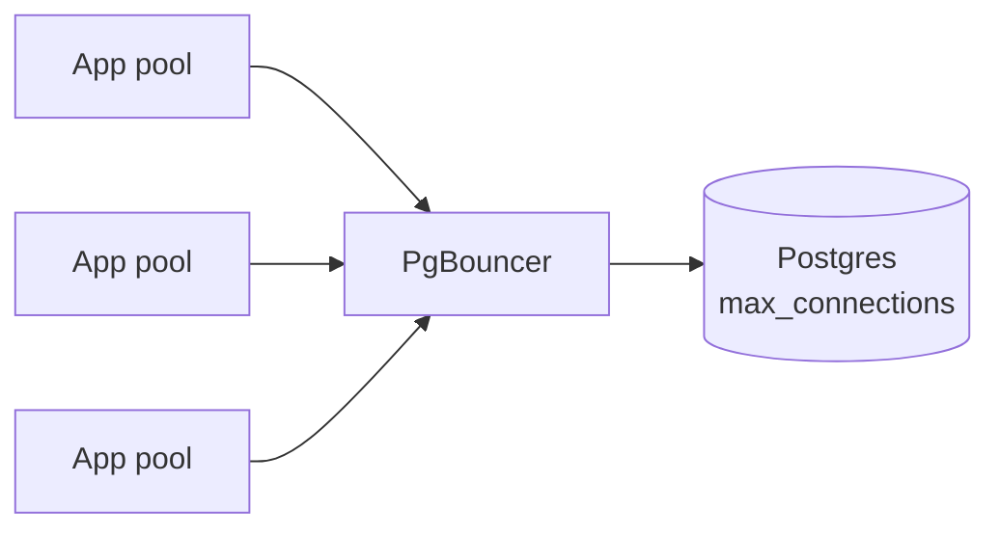

# Connections and Network I/O

> [!abstract]
> - A Postgres connection is a **process** (roughly). It is scarce and expensive
> - Opening TCP + TLS + auth **per query** will melt you
> - Apps share a **pool**. Many app boxes × a fat pool = too many server backends
> - Server-side: thread-per-connection vs **event-driven** (`epoll` / `kqueue`)
> - Ten-minute slice: [[05 - Databases]]

---

## Why a connection is expensive

- TCP handshake
- TLS handshake (the expensive part)
- Auth, session GUCs, maybe a backend **process** fork
- Memory per connection (Postgres: tens of MB possible)
- `max_connections` is a hard ceiling (often 100–400 on a box you have not tuned)

- One HTTP request that opens a new DB connection is a **bug**
- One HTTP request that **borrows** from a pool for 5 ms is the design

---

## Connection pooling

### App pool (Hikari, SQLAlchemy, pgxpool)

- Lives **in the app process**
- At startup: open `N` connections, keep them warm
- Request: checkout → query → checkin
- `N` is small
    + 5–20 per instance is common
    + not 50 “to be safe”

### The melt formula

- 200 app pods × 50 pool size = **10,000** backends
- Postgres will
    + refuse (`too many connections`)
    + or swap itself to death
- Fix
    + shrink per-instance pool
    + put a **pooler** in front (next)
    + don’t run 200 pods if 20 would do

### External pooler (PgBouncer)

- Sits between apps and Postgres
- Many client connections → few server connections
- Modes
    + **session** — client holds a server conn for the session (weak multiplexing)
    + **transaction** — server conn returned at `COMMIT` (the usual)
    + **statement** — even tighter; breaks session state
- Transaction pooling **breaks** session features
    + `SET`, temp tables, prepared statements unless you are careful
- You name PgBouncer when the **app count** is the problem, not when you have 2 boxes

> [!tip] Interview default
> - “Each app has a small pool. If we have many services, PgBouncer in transaction mode in front of Postgres.”
> - Don’t design PgBouncer internals

---

## I/O models (the server / proxy side)

### Thread- or process-per-connection

- One OS thread/process blocked in `read()` per client
- Simple
- 10k clients = 10k stacks + context switches
- Postgres **backends are processes** — this is why `max_connections` is small
- Classic Java app servers used to do this toward the DB too

### Event-driven + kernel notification

- One (or few) threads, **non-blocking** sockets
- Kernel tells you which fds are ready
    + Linux: **`epoll`**
    + BSD / macOS: **`kqueue`**
    + old: `select` / `poll` (linear scan, dies at high fd count)
- This is how Nginx, Redis, PgBouncer, Node, modern gateways hold **tens of thousands** of idle clients

| Model | Concurrent idle clients | Cost |
|---|---|---|
| Process/thread per conn | Hundreds–low thousands | Memory + scheduler |
| `epoll` / `kqueue` | Tens–hundreds of thousands idle | One loop, work when data arrives |

- **Idle** is the key word
    + 50k open TLS connections that rarely send is an `epoll` problem
    + 50k **active queries** is still “how many backends / cores”
- Multiplexing clients ≠ multiplexing **queries on one Postgres backend**
    + one backend still runs one query at a time
    + the pooler’s job is to not hold a backend while the client thinks

> [!info] Where this shows up in HLD
> - API gateway / websocket fan-in: event-driven
> - DB: still a small number of fat backends
> - Don’t say “Postgres uses epoll so we can have 100k queries”

---

## Related Notes

- [[README]]
- [[03 - Networking and APIs]]
- [[04 - Load Balancing CDN and Gateway]]
- [[11 - Interview Questions]]
- [[08 - Reliability]] — timeouts on the checkout from the pool
