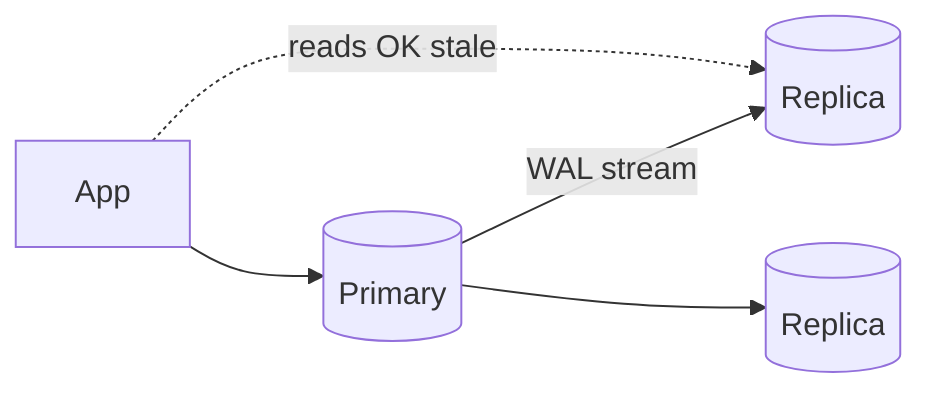

# Replication

> [!abstract]
> - Extra copies of the same data. Why: **reads**, **failover**, **backup**
> - Default design: **one primary, async replicas, cache in front**
> - Async means **lag**. After a write, read the primary or accept stale
> - How the bytes move: the replica is applying the **WAL** — [[01 - Storage Engine and Disk IO]]
> - Quorum math for leaderless stores: [[10 - Distributed Building Blocks]]

---

## Why you add a replica

- Scale **reads** (writes still hit one primary in the usual setup)
- Failover when the primary dies
- Backup / analytics without sitting on the OLTP box
- Not a substitute for **sharding** — that is when **writes or disk** don’t fit — [[09 - Sharding]]

---

## Topologies

| Mode | Write | Read | Failure |
|---|---|---|---|
| **Leader–follower** (primary–replica) | All writes to leader | Replicas for reads | Promote a replica |
| **Sync replica** | Write waits until replica has it | Up to date | Slower commits, stronger |
| **Async replica** | Write returns after leader WAL | Replica **lags** | Can lose last writes on failover |
| **Multi-leader** | Writes on both | Conflicts | Only if you must write in two regions |
| **Leaderless (quorum)** | `W` of `N` | `R` of `N`, want `R+W>N` | Dynamo / Cassandra |

---

## Sync vs async

### Async (the default you draw)

- Primary `fsync`s WAL, returns to the client
- Replica pulls / receives WAL and applies **later**
- Lag: 0 ms when quiet, **seconds** under load or a slow replica
- Failover
    + promote a replica
    + any txn that committed on the old primary and **not yet** on this replica is **gone**
    + that is the RPO sentence

### Sync

- Commit waits until at least one replica has the WAL
- You don’t lose those writes if the primary dies
- You **do** wait on the replica’s disk
    + a dead sync replica **blocks writes** (or you degrade — say how)

> [!tip] Interview default
> - One primary, **async** replicas
> - Mention lag out loud: “after a write, read the primary or accept ~100 ms stale”
> - Sync replica if they say “cannot lose the last payment”

---

## Read-your-writes

- User updates their name, then `GET /me` hits a **lagging** replica → old name
- Fixes
    + stick that user to primary for a second (session flag)
    + read-after-write always from primary
    + causal token / “read your write timestamp” (rare at SDE-1)
- Eventual is fine for **other people’s** feed
- It is not fine for **your own** submit-then-refresh

---

## Multi-leader

- Two regions both take writes
- Same row, two updates, no common order → **conflict**
- Resolves
    + last-write-wins (clocks lie)
    + store both, app merges
    + CRDTs — [[15 - Out of Scope]]
- Default: **don’t**. One writer region. If they force two, name the conflict

---

## Leaderless / quorum

- No primary. Client (or coordinator) sends to `N` replicas
- Write `W`, read `R`
- **`R + W > N`** → a read overlaps at least one latest write (usual assumptions)
- Classic: `N=3, W=2, R=2`
- Fast write: `W=1` → stale reads unless `R=N`
- This is **Cassandra / Dynamo**, not how you talk Postgres
- Depth: [[10 - Distributed Building Blocks]]
- CAP choice when a node is down: [[02 - Fundamentals]]

---

## What replication is **not**

- Not a cross-region active-active story unless you took multi-leader
- Not “now we can shard”
- Not CDC by itself
    + CDC **is** “someone tails the WAL for ES / Kafka”
    + [[10 - Distributed Building Blocks]] · [[06 - Ecosystem Resilience and Design Patterns]]

---

## Related Notes

- [[README]]
- [[01 - Storage Engine and Disk IO]]
- [[09 - Sharding]]
- [[02 - Fundamentals]]
- [[10 - Distributed Building Blocks]]
- [[11 - Interview Questions]]
