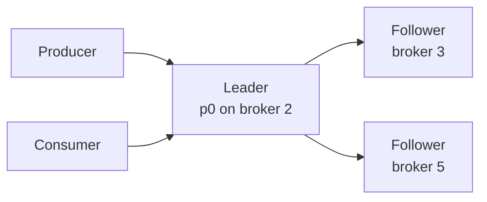
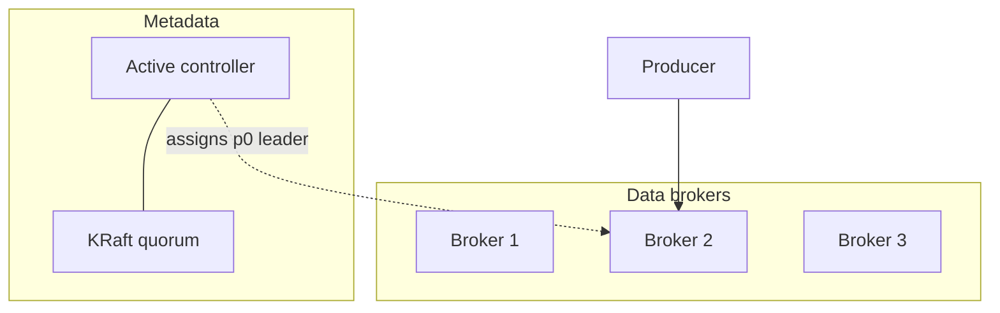

# Core Architecture and Cluster Consensus

> [!abstract]
> - A Kafka cluster is a bunch of **brokers** that store logs and serve produce / fetch
> - **Metadata** (who leads which partition, topic config, membership) is decided by a **controller**
> - Controller consensus used to live in **ZooKeeper**; now it lives in **KRaft** (Raft *inside* Kafka)
> - User records are **not** Rafted per message — a partition has one **leader** + **followers**
> - Ten-minute slice: [[07 - Async Messaging]]

---

## The pieces (say this first)

| Piece | Job | Not its job |
|---|---|---|
| **Broker** | One Kafka process. Stores partition files. Serves produce / fetch. | Track “did consumer C finish message 5?” |
| **Topic** | Named stream (`orders`) | Hold one giant ordered list of the world |
| **Partition** | One **ordered** log. Unit of parallelism. | Global order across the topic |
| **Controller** | Cluster brain: create topic, pick **partition** leaders, react to broker death | Sit on every produce |
| **KRaft quorum** | Raft for **metadata** only | Replacing ISR for your user records |

> [!tip] Dumb broker, smart consumer
> - The broker is a disk log. It stores the records and gives them out when a consumer **polls**. After that, it does not keep a per-message “waiting for this consumer to finish” list. Rabbit does keep that list. Kafka does not.
> - **Offset** = a number: “this group’s next record on this partition is #10461.” While the process is running, that number sits in the consumer’s memory. That is not enough — if the process dies, memory is gone.
> - **Commit** = the consumer **writes that number to Kafka** so it survives a crash. Kafka stores it in a compacted topic called `__consumer_offsets`, keyed by `(group, topic, partition)`. So: Kafka holds the durable bookmark. The consumer decides **when** to write it. The consumer does not keep the official bookmark only on its own disk.
> - You commit **after the handler has finished** (success or a deliberate skip). Then a restart continues from the next record. If you commit the moment you **poll** (or an auto-timer commits before the handler runs) and then crash, that record is never processed — you skipped it. Default you want: process first, then commit. Depth: [[05 - Consumer Mechanics and Scalability]]

---

## Brokers and Broker Configuration

### What a broker is

- One Kafka **process / node**
    + stores partition logs on disk
    + serves **produce** (writes) and **fetch** (reads)
- You run **several** brokers
    + one box dying does not take the cluster
    + a topic’s partitions are **spread** across brokers
    + more brokers → you can place more partitions → more produce and fetch in parallel
    + one broker holds **many topics**, and can also hold **several partitions of the same topic** (e.g. leader of `orders-p0`, follower of `orders-p2`)

### Config you actually name (don’t recite 200 keys)

| Knob                             | Why it exists                                  | Prod default you say                                    |
| -------------------------------- | ---------------------------------------------- | ------------------------------------------------------- |
| `broker.id`                      | Who this node is                               | Unique per broker                                       |
| `log.dirs`                       | Where the append-only segment files live       | Dedicated disks                                         |
| `num.partitions`                 | Default partition count for new topics         | You still set this **per-topic**                        |
| `default.replication.factor`     | How many copies of each partition              | ==3==                                                   |
| `min.insync.replicas`            | Durability floor for `acks=all`                | ==2== — [[03 - Replication Durability and Consistency]] |
| `unclean.leader.election.enable` | Promote a lagging replica if all ISR are dead? | **false** unless you chose uptime over the last writes  |

### What the broker does **not** do

- Track “has consumer C processed message 5?”
    + that is the **group’s offset**
    + stored in `__consumer_offsets` — [[05 - Consumer Mechanics and Scalability]]

---

## Controllers and Leader Controller Election

### Cluster metadata

- This is the cluster’s **address book**, not your `orders` records
- It answers
    + which topics exist
    + how many partitions each has
    + **which broker is leader of partition 7**
    + which brokers are alive
    + what the replica list is
- Someone has to **change** that book when you create a topic or a broker dies
- Someone has to **hand the book** to clients (“send `orders` partition 0 to broker 2”)

### What a controller does

- The **controller** is the Kafka role that **updates that address book**
- It does
    + create / delete a topic
    + assign partitions to brokers
    + when broker 4 dies, pick a new leader for each partition that 4 used to lead
- How the book is stored and how several machines agree on it is the next heading

### What it does **not** do

- Append your `OrderPlaced` bytes
    + that is the **partition leader**
- Sit on every produce
    + clients cache `partition → leader broker`
    + they refresh the book only when a produce comes back “not leader for this partition”

### Active controller

- Only **one** controller is allowed to change the address book at a time
- That one is the **active** controller
- If two controllers both changed the book, you would get two different “who leads partition 7” answers

### If the active controller dies

- Someone else must take the role, or the address book **cannot change**
- Who that someone is (and how they have the same book) is the next heading
- Produces already going to a **partition leader** keep going
    + they do not wait on the controller unless that partition’s leadership itself is moving

> [!info] Two different “leaders”
> - **Controller** = who updates the address book (who is *allowed* to be a partition leader)
> - **Partition leader** = who actually appends *this* partition’s log
> - Mixing these two up is a common interview fail

---

## Consensus Algorithms (KRaft vs ZooKeeper)

### Metadata log

- The address book is not a sticky note in one process’s RAM
- It is stored as an **append-only log of changes**
    + “created topic X”
    + “broker 4 is dead”
    + “p7 leader is now broker 2”
- That log is the **metadata log**
- Replay it from the start and you rebuild the current address book

### Raft

- **Raft** is how several machines keep **the same log**
- A change is real only after a **majority** has it (2 of 3, or 3 of 5)
- After that, if one machine dies, the others still have the book
- This is only for the **metadata log**
- Your user produce still goes to the **partition leader**, then to ISR followers
    + [[03 - Replication Durability and Consistency]]

### Controller quorum

- The **controller quorum** is the set of machines that keep the metadata log with Raft
- Usually 3 or 5
- One of them is the **active** controller (the Raft leader for this log)
- The others have a copy so the book does not die with one box
- They vote on **metadata**, not on who stores `orders`

**Combined vs isolated (both are KRaft)**

- **Combined** (`process.roles=broker,controller`)
    + same process is a data broker and a controller-eligible node
    + the quorum is some (or all) of the machines you already run as brokers
- **Isolated** (`process.roles=controller` on some boxes, `broker` on others)
    + controller nodes do not serve produce / fetch
    + the quorum is a separate 3 or 5 machines

### ZooKeeper (old world)

- Same jobs: address book + one active controller
- The book lived in **ZooKeeper**, a **separate** cluster with its own majority vote
- Kafka brokers did not store that log
- ZooKeeper’s job
    + store the book
    + help **elect** which Kafka **broker** is the active controller
- The controller is still a normal Kafka broker, not a ZooKeeper node
- When that broker dies, ZooKeeper is used to pick another **broker** as controller

### KRaft vs ZooKeeper

| | ZooKeeper era | KRaft |
|---|---|---|
| Where the address book lives | ZooKeeper’s own store | Metadata log **inside Kafka** |
| Who agrees on each change | ZooKeeper’s majority | Controller quorum (Raft) |
| Who is the active controller | One **Kafka broker**, chosen via ZK | One member of the **controller quorum** |
| Extra system to run | Yes (ZK) | No |

- If they still have ZK in an old shop: same *ideas* (controller, partition leaders), different place the book lives

> [!warning] Don’t oversell Raft
> - KRaft is for the **metadata log**
> - Not “every user message is a Raft round”

### Where the chain stops

- Kafka (old world) asked ZooKeeper to run the vote. ZooKeeper does **not** ask another product.
- You start ZooKeeper with a **list you typed**: server 1, 2, 3 (or 5). Those machines vote **among themselves**. That is the bottom.
- KRaft is the same idea with no extra product. You start the controller quorum with a voter list you typed (`controller.quorum.voters`). They vote **among themselves**.
- Lose a **majority** of that list → the address book **stops updating**. The chain does not continue. It **halts**.
- The only leftover “dependency” is bootstrap: a human types the first voter list. That is not another coordinator.

---

## Leader-Follower Mechanism

### Roles on one partition

| Role | Writes | Reads (classic) |
|---|---|---|
| **Leader** | All produces | Consumers (so they never see uncommitted) |
| **Follower** | Fetch from leader, append locally | Standby |

### Client connection

- Producer and consumer use the **same kind of connection**
- It is a **long-lived TCP** socket
- On it they speak the **Kafka protocol**: binary request / response, not HTTP
- The client opens **one socket per broker it needs**, and **reuses** that socket. Not a new TCP handshake per record
- TLS (if the port is encrypted) is that same TCP plus encryption. Still Kafka, not HTTPS

| | Producer | Consumer |
|---|---|---|
| Request | `Produce` | `Fetch` |
| Who waits | Client waits for an ack (or not, if `acks=0`) | Client sends Fetch. The **broker may wait** until there is enough data, then replies |
| Then | Next Produce on the **same** socket | Next Fetch on the **same** socket |

- The consumer is not a special connection type. Fetch is **long-poll**: the request stays open until new data or the wait expires
- The two wait knobs (`fetch.min.bytes`, `fetch.max.wait.ms`): [[05 - Consumer Mechanics and Scalability]]

### Write path

- The URL / bootstrap list you give the producer is **not** “the leader.” It is any brokers that can answer “who leads this partition?”
- What “connect to bootstrap” actually does
    + **1.** Client looks up the bootstrap hostname (DNS). DNS returns **IPs**. That is all DNS does.
    + **2.** If those IPs are an **NLB**, the NLB only forwards **TCP** to **one** backend broker. It does not read Kafka. It does not return the address book.
    + **3.** The TCP session is now with **that broker**.
    + **4.** The client sends a **Metadata** request on that socket.
    + **5.** **The broker** replies with `partition → leader host:port`.
    + **6.** The client opens **new** TCP connections to those advertised brokers (usually their real hostnames, not back through the same bootstrap name).
    + **7.** Produce goes on those sockets, to the **leader**.
- Writes always go to the leader, not to a random broker in the bootstrap list
- If it sends to a broker that is **not** the leader (stale metadata, or it hit a follower), that broker does **not** append the record. It replies “not leader for this partition.” The producer refreshes metadata and retries on the real leader
- Followers **pull** from the leader (fetch) and append locally. The leader does not push to them
- AWS MSK is this shape: a bootstrap hostname or list, then advertised brokers. An ALB does **not** pick the partition leader

### Read path

- Same socket type as above. The request on it is **Fetch**, not Produce
- Historically: consumers read from the **leader**
    + so you never see a message that isn’t committed to the ISR
- Newer: “fetch from follower” exists for locality
    + if they don’t name it, **leader reads** is the safe sentence
    + don’t lead with follower-fetch in an SDE-1 round
    + **Default:** produce → leader. Consume → leader. Followers only pull and stand by.
    + Consumers may read only up to the **high watermark** (on every ISR member). That is why classic fetch hits the leader. You never see a record that exists only on the leader and would vanish if it crashed. HW depth: [[03 - Replication Durability and Consistency]]
    + **Extra mode:** consumer Fetch from a follower in the same rack / AZ (`client.rack` + `broker.rack`). Writes still go to the leader.
    + **Rack** = a label for physical place. In a datacenter it was a real rack. On AWS you set it to the **AZ** (`ap-south-1a`). Brokers advertise `broker.rack`. The consumer sets `client.rack` to *its* AZ. Kafka then prefers a follower with the **same** label.
    + **Safe:** the follower still only serves data at or below the HW. Not dirty bytes from a lagging replica.
    + **Slightly worse:** that follower can be behind the leader’s tip. You may see committed data a moment later.
    + **Helpful:** less cross-AZ traffic. Less load on the leader.
    + Open with this only if they ask about leader load or AZ cost. Otherwise they hear “any replica, any data.”

### Leader dies

- Controller promotes someone from the **ISR**
    + not a replica that is 10 minutes behind
- Depth of ISR / HW / unclean election: [[03 - Replication Durability and Consistency]]

### How many of each

- **Replication factor** = usually ==3==
- **Partition count** = parallelism
    + how many: [[04 - Producer Mechanics and Delivery Guarantees]]
    + how consumers split them: [[05 - Consumer Mechanics and Scalability]]

---

## Picture of a cluster

- **KRaft** elects the **active controller**
- The **active controller** picks who leads `p0` (usually someone in the ISR) and writes that into the metadata log
- Producer talks to **broker 2** (the partition leader)
- Brokers 1 and 3 may hold **followers** of `p0`, or leaders of other partitions

---

## Related Notes

- [[Kafka/README]]
- [[03 - Replication Durability and Consistency]]
- [[07 - Async Messaging]]
