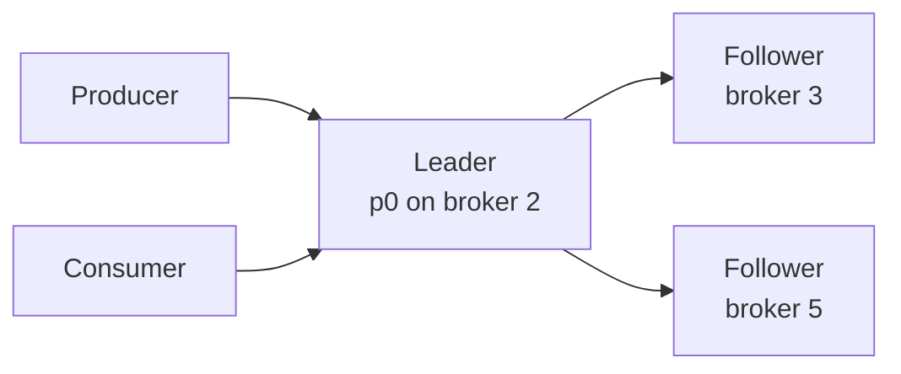
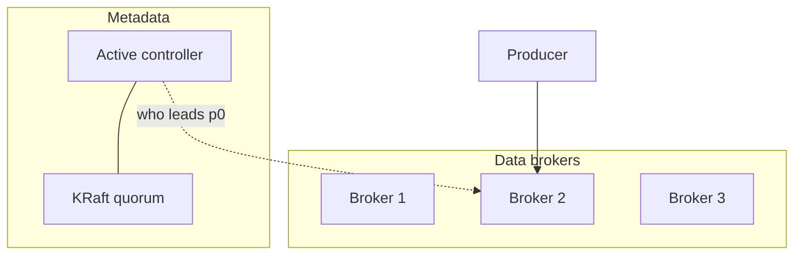

# Core Architecture and Cluster Consensus

> [!abstract]
> - A Kafka cluster is a bunch of **brokers** that store logs and serve produce / fetch
> - **Metadata** (who leads which partition, topic config, membership) is decided by a **controller**
> - Controller consensus used to live in **ZooKeeper**; now it lives in **KRaft** (Raft *inside* Kafka)
> - User records are **not** Rafted per message — a partition has one **leader** + **followers**
> - Ten-minute slice: [[07 - Async Messaging]]

---

## The pieces (say this first)

| Piece | Job | Not its job |
|---|---|---|
| **Broker** | One Kafka process. Stores partition files. Serves produce / fetch. | Track “did consumer C finish message 5?” |
| **Topic** | Named stream (`orders`) | Hold one giant ordered list of the world |
| **Partition** | One **ordered** log. Unit of parallelism. | Global order across the topic |
| **Controller** | Cluster brain: create topic, pick **partition** leaders, react to broker death | Sit on every produce |
| **KRaft quorum** | Raft for **metadata** only | Replacing ISR for your user records |

> [!tip] Dumb broker, smart consumer
> - The broker is a disk log
> - Offsets live with the **consumer group**, not on the broker’s “in-flight list”
> - Kafka does not babysit “has this message been processed?”

---

## Brokers and Broker Configuration

### What a broker is

- One Kafka **process / node**
  - stores partition logs on disk
  - serves **produce** (writes) and **fetch** (reads)
- You run **several** brokers
  - one box dying does not take the cluster
  - a topic’s partitions are **spread** across brokers
  - that spread **is** the horizontal-scale story

### Config you actually name (don’t recite 200 keys)

| Knob | Why it exists | Prod default you say |
|---|---|---|
| `broker.id` | Who this node is | Unique per broker |
| `log.dirs` | Where the append-only segment files live | Dedicated disks |
| `num.partitions` | Default partition count for new topics | You still set this **per-topic** |
| `default.replication.factor` | How many copies of each partition | ==3== |
| `min.insync.replicas` | Durability floor for `acks=all` | ==2== — [[03 - Replication Durability and Consistency]] |
| `unclean.leader.election.enable` | Promote a lagging replica if all ISR are dead? | **false** unless you chose uptime over the last writes |

### What the broker does **not** do

- Track “has consumer C processed message 5?”
  - that is the **group’s offset**
  - stored in `__consumer_offsets` — [[05 - Consumer Mechanics and Scalability]]
- Hold global order for a topic
  - order lives **inside one partition**

---

## Controllers and Leader Controller Election

### What the active controller does

- One broker is the **active controller** among the controller quorum
- Job is cluster **metadata**, not user bytes
  - topic created / deleted
  - partition assigned to brokers
  - “broker 4 died → pick a new leader for partition 7”

### What it does **not** do

- Append your `OrderPlaced` bytes
  - that is the **partition leader**
- Sit on the produce path
  - clients cache `partition → leader broker`
  - refresh metadata only when a produce comes back “not leader for this partition”

### If the controller dies

- Another member of the **controller quorum** becomes active
- Produces already in flight to a **partition leader** keep going
  - they do not wait on the controller unless leadership itself is moving

> [!info] Two different “leaders”
> - **Controller** = who is *allowed* to be a partition leader
> - **Partition leader** = who actually appends *this* partition’s log
> - Mixing these two up is a common interview fail

---

## Consensus Algorithms (KRaft vs ZooKeeper)

| Era | Where cluster state lives | What you operate | What you say |
|---|---|---|---|
| Legacy | **ZooKeeper** | Two systems to page on (Kafka + ZK) | Same *ideas* (controller, leaders), different place the metadata lives |
| Now | **KRaft** — Raft log **inside** Kafka | One process family | Metadata is a Kafka-internal log, Rafted across the controller quorum |

### What KRaft actually Rafts

- Topic config
- Partition assignment
- Who is the active controller
- Broker membership

### What KRaft does **not** Raft

- Your user produce
  - that still goes to the **partition leader**
  - then copies to **ISR followers**
  - depth: [[03 - Replication Durability and Consistency]]

> [!warning] Don’t oversell Raft
> - KRaft is for **metadata**
> - Not “every message is a Raft round”
> - If they still have ZK in an old shop: same ideas, different brain

---

## Leader-Follower Mechanism

### Roles on one partition

| Role | Writes | Reads (classic) |
|---|---|---|
| **Leader** | All produces | Consumers (so they never see uncommitted) |
| **Follower** | Fetch from leader, append locally | Standby |

### Write path

- Client is told the leader for that partition
- Produce to the **wrong** broker → redirected
  - produce is **not** “any node”
- Followers **pull** from the leader (fetch), they are not pushed to

### Read path

- Historically: consumers read from the **leader**
  - so you never see a message that isn’t committed to the ISR
- Newer: “fetch from follower” exists for locality
  - if they don’t name it, **leader reads** is the safe sentence
  - don’t lead with follower-fetch in an SDE-1 round

### Leader dies

- Controller promotes someone from the **ISR**
  - not a replica that is 10 minutes behind
- Depth of ISR / HW / unclean election: [[03 - Replication Durability and Consistency]]

### How many of each

- **Replication factor** = usually ==3==
- **Partition count** = parallelism
  - how many: [[04 - Producer Mechanics and Delivery Guarantees]]
  - how consumers split them: [[05 - Consumer Mechanics and Scalability]]

---

## Picture of a cluster

- Controller (via KRaft) decides **who leads p0**
- Producer talks to **broker 2** (the partition leader)
- Brokers 1 and 3 may hold **followers** of p0, or leaders of other partitions

---

## Related Notes

- [[Kafka/README]]
- [[03 - Replication Durability and Consistency]]
- [[07 - Async Messaging]]
