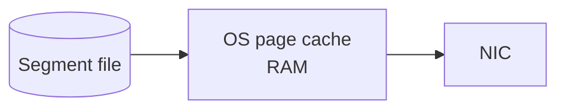

# Low-Level Storage and Performance I/O

> [!abstract]
> - A partition on disk is an **append-only log** — write only at the end, never `UPDATE` in the middle
> - Lookups use two **tiny sparse indexes** (offset → file position, timestamp → offset)
> - Hot bytes sit in the **OS page cache**, not a 32 GB JVM heap
> - Consumer fetch uses **`sendfile`** — page cache → socket, user space barely touches the payload
> - Cleanup is either **time/size retention** or **compaction** (keep latest value per key)

---

## Append-Only Logs

### What the log is

- A partition on disk = a **log** of **segment files**
- You only write at the **end**
    + no `UPDATE` in the middle
    + no rewrite of page 12
- Produce is cheap because it is **sequential I/O**
- Replay is cheap because an offset is just a **bookmark**

### Segments

- Active segment = the one currently being appended to
- Old segments get **closed** when size or time hits a limit
- Retention / compaction run on **closed** segments
    + not on the live tail
    + so the writer is never fighting the cleaner on the same file

> [!tip] Notebook
> - Producers add pages
> - Consumers are paperclips (offsets)
> - Nobody rewrites a page that already exists

| Consequence | Why we like it |
|---|---|
| Sequential disk | Cheap produces |
| Offset = bookmark | Replay is “move the bookmark” |
| Old segments close | Retention / compaction run on closed files, not the live tail |

---

## Index Structures (Offset Index and Time Index)

### Why indexes exist

- A segment can be **hundreds of MB**
- You cannot scan from byte 0 to find “offset `1_000_412`”
- You also cannot scan from byte 0 to find “messages after 10:00”

### The two indexes

| Index | Maps | Used for |
|---|---|---|
| **Offset index** | logical offset → file position | “start at offset X” |
| **Time index** | timestamp → offset | “messages after 10:00” |

### Sparse, not a B-tree of every record

- **Sparse** = a checkpoint every few KB / every N messages
    + not one entry per record
- Kafka jumps to the **nearest checkpoint**, then scans a little
- Indexes stay **tiny**; logs stay **huge**
- This is why “find offset X” is not a full-file scan

---

## OS Page Cache

### What Kafka does **not** do

- Keep the hot log in the **JVM heap**
- Run a 32 GB `-Xmx` so GC can murder you at 100k msg/s

### What it does instead

- Writes / reads **files**
- Lets **Linux page cache** hold recent bytes in RAM
- Heap stays **small**
    + GC does not eat the throughput
- If you restart the broker, page cache can still be **warm**
    + the OS didn’t need that RAM yet
    + first fetches after restart can still be cache hits

> [!warning] RAM is for the page cache
> - A tiny box that **pages out** kills this
> - A huge heap that **starves** the OS cache also kills this
> - Give the broker **RAM for cache**, not a fat `-Xmx`

---

## Zero-Copy (`sendfile`)

### Naive fetch (two copies)

- Kernel reads file → **user-space buffer**
- User-space copies → **kernel socket buffer**
- Two copies
    + CPU
    + GC pressure (those user buffers live on the heap)

### Kafka fetch (`sendfile`)

- Data is already in **page cache** (or comes from disk into cache)
- `sendfile` moves page-cache pages toward the **socket**
- User space barely touches the payload
- Fetch path is **network / sequential-disk bound**, not “Java memcpy”

> [!info] Interview line
> - “It’s Java, but throughput is **network / sequential-disk** bound, not GC-bound”
> - Page cache + `sendfile` + sequential append — that’s the whole trick
> - Depth they want: this note, not a JVM lecture

---

## Log Compaction Strategies

### Two different cleanup jobs

| | Retention (default) | Compaction |
|---|---|---|
| Drops | Older than N days (`retention.ms`) / bigger than N GB (`retention.bytes`) | Older **values for the same key** |
| What’s left | Recent **history** | **Latest state** per key |
| Use | Clicks, orders audit, “every event” | Changelog, `__consumer_offsets`, “current address for `user_id`” |
| Delete a key | Wait for time / size | **Tombstone** (`key=X, value=null`) |

> [!example] Same topic, two jobs
> - “7 days of every `user_id` event” → **retention**
> - “Current address for `user_id`” → **compaction**

### What compaction is

- For each **key**, keep the **latest value**
- Older updates for that key go away
- The log becomes a **changelog** — current state, not full history
- Used for
    + compacted “table” topics
    + `__consumer_offsets` (you care about the **last** commit per group-partition, not every commit ever)

### What compaction is **not**

- “Exactly one record forever, instantly”
    + it is **background**, on **old** segments
    + the tail can still have two updates for the same key until compact runs
- A substitute for audit
    + if you need **every event**, use retention
    + compaction will throw the history away on purpose

### Tombstones

- Produce `key=X, value=null`
- After compaction, X **disappears**
- That is how you delete a key on a compacted topic

---

## Related Notes

- [[Kafka/README]]
- [[08 - Interview Questions]]
- [[03 - Replication Durability and Consistency]]
- [[05 - Consumer Mechanics and Scalability]] — `__consumer_offsets` is compacted
