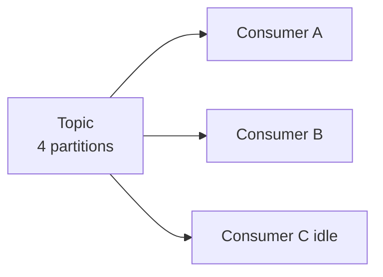

# Consumer Mechanics and Scalability

> [!abstract]
> - Consumers **pull** (that is backpressure) — they poll, the broker does not push
> - A **group** splits partitions; progress is an **offset** in `__consumer_offsets`
> - Two groups on the same topic each see **every** record
> - Rebalance used to stop the world (**eager**); **cooperative sticky** + **static membership** don’t have to
> - Two liveness clocks — mix them up and you get a fake-death storm
> - Adding consumers past partition count does **nothing**; a hot partition still pins one instance

---

## Pull vs Push Consumption

### Kafka pulls

- The consumer **polls**
- If you are slow, you poll less / fetch smaller
- The log waits (until retention)
- That is **consumer-managed backpressure**

### Why not push

- A push broker would pile memory on the consumer **or** the broker
- Kafka does not babysit your in-flight list on the broker

### Contrast with Rabbit

- Rabbit **pushes** / tracks unacked messages
- Rabbit can **prefetch**
- Kafka: you ask, you get a batch, you commit an offset when *you* decide you’re done

### Fetch wait knobs

- Fetch is a request on the **same long-lived TCP** as Produce. The broker can **hold that request** before it replies
- **`fetch.min.bytes`**
    + do not reply until the response is at least this many bytes
    + stops a flood of tiny Fetch replies
- **`fetch.max.wait.ms`**
    + do not wait longer than this, even if `min.bytes` is not met
    + reply with whatever you have (maybe empty)
- The broker replies at **whichever happens first**
    + enough bytes, or
    + the wait expires
- Trade-off
    + larger min + longer wait → fewer requests, better throughput, **higher** latency
    + small min + short wait → faster “I got something,” more chatter
- Socket / protocol / bootstrap steps: [[01 - Core Architecture and Cluster Consensus]]

---

## Consumer Groups and Offsets

### Two groups = two independent subscribers

- `email-workers` and `analytics` on `orders`
    + each group sees **every** order
    + they do not steal records from each other

### Inside one group

- One partition → **at most one** consumer (classic assignment)
- Scale out by adding instances **up to partition count**
- Instance 11 with 10 partitions sits **idle**

- 4 partitions, 3 consumers in the **same** group
    + two of them get work
    + one sits idle
    + you needed a 4th partition, not a 3rd consumer

### Partition vs consumer balancing (the curve)

- Let `n` = partitions, `c` = instances in **this** group
- Parallelism you actually get = `min(n, c)`
- Extra work always piles onto **someone** — assignment is “as even as integers allow,” not magically equal QPS

| Situation | What you get | What you do |
|---|---|---|
| `c < n` | Each consumer owns `ceil(n/c)` partitions. 10 parts / 3 consumers → **4 / 3 / 3**. | Fine. The 4-partition box is slightly hotter. |
| `c = n` | One partition per consumer. Clean. | This is the usual target. |
| `c > n` | `c - n` instances sit **idle**. | Adding pods does **nothing**. Add partitions first — or stop scaling this group. |
| `n >> c` | Each consumer owns a pile of partitions. | Parallelism did **not** increase. You paid files / memory / longer rebalance for no extra workers. |

- Adding a consumer
    + triggers a **rebalance**
    + only helps if `c` was `< n`
- Adding a partition
    + also rebalances
    + only helps if some consumer was the limiter **and** the new partition actually gets traffic
    + producer hash changes — [[04 - Producer Mechanics and Delivery Guarantees]]
- Prefer `n` that **divides** the `c` values you will run
    + 12 parts → 2 / 3 / 4 / 6 instances all get an even split
    + 10 parts + 3 instances cannot

### Hot partitions (consumer view)

- Even assignment of **partitions** ≠ even assignment of **load**
- One key / one tenant can be 80% of the topic
    + that partition has one owner in the group
    + that owner is at 100% CPU
    + the other consumers are bored
- More consumers **cannot** share that partition
    + one partition → at most one consumer in the group
- More partitions **cannot** split that key
    + same key → same partition
- What you say
    + this is the order contract, not a bug
    + fix the **key** (higher cardinality) or isolate the whale
    + don’t “scale the group to 50” and expect the celebrity lane to fork
- Depth (producer / hash / why `n` doesn’t save you): [[04 - Producer Mechanics and Delivery Guarantees]]

### Offset

- “Next record **this group** wants on **this partition**”
- Stored in topic `__consumer_offsets`
    + **compacted** — you care about the last commit, not every commit ever
    + [[02 - Low-Level Storage and Performance IO]]

| Commit style | What happens on crash | Failure mode |
|---|---|---|
| **Auto** (interval) | Easy to commit **before** you finished | **Lose** work (at-most-once) |
| **Manual after success** | Crash before commit → **replay** | Duplicates (at-least-once). This is what you want. |

### Commit frequency

- Too often = hammer `__consumer_offsets`
- Too rare = long replay after a crash
- Manual after success is the default you design for

### Lag

- **Lag** = HW − committed offset
- Alert on it
- Fix
    + more partitions + more instances (cap = partition count)
    + faster handler
    + produce slower
- Depth of “always lagging”: [[08 - Interview Questions]]

---

## Rebalance Protocols

### What triggers a rebalance

- Member **joins**
- Member **leaves**
- Topic’s **partition count** changes
- Someone is **kicked**
    + session timeout (heartbeat)
    + poll interval (processing)

### Eager (old, stop-the-world)

- Every member **revokes all** partitions
- Whole group **stops**
- New assignment from scratch
- That’s the **latency spike** they complain about

### Cooperative sticky (what you want)

- Keep partitions you still own
- Only **revoke the ones that must move**
- Rest of the group keeps polling
- “Sticky” = prefer not to shuffle for fun

| | Eager | Cooperative sticky |
|---|---|---|
| Partitions | All revoked | Only ones that **must move** |
| Group | Stop the world | Rest keep reading |
| Feel | Latency spike | Incremental handoff |

---

## Static Group Membership

### What `group.instance.id` is

- This process is a **named** member
- Not a random UUID each start

### Rolling restart

- Instance dies and comes back **before** session timeout
- Group does **not** treat it as a new stranger
- **No rebalance** (or a much smaller one)

### Dynamic membership (the default you don’t want for stateful nodes)

- Every deploy looks like leave + join
- Revoke storm every rollout

### When to use it

- Stateful consumers
- Kafka Streams nodes that should own the **same** partitions across restarts

---

## Consumer Liveness Knobs

### Two different “are you alive?” clocks

| Knob | Watches | Thread | If you miss it |
|---|---|---|---|
| `heartbeat.interval.ms` / `session.timeout.ms` | **Network** heartbeat | Heartbeat thread | Coordinator: you’re dead → rebalance |
| `max.poll.interval.ms` | Time **between polls** | Your processing / poll loop | Kicked even if heartbeats were **fine** |

> [!danger] Classic outage
> - Fat handler + small `max.poll.interval.ms`
> - Coordinator thinks you’re dead (**fake death**)
> - Rebalance
> - Next owner hits the **same** slow record
> - Storm

### Fixes

- Raise `max.poll.interval.ms` for fat work
- **Process faster** — shrink the handler
- Smaller `max.poll.records`
    + smaller batches so you can poll again before the interval
- Thread pool **only if**
    + you can still commit offsets correctly
    + order / exactly-once get harder the moment you leave the poll thread
    + don’t do this if per-key order is the invariant

---

## Related Notes

- [[Kafka/README]]
- [[08 - Interview Questions]]
- [[04 - Producer Mechanics and Delivery Guarantees]]
- [[02 - Task Scheduler]] — don’t fake a delay by sleeping in the consumer
