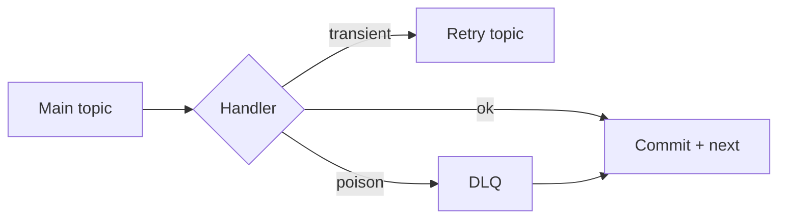
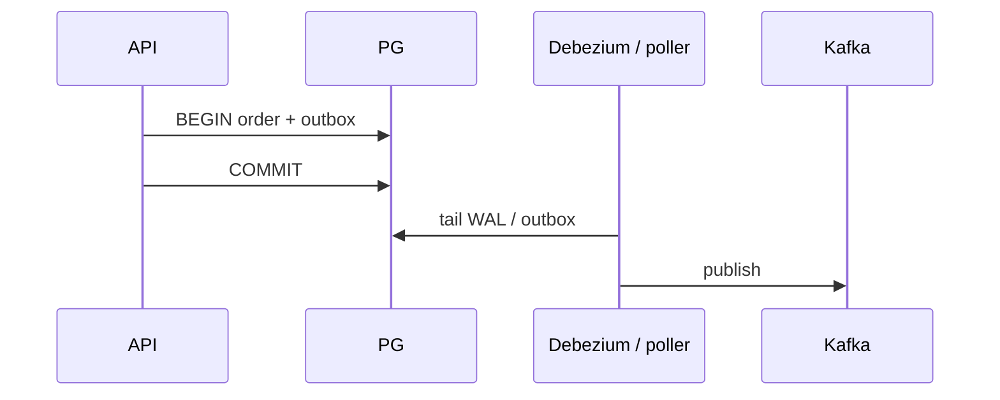

# Ecosystem, Resilience and Design Patterns

> [!abstract]
> - **Streams** = process *in* Kafka (your JVM, consume → transform → produce)
> - **Connect** = pipes in/out (Debezium tails Postgres WAL)
> - **Schema Registry** = contracts so service A adding a field doesn’t poison-pill service B
> - **DLQ** = poison pills don’t loop the group
> - **Outbox** = DB write + event without lying about a distributed transaction

---

## Kafka Streams

### What it is

- A **library in your app**, not a separate cluster you “install”
- Consume → transform → produce
- State stores: local **RocksDB** + a **changelog topic** (compacted)

### Stateless vs stateful

| Kind | Examples | State |
|---|---|---|
| Stateless | map, filter | None |
| Stateful | aggregate, join, window | Local RocksDB + **changelog topic** (replay if the instance dies) |

### Why static membership + enough partitions matter here

- State is **replayable** from the changelog if the instance dies
- You still want the **same** instance to own the same partitions after a rolling restart
    + [[05 - Consumer Mechanics and Scalability]] — `group.instance.id`

### EOS in Streams

- Streams can wrap the loop in a **transaction**
    + read-process-write + offset commit in one txn
- Still **not** your Postgres
    + DB + Kafka is still outbox (below)

> [!tip] HLD default
> - “Send email on order” → a **consumer group** is enough
> - Don’t start an HLD with “I’ll write a Streams cluster” unless the **product is the pipeline**

---

## Kafka Connect + Debezium

### Connect

- **Framework** for source / sink
    + DB → Kafka
    + Kafka → ES / S3
- You run **connectors**, not a hand-rolled poller for every table
    + unless the connector is worse than 50 lines

### Debezium

- CDC
- Tails Postgres **WAL**
- Emits row-change events
- That’s how an **outbox table** (or the table itself) becomes a topic
    + **without** the API calling `producer.send`

### What Connect is not

- Not magic consistency
- Mis-set a connector and you **duplicate**
- Still **at-least-once** unless the sink is idempotent

---

## Schema Registry

### Why it exists

- Producers and consumers don’t share a repo
- A record on the wire is **bytes**
- **Avro / Protobuf / JSON Schema** + a **registry**
    + writer embeds a **schema id**
    + reader fetches the schema

### Compatibility

| Mode | Meaning | Typical safe change |
|---|---|---|
| Backward | New **reader** can read **old** data | Add an **optional** field |
| Forward | Old reader can read **new** data | Don’t delete fields they still need |
| Full | Both | The tight contract |

> [!warning] Without this
> - Service A adds a field
> - Service B NPEs
> - **Poison pill**
> - Registry is the **contract**, not a nice-to-have

---

## Error Handling (DLQ and Retry Topics)

### Transient (503, timeout)

- Retry with **backoff**
- A **retry topic** (or delayed retry) keeps the **main** partition moving
- Don’t `sleep(60)` on the hot partition
    + that blocks every record behind this one

### Poison pill (bad JSON, forever-fail, deserialization crash)

- If you **don’t** commit, the same record blocks the partition forever
- After rebalance, it **kills the next instance**
- Cascading crash of the whole group

### DLQ

- Catch the exception locally
- Log it
- Produce the payload to `topic.dlq`
- **Commit the bad offset anyway**
- Continue
- Humans / a replay job own the DLQ
- Don’t retry **400s** on the hot path

> [!danger] Never commit = group death loop
> - Offset never advances
> - Every new owner dies on the same record
> - This is the poison-pill interview question — [[08 - Interview Questions]]

---

## The Outbox Pattern

### The anti-pattern (dual write)

- `INSERT order` then `kafka.send` in the **same API request**
- One can succeed, the other fail
    + crash between them
    + network partition
    + broker down after the DB commit
- That is **not** a transaction

### The pattern

1. Same **Postgres transaction**: business row + `outbox` row
2. Something else publishes the outbox → Kafka
   - poller: `SELECT … FOR UPDATE SKIP LOCKED`, publish, mark sent
   - **or** Debezium on the `outbox` table / WAL

### Why CDC-from-outbox is the tight version

- If the API also `kafka.send` **after** commit, you can still crash in between
- Tailing the WAL means: if the row committed, the event **will** be published
    + eventually

### What you tell them about consistency

- This is **eventual**
- The row is committed; the topic lags milliseconds
- Users do **not** need the email in the same 50 ms as `201 Created`
- No 2PC with the broker
    + Kafka transactions are **inside** Kafka, not with Postgres
    + [[04 - Producer Mechanics and Delivery Guarantees]]

### The other side: inbox

- Consumer writes `event_id` in the **same txn** as the side effect
- Replay of the same event → conflict / no-op
- [[14 - Coordination and Concurrency]]

---

## Related Notes

- [[Kafka/README]]
- [[07 - Async Messaging]]
- [[07 - Event-Driven Architecture and System Trade-offs]]
- [[14 - Coordination and Concurrency]]
