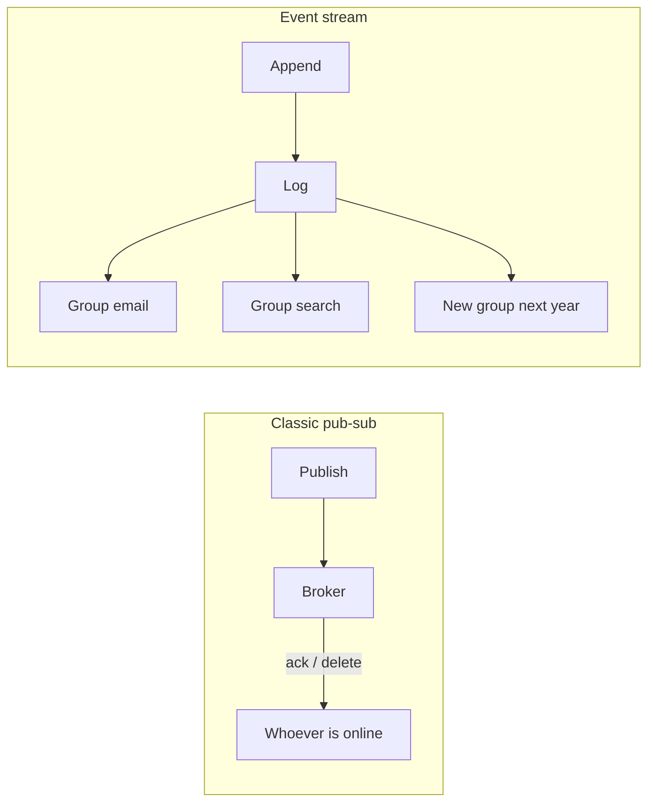

# Event-Driven Architecture and System Trade-offs

> [!abstract]
> - Pick the **shape** first (job vs event history), then the broker
> - Kafka is a **log**. Rabbit / SQS are **queues**. They are not “faster Kafka.”
> - Frame: **smart broker** (Rabbit) vs **smart consumer** (Kafka)
> - Don’t put the card charge only on a fire-and-forget topic

---

## Smart broker vs smart consumer

| | Kafka | RabbitMQ | SQS |
|---|---|---|---|
| Brain | Dumb log. **You** track offsets. | Broker tracks unacked, NACK, routing, priority | AWS tracks visibility timeout |
| After consume | Stays until **retention** | Usually **gone** on ack | Gone on delete / ack |
| Replay | Reset offset — first-class | Awkward (you’re late) | No (unless you copied it yourself) |
| Order | Per **partition** | Per queue + priority | Standard: none. FIFO: yes, **capped TPS** |
| Routing | Topic + key → partition | Exchanges (direct / topic / fanout) + bindings | One queue, simple |
| Throughput | Sequential disk, batch, zero-copy | Lower — not the point | Fine for workers; FIFO is the bottleneck |
| Latency | Batching / linger | Often **lower** for a single small job | Fine; not a stream |
| Message size | Prefer small; huge blobs → **S3 + id** | Also unhappy at tens of MB | Same — don’t put the video in the message |
| Ops | You (or MSK) | You | Almost none |
| Best at | Fan-out, audit, CDC, Streams, many groups on one history | Work queues, retry *this* message, priority, fancy routing | Decouple a worker / Lambda, zero cluster |

> [!tip] Pick in one line
> - Jobs / NACK / priority / “do this once” → **Rabbit**
> - Many subscribers + replay + per-key order at scale → **Kafka**
> - Zero ops, no history → **SQS** (FIFO if order — **TPS cap**)

---

## Kafka vs RabbitMQ (the fight they want)

### Pick Rabbit when the broker must be smart

- This message failed → **requeue / NACK**
- This one is **priority**
- Route by 5 headers through exchanges / bindings
- Work queue, “eat once,” competing consumers
- A payment **job** with retry / NACK is a queue-shaped problem

### Pick Kafka when time-decoupling matters

- Analytics onboarded in June still reads **May**
- Search and email are **two groups** on the same topic
- Audit / CDC / Streams
- Strict **per-key** order at high fan-out

### Latency vs throughput

- Rabbit often wins a **single small job**
- Kafka wins **throughput**
  - batch
  - sequential disk
  - zero-copy
  - [[02 - Low-Level Storage and Performance IO]]
- Huge payloads: **S3 + id** in either case
  - neither broker wants a 50 MB message

> [!warning] Don’t say “Kafka is always better”
> - A payment job with retry / NACK is a **queue**
> - A log of every `OrderPlaced` for five independent subscribers is a **stream**

---

## Kafka vs SQS

### What SQS is

- **No brokers on your on-call** (almost)
- Standard
  - at-least-once
  - **no** order
- FIFO
  - order + dedupe
  - **throughput cap** — say this, don’t hide it

### What SQS cannot do

- Replay of “last 2 days for a new analytics group”
  - unless you kept a copy yourself
- Several **consumer groups** on one log
- CDC / Streams / compacted changelog

### When to use which

- SQS: the product is “decouple this Lambda / worker” and you will **not** sell replay
- Kafka: the **log is the product**

---

## Pub-Sub vs Event Streaming

| | Ephemeral pub-sub (queue) | Event stream (Kafka) |
|---|---|---|
| Missed it while down | Usually **gone** | Still on disk if retention allows |
| New consumer | Starts **now** | Can start at **offset 0** or a timestamp |
| After consume | Deleted on ack | Stays until retention / compaction |
| You pay | Simpler broker | Disk + lag alerts + retention policy |
| You gain | “Do this job once” | Decoupling in **time**, not just in process |

### Trade-off in one breath

- You pay **disk + retention + consumer-lag ops**
- You gain a new team in June still reading May
- That is the whole EDA pitch for Kafka

---

## What does **not** go on a fire-and-forget topic

- Card **capture** as the only write
- “Exactly this once” **without** an idempotent sink
- Anything where “the event vanished and we charged twice / never charged” is a lawsuit

### HLD default

- User request writes the **DB first** (or outbox)
- Topic = email, search, analytics, push
- Don’t put the **money** only on a topic
- [[06 - Ecosystem Resilience and Design Patterns]]

---

## Related Notes

- [[Kafka/README]]
- [[08 - Interview Questions]]
- [[07 - Async Messaging]]
- [[06 - Ecosystem Resilience and Design Patterns]]
