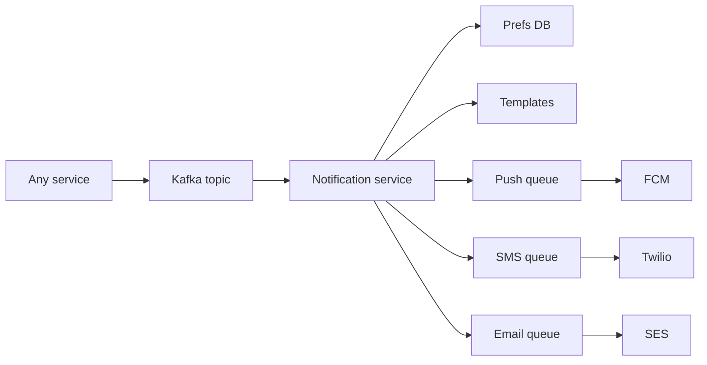

# Mini Designs

> [!abstract] These are the designs SDE-1 loops actually run. Each one is a **vehicle for building blocks**, not a product to memorise. Walk the first six from a blank board until the hard part is the first sentence you say.

How to use: timer 20 minutes. Requirements → 6 boxes → one deep dive. Then check this note.

Building blocks: [[01 - How the Round Works|script]] · [[05 - Databases]] · [[06 - Caching]] · [[07 - Async Messaging]] · [[08 - Reliability]]

---

## 1. URL shortener — **the one they will ask**

**Does:** `POST longUrl → shortCode`. `GET /{code} → 302` to long URL. Optional: custom alias, expiry, click count.

**Why it's asked:** unique ID, read-heavy cache, 301 vs 302, nothing else.

**NFRs:** redirects << 100 ms, uniqueness, high availability. Analytics **off the hot path**.

**APIs:** `POST /urls` `{longUrl}` → `{shortUrl}`. `GET /{code}` → 302.

**Boxes:** client → gateway → write service / redirect service → Redis → Postgres. Kafka for clicks.

**Hard part — generating codes:**

- 7 chars base62 ≈ 62^7 ~ 3.5e12 keys. Enough.
- **Counter / snowflake → base62.** No collision if the counter is unique. Best default.
- Hash(longUrl) and take prefix — collisions, need retry; same URL maps to same code (sometimes wanted).
- Pre-generate a key pool in Redis.

**301 vs 302:** 301 is cached forever by browsers — you lose click counts and cannot change destination. **302** (or 307) so every click hits you. Say this; they listen for it.

**Redirect path:** Redis GET → 302. Miss → Postgres (index on `code`) → fill Redis. Write click event to Kafka **after** responding.

**DB:** `code PK, long_url, created_at, expires_at, user_id`. That's it.

Follow-ups: custom alias uniqueness (insert, handle conflict), expiry (TTL in Redis + column), abuse (rate limit POST).

---

## 2. Rate limiter — **the other one they will ask**

Covered as a component in [[08 - Reliability]]. As a **design**:

**Does:** N requests per user/IP/key per window. Else 429 + Retry-After. Rules per endpoint.

**Where:** gateway, before the service.

**Pick:** token bucket in **Redis + Lua** (atomic get-refill-consume). Sliding window counter if they want smoother windows.

**Distributed:** cannot be process-local. Redis is the shared counter.

**Deep dives:** burst vs sustained, many dimensions (user AND ip AND route), Redis down (fail open vs fail closed — **auth/payments fail closed, public read fail open**), clock skew (use Redis time).

---

## 3. Notification system — **most common "product" design**

**Does:** send push / SMS / email. Preferences. No duplicates. Scale to bursts (flash sale, "your order shipped").

**Hard part:** **fanout + idempotency + channel choice**, not "FCM exists."



- Producer drops an event `{user_id, type, payload, event_id}`. Does not call FCM itself.
- Notification service: load prefs (don't SMS at 3am if they said no), render template, enqueue **per channel**.
- Workers call providers. Retry + DLQ. Dedup on `event_id + channel`.
- Provider rate limits — **their** 429 is why you have queues.
- Priority: OTP vs marketing. Separate queues so marketing cannot starve OTP.

Follow-ups: 10M users for one event (chunk, don't SELECT all in one query), quiet hours, device tokens table, unread badge (that's a different counter).

---

## 4. Unique ID generator

Often a **5-minute deep dive** inside URL shortener / tweets, not a full round.

Walk [[10 - Distributed Building Blocks]] snowflake. Mention UUID if they don't need sortability. Mention "DB sequence per shard with an offset" as the boring alternative.

---

## 5. Chat (1-1 first, then groups)

**Does:** send message, history, online, (optional) receipts.

**Hard part:** **WebSockets + where messages live + fanout to devices.**

- Connection gateway: sticky L4 or a WS cluster. User session → `user_id → {connection_id, node}` in Redis.
- Send: persist first (Cassandra / Dynamo keyed by `chat_id + timestamp`, or Postgres until scale), then push to recipient's node via Redis pub/sub.
- If offline: store, push notification via [[#3. Notification system]].
- History: paginate by cursor (`before ts`).
- Groups: fanout to members (small group: write N copies or one copy + member list). Large group: don't write 1M rows on each message — store once, members pull / fanout online only.

**Don't** use a single Postgres table scanned by `ORDER BY ts` without `(chat_id, ts)` index.

Presence: heartbeat to Redis with TTL. "Online" is eventual.

---

## 6. News feed / Twitter-lite

**Does:** post, follow, home timeline.

**Hard part:** **fanout-on-write vs fanout-on-read.**

| | Write | Read | Who |
|---|---|---|---|
| Fanout on write | on post, push `post_id` to each follower's Redis list | cheap GET list | celebs explode writes |
| Fanout on read | just store the post | pull from everyone you follow, merge | slow for 1k follows |
| **Hybrid** | write-fanout for normal users, read-fanout for celebrities | | the actual answer |

Store posts in DB (shard by `author_id`). Timeline cache: Redis list/sorted set of `post_id` per user, trim to 800. Hydrate bodies from post cache.

Follow graph: Postgres or graph. Not the first bottleneck.

Ranking: start chronological. Rank is a later worker.

---

## 7. File upload / Dropbox-lite

**Does:** upload, download, share link.

**Hard part:** **bytes never go through the app.** Presigned S3, metadata in Postgres, CDN on download. Multipart for large. Hash for dedup. Optional: chunk + sync (delta) — say "phase 2."

Full walk: [[04 - Multipart Upload]].

Conflict (two devices edit): last-write-wins or store versions. Don't design CRDTs unless they ask.

---

## 8. Pastebin

URL shortener + blob. Small text in Postgres; large paste in S3. Expiry = TTL. Same 302/cache story.

---

## 9. Autocomplete / typeahead

**Does:** prefix → top 10 queries.

**Hard part:** **not a SQL `LIKE prefix%` at 10k QPS.**

Offline: aggregate query logs → top-K per prefix. Load into a trie in memory on each app box, or ES completion, or Redis sorted sets per prefix (`za`, `zam`, `zoma`…).

Freshen with a pipeline (Kafka counts → periodic rebuild). Typo tolerance is extra (edit distance) — mention, don't build.

---

## 10. Nearby / "places around me"

[[09 - Storage Search and Geo]]. Redis GEO for moving things, PostGIS/geohash for static places. Return ranked by distance + score. Don't scan the planet.

---

## 11. Ticket booking / inventory

**Does:** browse, hold seat, pay, confirm.

**Hard part:** **don't double-sell.**

- Seat row in Postgres. Transaction: `UPDATE seats SET status='held', hold_until=now()+10m, version=version+1 WHERE id=? AND status='free'`.
- Or Redis lock with TTL + DB write.
- Payment success → `sold`. Timeout worker → release holds.
- Cache for **browse** (event page) must not be the source of truth for remaining seats — or accept "you clicked, it's gone."

This is the same skeleton as limited-stock checkout.

Full walk: [[06 - Seat Booking]].

---

## 12. Payments backend (the slice, not Stripe)

**Does:** charge for an order.

**Hard part:** **idempotency + state machine + you never store cards.**

```
created → payment_pending → paid
                ↘ failed
                ↘ refunded
```

- Call payment gateway with `Idempotency-Key = order_id`.
- Webhook confirms (don't trust only the client redirect). Webhook must be idempotent too.
- Outbox: order paid → Kafka → notifications, fulfilment.
- Refunds are a second state machine, not `DELETE`.

Strong consistency on the money tables. Everything else can lag.

Full walk: [[07 - Wallet and Ledger]].

---

## 13. Know-the-shape (don't memorise full designs)

**Video streaming:** upload → transcode workers (many bitrates) → S3 → CDN. Metadata in DB. Player uses HLS. Auth on the manifest. [[Netflix HLD]] if extra time.

**Ride matching:** rider request → geo query drivers (Redis GEO) → score → offer with short TTL lock → track WS. Matching is the hard part, not the map tiles.

**Web crawler:** URL frontier (queue + bloom "seen"), politeness per domain, workers fetch, store raw, parse links back to frontier. Not an SDE-1 favourite but it's on Grokking lists.

**Key-value store:** consistent hashing, replication factor, quorum, hinted handoff. SDE-2 infra interview. Know the words from [[10 - Distributed Building Blocks]].

**Metrics:** agents → Kafka → TSDB. Don't write metrics to the product Postgres.

---

## Related Notes

- [[13 - Question Bank]]
- [[01 - How the Round Works]]
