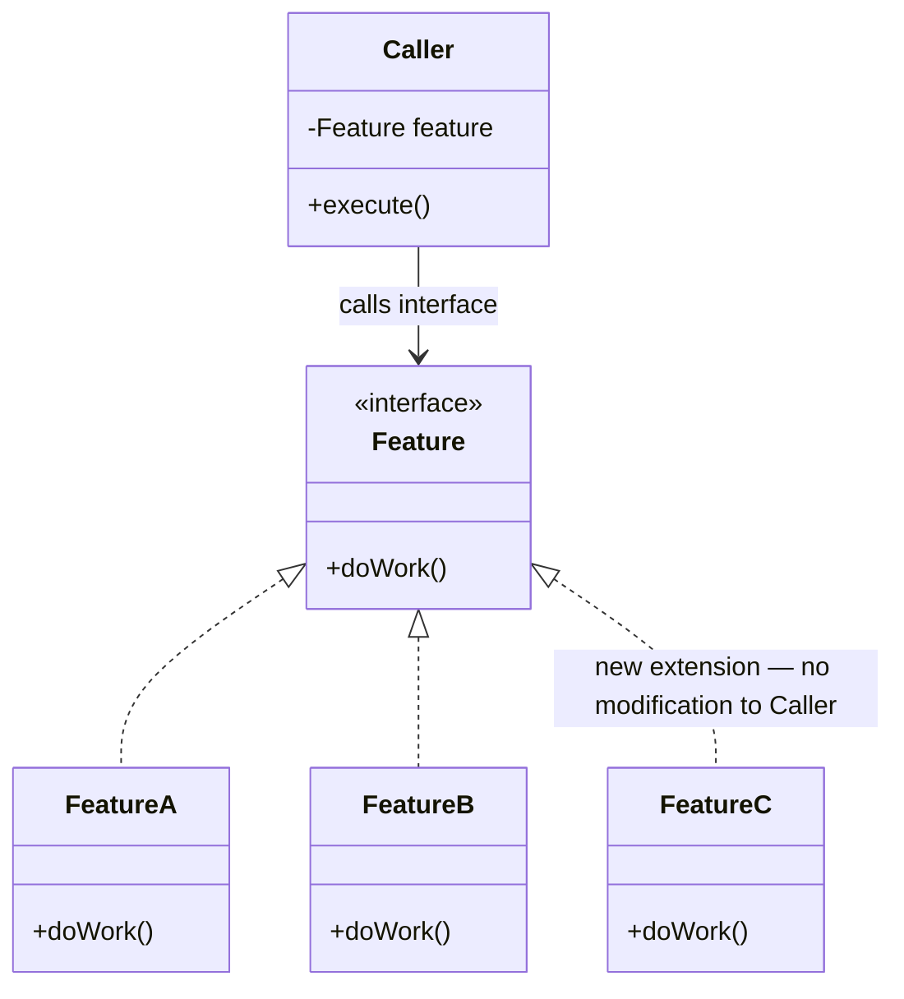

# Open-Close Principle

> [!abstract] A class should be open for extension but closed for modification.

## Definition

A class should be **open for extension** but **closed for modification**. You should be able to extend or add new features to a class's behaviour without having to modify the in-production source code of that class.

This clarifies what the definition actually means — you never go back and edit the existing class. You add new behaviour by writing new code (new classes), not by changing old code.

---

## The Engine — Runtime Polymorphism

The mechanism that makes OCP possible is **runtime polymorphism** via interfaces (or abstract classes).

Instead of a class containing if-else or switch-case blocks that check the object type and execute different logic for each, the class attaches to an **interface**. Each variant implements that interface. When a new feature/variant is needed, you add a new implementation — the existing class never changes.

This decouples the "what to do" (interface contract) from the "how to do it" (concrete implementation). The calling class doesn't know or care which implementation it's talking to — it just calls the interface method.

> [!info] The magic
> Runtime polymorphism with interfaces gives you the switch-case happening *magically* without you having to code it out. The language itself resolves which implementation to call at runtime — you never write that branching logic. The dispatch is built into the language, for free.



Adding `FeatureC` means writing one new class. `Caller` is never touched.

---

## What Happens if OCP is Violated

- Every time you modify existing code to add a feature, you risk introducing **regression bugs** into a system that was previously working perfectly.
- The codebase becomes increasingly fragile over time — each addition requires re-testing everything the modified class touches, not just the new feature.

---

## How to Check if Code Follows OCP

**The giveaway:** lots of if-else or switch-case blocks that branch execution logic based on the type of object you're dealing with.

**The question to ask yourself:** if we had to later expand or add new features/behaviours to this class, would we have to modify the existing in-production codebase? If yes — OCP is violated.

---

## Example — NotificationSender

### Step 1: The Bad Code (violates both SRP and OCP)

```java
public enum NotificationType {
    SMS, EMAIL, PUSH, WHATSAPP;

    public void sendSMSNotification(String message) { /* ... */ }
    public void sendEmailNotification(String message) { /* ... */ }
    public void sendPushNotification(String message) { /* ... */ }
    public void sendWhatsAppNotification(String message) { /* ... */ }
}
```

```java
public class NotificationSender {
    public void sendNotifications(List<NotificationType> notificationTypes) {
        for (NotificationType notificationType : notificationTypes) {
            switch (notificationType) {
                case SMS:
                    notificationType.sendSMSNotification(message); break;
                case EMAIL:
                    notificationType.sendEmailNotification(message); break;
                case PUSH:
                    notificationType.sendPushNotification(message); break;
                case WHATSAPP:
                    notificationType.sendWhatsAppNotification(message); break;
            }
        }
    }
}
```

Problems: `NotificationType` is a monster enum doing everything (SRP violated). `NotificationSender` has a switch-case that must be modified for every new notification type (OCP violated).

### Step 2: Fix SRP (but OCP still violated)

Break the enum into separate classes — `EmailNotification`, `SMSNotification`, `PushNotification`. Each class owns its own send logic.

```java
public class NotificationSender {
    public void sendNotifications(List<String> notificationTypes, String message) {
        for (String notificationType : notificationTypes) {
            switch (notificationType) {
                case "EMAIL":
                    new EmailNotification().sendEmailNotification(message); break;
                case "SMS":
                    new SMSNotification().sendSMSNotification(message); break;
                case "PUSH":
                    new PushNotification().sendPushNotification(message); break;
            }
        }
    }
}
```

SRP is now satisfied — each notification type is its own class. But OCP is still violated: adding WhatsApp means modifying `NotificationSender` to add another case.

### Step 3: Fix OCP — Interface + Polymorphism

```java
public interface Notification {
    void sendMessage(String message);
}
```

```java
public class EmailNotification implements Notification {
    @Override
    public void sendMessage(String message) {
        System.out.println("Email notification: " + message);
    }
}
// SMSNotification, PushNotification, etc. — same pattern
```

```java
public class NotificationSender {
    public void sendNotifications(List<Notification> notifications, String message) {
        for (Notification notification : notifications) {
            notification.sendMessage(message);
        }
    }
}
```

Now `NotificationSender` is **closed for modification** — it never changes. To add WhatsApp, just write `WhatsAppNotification implements Notification`. The sender doesn't know or care. Runtime polymorphism does the dispatch.

---

## Extracted To

*(will be updated as the design evolves)*

## Related Notes

- [[01 - SOLID Principles/01 - Single Responsibility Principle]]
