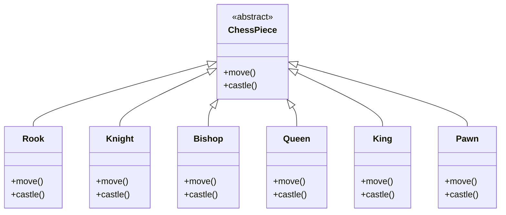
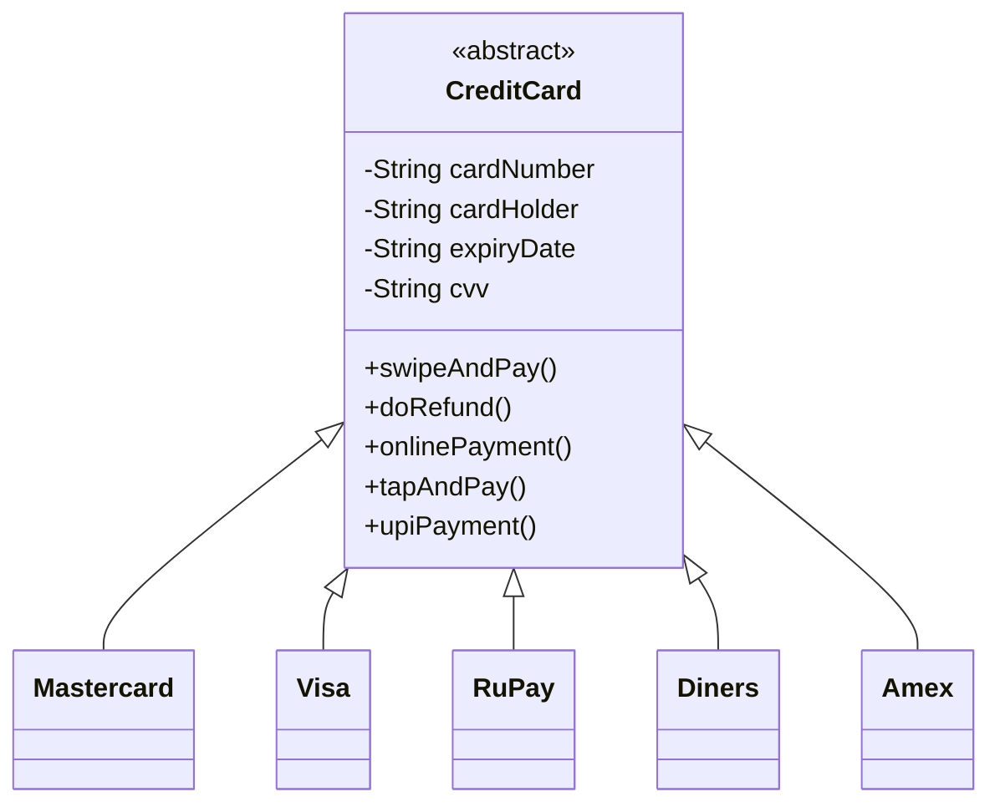

# Interface Segregation Principle

> [!abstract] Code should not be forced to use methods it doesn't need — a parent class must not impose functions onto child classes that they have no use for.

## When the Need Arises

The need for ISP shows up when some child classes follow extra, unique behaviours that others don't — but those behaviours are being **forced** onto all the classes anyway.

---

## Definition

Interface Segregation Principle states that code should not be forced to use methods it doesn't need. That is, classes should not be forced to implement functions imposed by the parent class that they don't actually need.

> [!tip] How to apply ISP
> Keep the **mandatory and common** things in the base class, but keep the **cross-combination** things as individual interfaces — implemented only by whoever actually needs them.

---

## Problem 1 — The Chess Design (continued)

The `castle()` issue was first highlighted in the LSP note, but it gets solved here under ISP.

As of now, chess pieces inherit from a base `ChessPiece` class — but this design cannot support **cross combinations** of pieces or movement styles. A piece should be able to move like a combination of original pieces:

- Rook → move like Rook + Knight
- Queen → move like Queen + Knight
- Knight → move like Bishop + King
- King → move like Pawn + Queen + Bishop + Knight

A rigid inheritance hierarchy can't express these combinations. Segregated interfaces (one per movement style) can be mixed and matched onto whichever piece needs them.

> [!info] Full solution
> The cross-combination problem is solved completely with the [[Strategy]] pattern — each movement type (L, straight, diagonal, ...) becomes a strategy that gets mixed and reused.

Current design at the time of writing — every piece inherits the base and is forced to implement `castle()`:



> [!info] Java note
> Only a single inheritance is allowed in Java, but multiple interface implementations are allowed:
> ```java
> public class SomePiece extends BasePiece implements MoveA, MoveB, MoveC { }
> ```

---

## Problem 2 — Credit Cards (new example)

Suppose a `CreditCard` base class is extended by networks like **Mastercard, Visa, RuPay, Diners, Amex**.

Base class functions: `swipeAndPay`, `doRefund`, `onlinePayment`, `tapAndPay`, `upiPayment`.



The trouble:
- **UPI payment** may not be supported by anyone but RuPay.
- **Diners** may not support refunds.
- **International payments** — say, not allowed on Mastercard, allowed on Visa with PIN, and allowed without PIN on the rest.

So we're enforcing features on cards for no reason. The problem occurs precisely when there are lots of **cross combinations** happening.

> [!info] Fix (ISP)
> Keep the mandatory/common functions in the base class; move the cross-combination features out into separate interfaces that only the relevant cards implement.

---

## Still To Solve (covered later with the remaining principles)

- What if a **mandatory** behaviour becomes unsupported in the future? (e.g., tap-and-pay in Visa)
- If the implementation of a behaviour is the same across two or three cards, is code duplication happening — and how do we solve that?

---

## Extracted To

*(will be updated as the design evolves)*

## Related Notes

- [[01 - SOLID Principles/01 - Single Responsibility Principle]]
- [[01 - SOLID Principles/02 - Open-Close Principle]]
- [[01 - SOLID Principles/03 - Liskov Substitution Principle]]
