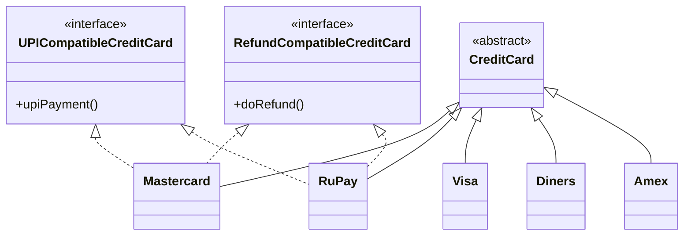
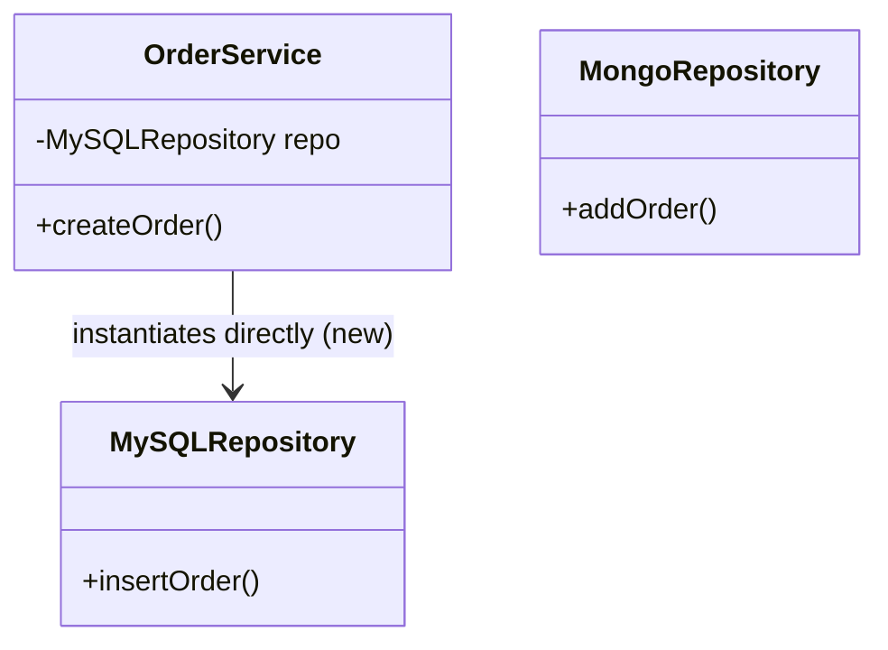
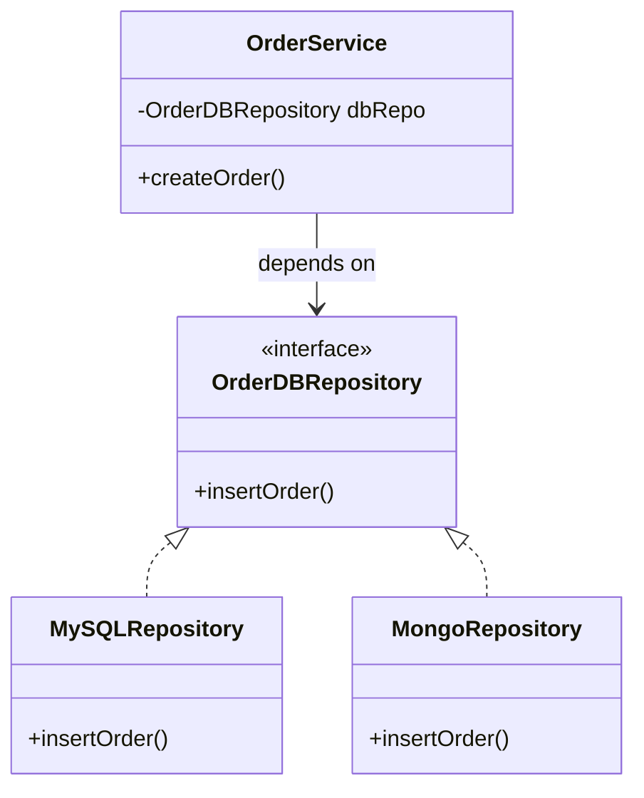

# Dependency Inversion Principle

> [!abstract] High-level modules and low-level modules should both depend on abstractions, not on each other — and abstractions should never depend on details.

## Definitions First

- **High-level modules** — the classes that sit higher up in the flow of data. Example: service layer modules like business logic.
- **Low-level modules** — the things that sit lower in the flow, providing direct contact with the infrastructure via plumbing. Example: repositories, tools, etc.
- **Abstractions** — interfaces; the blueprints and rules that concrete classes should follow.
- **Details** — the specific implementations of abstractions that actually do the low-level plumbing.

---

## Definition

1. High-level modules should not depend on low-level modules. Both should depend on **abstractions**.
2. Abstractions should not depend on details. **Details should depend on abstractions.**

---

## Dependency Injection

Dependency injection is a technique with various ways to **inject** a dependency — i.e., pass in the class/object that a class is going to use, rather than having the class create it itself.

It is a very important piece in maintaining the Dependency Inversion Principle (note: this is not the definition of DIP itself). Through dependency injection we make sure that the classes/objects used inside our class are **not instantiated within the class** — the `new` keyword is not used there. Instead:

- The instantiation is done somewhere else (outside the class).
- Our class only accepts the **abstraction** and uses the contract.
- The actual class instantiation and wiring is handled from the outside.

### Flavours of Dependency Injection

- **Constructor injection** — dependency passed through the constructor. The usual default: makes the dependency mandatory and the object immutable once built.
- **Setter injection** — dependency passed through a setter method after construction. Useful for optional dependencies, but the object can exist in a half-wired state.
- **Method/interface injection** — dependency passed directly into the specific method that needs it, rather than stored on the object.

---

## Continuing the Credit Card Example

After applying ISP, `UPICompatibleCreditCard` and `RefundCompatibleCreditCard` are now two separate interfaces. Mastercard and RuPay implement them; Visa, Diners, and Amex use no external interfaces. All of them inherit the base `CreditCard` class.

ISP has now solved most of the issues in the credit card design.

---

## The Code Duplication Problem → Toward Strategy

But say refund algorithms are **multiple**, and they are *families of algorithms* — not unique to each credit card. Now we need to remove code duplication. Thinking from scratch about how to approach this:

- **Approach 1 — one single class holding all algorithms.** Violates both SRP and OCP.
  - SRP: the class has too many responsibilities and reasons to change.
  - OCP: to add a new algorithm, you must edit the existing in-production class (the one holding all the algorithms).
- **Approach 2 — multiple classes, one per algorithm, each with the same function name (but no common interface between them).** Here the issue becomes the very topic we're on — the Dependency Inversion Principle — because you'll have to instantiate the algorithm class *within* the class under discussion and then use it. Note there's no shared interface tying these classes together yet, so they aren't interchangeable abstractions — the class must name and instantiate a concrete algorithm directly. (The shared interface is exactly what the Strategy pattern will add.)

So there's a need for another way to think about it: the [[Strategy]] pattern, where an interface of `Strategy` appears and is implemented by multiple concrete algorithms. (Covered fully in its own note — see [[Strategy]].)

---

## The Core Issue — Constructor Cascade

Whether we use "multiple classes with the same function name" or "single class with algo1, algo2, ...", in either case we'd have to instantiate the algorithm class here. This leads to the **constructor cascade issue** — the core problem DIP was created to solve.

The constructor cascade issue: because we use the `new` keyword, we have to take care of the **constructor dependencies of the util classes too**. The burden of constructing that object falls on the actual class's constructor. A change in the util class's constructor arguments would then force a change in the constructor (and related code) of the actual class.

The proper way to avoid this: the ready-made object should be **provided** to the actual class at the time of its construction, or through some form of dependency injection.

> [!danger] The takeaway
> Whenever you set yourself up by instantiating an object of the dependency (i.e., rely on concrete classes), you end up needing to know *everything* about that class — because you took on the burden of instantiating it. So you have to change your class's code whenever the core dependency of the dependency class changes. That is the core issue DIP was created for.

---

## Example — OrderService and Repositories

Setup: an `OrderService` class uses a `MySQLRepository` instance. `OrderService` has a `createOrder()` function which internally calls `insertOrder()` on the MySQL repository. There's also a `MongoRepository` that does something similar, but its function is called `addOrder()`. Currently `OrderService` instantiates a concrete repository directly.

This setup violates both **OCP** and **DIP**:
- DIP violation because the constructor has to instantiate a specific `MySQLRepository` object and use it directly.
- If I later had to switch from MySQL to Mongo, I'd have to make a lot of changes — changing the call from `insertOrder()` to `addOrder()`, and changing the instantiation from `MySQLRepository` to `MongoRepository`.

**The fix:**
1. Make both repositories implement the **same function name**, and better yet enforce it via an interface — `OrderDBRepository`. Both now follow and implement `insertOrder()`.
2. **Dependency injection** completes the adherence to DIP by injecting whatever repository is needed into `OrderService`.
3. `createOrder()` now just calls `dbRepo.insertOrder()` — against the interface, not a concrete class.

> [!info] Unit testing angle
> Another issue with the previous setup: unit tests and their mock data usually have many dependencies on the concrete composition being used. Changing the repository class itself would severely impact the unit tests. Depending on an abstraction (and injecting it) lets you swap in mocks cleanly — another reason the original setup was bad.

---

## Extracted To

*(will be updated as the design evolves)*

## Related Notes

- [[01 - SOLID Principles/01 - Single Responsibility Principle]]
- [[01 - SOLID Principles/02 - Open-Close Principle]]
- [[01 - SOLID Principles/03 - Liskov Substitution Principle]]
- [[01 - SOLID Principles/04 - Interface Segregation Principle]]
