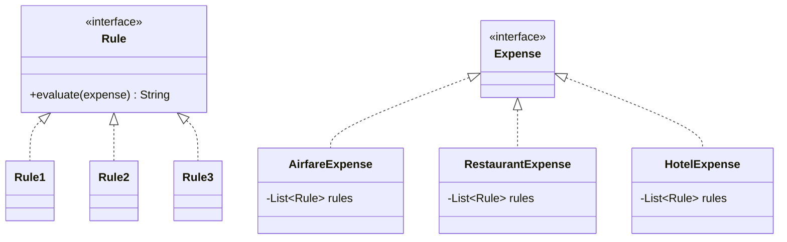

# Naive Solution & First Approach

> [!abstract] Two early attempts at the rule engine — the naive filter function and the strategy-based refactor — and why both fell short before we landed on the real design.

## The Naive Solution

The first instinct: write a single function that loops through all expenses and decides which ones are violating.

```java
Map<Expense, String> filterExpenses(List<Expense> expenses) {
    // for each expense, check all rules, return verdict string
}
```

One function. One place. Feels clean at first.

> [!danger] Why this breaks down
> - **SRP violation** — the function is doing two things: iterating over expenses *and* encoding every rule's logic. Adding a new rule means touching this function.
> - **OCP violation** — the function is not closed for modification. Every new rule (or change to an existing one) requires you to go back in and edit the same block of code. You can never just *extend* it.

	The rules are baked into the loop. There's no seam to add new rules without reopening the function.

---

## First Student Suggestion — Strategy Pattern on Rules

Students recognised the OCP problem and suggested pulling rules out into their own classes behind an interface. This is the **Strategy pattern** applied to rules.

Simultaneously, to handle different expense shapes cleanly, they suggested a parallel hierarchy on the expense side — a common `Expense` interface, then concrete classes per expense type. Each concrete expense would *own* a set of rules (composition), and the engine would just call `evaluate()` down the chain.



> [!tip] What's right about this
> Rules are now open for extension — add a new rule by adding a new class, not by editing existing ones. That's OCP fixed.

> [!danger] The concrete class explosion problem
> The expense-type hierarchy creates a **testing nightmare**. For every new `Expense` subclass, you need a new test class (or a repeated test setup) that covers all rule combinations against that concrete type. The test matrix grows with every new `ExpenseType` class added. You end up writing the same test logic multiple times in slightly different wrappers — which is a signal that the abstraction is wrong.
>
> The problem isn't the `Rule` interface. The problem is treating `Expense` as a type hierarchy when it's really just **data** — a map of string keys and values. Making it a class hierarchy adds complexity with no real benefit.

---

## Extracted To

*(will be updated as the design evolves)*

## Related Notes

- [[03 - Simple Rule Engine/01 - Problem Statement]]
