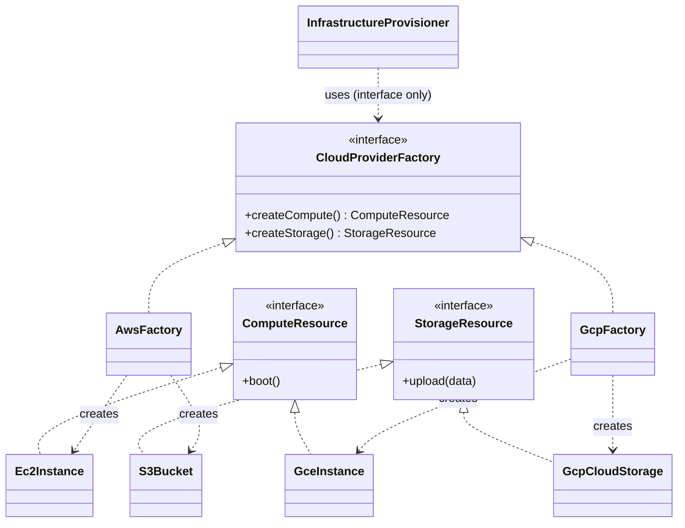

# Abstract Factory

> [!abstract] Provide an interface for creating **families of related products** without naming their concrete classes — and guarantee that products designed to work together are always used together (no incompatible mix-and-match).

**External references:**
- [Refactoring.guru — Abstract Factory](https://refactoring.guru/design-patterns/abstract-factory)
- [Refactoring.guru — Abstract Factory in Java](https://refactoring.guru/design-patterns/abstract-factory/java/example)
- [Refactoring.guru — Factory Comparison](https://refactoring.guru/design-patterns/factory-comparison)

## Part 1 — Core Framework

### Main Purpose

Provide an interface for creating families of related or dependent objects without specifying their concrete classes. Its defining job is **consistency**: objects meant to work together are always produced together, preventing incompatible combinations.

### Recognition Signal

> [!tip] The cue
> - The system must be configured with **one of several families** of products (cloud providers, DB engines, OS environments).
> - A family of related products is designed to be used strictly together, and you must enforce that constraint globally.
> - You want to expose a library of products by **interface only**, hiding concrete implementations.

### How to Implement

1. Define **abstract products** — one interface per product kind (`ComputeResource`, `StorageResource`).
2. Write **concrete products** per family (AWS: `Ec2Instance`, `S3Bucket`; GCP: `GceInstance`, `GcpCloudStorage`).
3. Define the **abstract factory** interface with a `createX()` per product kind.
4. Write a **concrete factory** per family, each producing that family's products.
5. The **client** depends only on the abstract factory interface — it can't mix families.

### Key Code

```java
// 1. Abstract products
public interface ComputeResource { void boot(); }
public interface StorageResource { void upload(String data); }

// 2. Concrete products — AWS family
public class Ec2Instance implements ComputeResource {
    public void boot() { System.out.println("Booting AWS EC2..."); }
}
public class S3Bucket implements StorageResource {
    public void upload(String data) { System.out.println("Uploading to S3..."); }
}

// 3. Concrete products — GCP family
public class GceInstance implements ComputeResource {
    public void boot() { System.out.println("Booting GCP Engine..."); }
}
public class GcpCloudStorage implements StorageResource {
    public void upload(String data) { System.out.println("Uploading to GCP Storage..."); }
}

// 4. Abstract factory
public interface CloudProviderFactory {
    ComputeResource createCompute();
    StorageResource createStorage();
}

// 5. Concrete factories
public class AwsFactory implements CloudProviderFactory {
    public ComputeResource createCompute() { return new Ec2Instance(); }
    public StorageResource createStorage() { return new S3Bucket(); }
}
public class GcpFactory implements CloudProviderFactory {
    public ComputeResource createCompute() { return new GceInstance(); }
    public StorageResource createStorage() { return new GcpCloudStorage(); }
}

// 6. Client context — knows only the abstract factory.
//    Mixing AWS + GCP components here is impossible by construction.
public class InfrastructureProvisioner {
    private ComputeResource compute;
    private StorageResource storage;

    public InfrastructureProvisioner(CloudProviderFactory factory) {
        this.compute = factory.createCompute();
        this.storage = factory.createStorage();
    }
    public void deploy() {
        compute.boot();
        storage.upload("Initial Config");
    }
}
```



### Who Creates the Concrete Factory?

If the client only ever sees the abstract `CloudProviderFactory` interface, **something** still has to create the actual `AwsFactory` or `GcpFactory` object. RG's answer:

> "Usually, the application creates a concrete factory object at the initialization stage. Just before that, the app must select the factory type depending on the configuration or the environment settings."

Unpacked — and this is exactly the right mental model:

- The **"factory type"** = *which concrete factory class* to instantiate (`AwsFactory` vs `GcpFactory`).
- At **startup/initialization**, the app reads a **config value or environment variable** (e.g. `CLOUD_PROVIDER=aws`), maps it to the matching concrete factory, and creates that one object.
- That concrete factory is then handed to the client as an **upcasted `CloudProviderFactory` reference via dependency injection**. From then on the client uses the interface and never knows or cares which family it got.

So: **env/config → pick the concrete factory (a small mapping/switch, done once at boot) → inject the upcasted reference → the whole app runs on that family.** The "which family?" decision happens exactly once, at the boundary, at startup.

### Beyond the Basics

The biggest payoff: **swap an entire product family by changing one line.** To move the whole app from AWS to GCP, you change only the concrete factory passed into `InfrastructureProvisioner` — every product it produces switches families in lockstep.

> [!tip] Adding a new family = new factory class + a tiny init tweak (never touch the client)
> RG: *"You don't need to modify the client code each time you add a new variation... You just create a new factory class that produces these elements and slightly modify the app's initialization code so it selects that class when appropriate."*
>
> Concretely — to add a third cloud provider (say Azure):
> 1. **Write a new concrete factory** (`AzureFactory implements CloudProviderFactory`) plus its product classes.
> 2. **Add one branch to the startup selection** (the config/env → factory mapping from *Who Creates the Concrete Factory?*) so `CLOUD_PROVIDER=azure` picks it.
>
> The client (`InfrastructureProvisioner`) and every existing factory stay **untouched**. This is [[02 - Open-Close Principle]] applied at the *family* level: open to new families (add a class), closed to modification (existing code unchanged). Contrast the scaling trap below — this only holds for adding *families*, not new *product kinds*.

### Anti-Patterns & When NOT to Use

- **Extreme rigidity (the scaling trap).** Abstract Factory is brittle when you *extend the family*. Adding `createNetworkingRules()` means modifying the base `CloudProviderFactory` interface — which breaks `AwsFactory`, `GcpFactory`, and every other factory until each implements the new method. Only use this pattern when the **product family is stable**. It's open for new *families*, closed against new *product kinds*.

## Part 2 — Architecture Deep Dive

### Pattern Synergy

- **Abstract Factory vs [[Factory Pattern|Factory Method]].** Factory Method creates a *single* product and relies on **inheritance**; Abstract Factory creates a *family* of related products and relies on **object composition**. The methods inside an Abstract Factory are often implemented *as* Factory Methods.
- **Abstract Factory + [[Singleton]].** An app usually needs only one instance of a given family factory (no need for many `AwsFactory` objects), so concrete factories are almost always singletons.

#### Composing the factory with [[Prototype]] (Statement 1)

You don't have to fill each `createX()` with `new` or by writing a subclass per family. A concrete factory can instead **hold prototype instances** of each product and have each `createX()` return a **clone** of its stored prototype. You then configure a "family" by handing the factory a set of prototypes — no new subclass needed. Useful when products are expensive to build or the family is decided at runtime.

```java
// Products must support cloning (see Prototype note)
interface ComputeResource extends Copyable<ComputeResource> { void boot(); }
interface StorageResource extends Copyable<StorageResource> { void upload(String data); }

// One factory class, ANY family — the family is defined by the prototypes you inject
class PrototypeCloudFactory implements CloudProviderFactory {
    private final ComputeResource computePrototype;   // fully-configured up front
    private final StorageResource storagePrototype;

    PrototypeCloudFactory(ComputeResource compute, StorageResource storage) {
        this.computePrototype = compute;
        this.storagePrototype = storage;
    }
    public ComputeResource createCompute() { return computePrototype.copy(); } // clone
    public StorageResource createStorage() { return storagePrototype.copy(); } // clone
}

// Build an "AWS family" without an AwsFactory subclass — just supply AWS prototypes:
CloudProviderFactory aws = new PrototypeCloudFactory(
    new Ec2Instance(/* pre-configured */),
    new S3Bucket(/* pre-configured */));
```

Contrast with the subclass version (`AwsFactory`, `GcpFactory`): there each family is a *class*; here each family is just a *set of prototype objects* passed into one reusable factory. Same trade-off as in [[Factory Pattern]] → *Factory Method vs Prototype* — you swap subclass boilerplate for prototype setup.

#### Abstract Factory as an alternative to [[Facade]]

A **Facade** is a simplified front to a whole complex subsystem — it hides *everything* about the subsystem: how objects are created **and** how they're used/coordinated. If the *only* thing you want to hide from the client is **how the subsystem objects get created** (not how they're used), an Abstract Factory is the lighter alternative — it hides just the instantiation behind `createX()` methods.

```java
// Without hiding: client must know each concrete subsystem class
VideoDecoder d = new H264Decoder();
AudioMixer   m = new DolbyMixer();

// Abstract Factory hides ONLY creation — client never names the concretes
interface MediaKitFactory {
    VideoDecoder createDecoder();
    AudioMixer   createMixer();
}
// client:
MediaKitFactory kit = /* injected */;
VideoDecoder d2 = kit.createDecoder();   // no idea it's an H264Decoder
```

If you *also* needed a single `play()` that orchestrates decoder + mixer together, that coordinating wrapper would be a Facade. Use Abstract Factory when only **creation** needs hiding; reach for Facade when the whole **interaction** needs simplifying.

#### Abstract Factory + [[Bridge]]

**Bridge** splits an *abstraction* from its *implementation* so they vary independently (the abstraction holds a reference to an implementor). Sometimes a given abstraction only works with **specific** implementations — not every combination is valid. Abstract Factory can encapsulate those valid pairings so the client can't build an incompatible combo.

```java
// Bridge: Shape (abstraction) delegates rendering to Renderer (implementation)
interface Renderer { void renderCircle(); }
abstract class Shape {
    protected final Renderer renderer;      // the "bridge"
    Shape(Renderer renderer) { this.renderer = renderer; }
    abstract void draw();
}
class Circle extends Shape {
    Circle(Renderer r) { super(r); }
    void draw() { renderer.renderCircle(); }
}

// Problem: a VectorCircle must only pair with a VectorRenderer, etc.
// Abstract Factory encapsulates the valid abstraction+implementation pairing:
interface ShapeFactory {
    Shape createCircle();     // returns a Shape already wired to its COMPATIBLE renderer
}
class VectorShapeFactory implements ShapeFactory {
    public Shape createCircle() {
        Renderer r = new VectorRenderer();   // the matching implementation
        return new Circle(r);                // guaranteed-compatible pair
    }
}
```

The client just calls `factory.createCircle()` and gets a correctly-wired Bridge object — it never risks pairing a vector shape with a raster renderer. The factory hides that compatibility complexity.

### Confused With

| Aspect | Factory Method | Abstract Factory |
|---|---|---|
| Produces | One product | A **family** of related products |
| Mechanism | Inheritance (subclass overrides `createX()`) | Composition (client holds a factory object) |
| Extending | Add a subclass | Add a concrete factory (for a new *family*) |
| Weak spot | — | Adding a new *product kind* breaks every factory |

### Real-World Context

- **JDBC.** The `Connection` interface acts like an abstract factory: depending on the driver (MySQL, PostgreSQL), `connection.createStatement()` returns a family of SQL statement objects guaranteed compatible with that DB.
- **Payment gateways.** A `PaymentFactory` producing a compatible `PaymentGateway`, `RefundProcessor`, and `TransactionLogger` tailored strictly to Stripe or PayPal.

### Advanced Nuances — the ISP conflict

Abstract Factory bundles multiple creation methods into one interface, which can clash with [[04 - Interface Segregation Principle]]: a client that only needs `createCompute()` is still forced to depend on the whole `CloudProviderFactory`. If the factory grows monolithic, the fix (common in microservices) is to **break it into smaller, domain-specific factories** so clients depend only on what they use.

## Principles Served

- [[02 - Open-Close Principle]] — add a new *family* by adding a concrete factory, no client edits. (But NOT open to new product *kinds* — see the scaling trap.)
- [[05 - Dependency Inversion Principle]] — the client depends on the abstract factory + product interfaces, never concrete classes.

## Sources

- [Refactoring.guru — Abstract Factory](https://refactoring.guru/design-patterns/abstract-factory) (external, primary reference)
