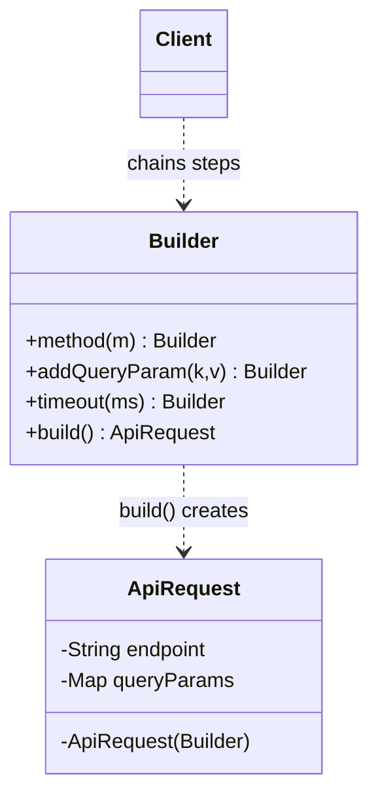
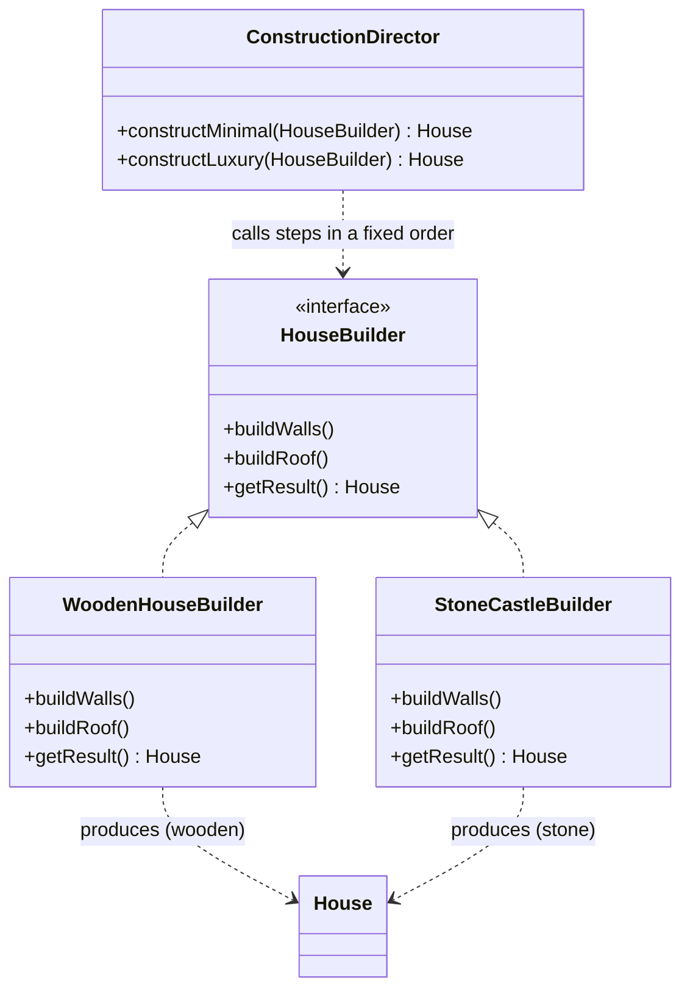

# Builder Pattern

> [!abstract] Separate the construction of a complex object from its representation, so you build it step-by-step with a readable, fluent process instead of a giant unreadable constructor.

**External references:**
- [Refactoring.guru — Builder](https://refactoring.guru/design-patterns/builder)
- [Refactoring.guru — Builder in Java](https://refactoring.guru/design-patterns/builder/java/example)

## Part 1 — Core Framework

### Main Purpose

Separate the construction of a complex object from its representation. The same step-by-step process can produce different representations, and it eliminates massive, unreadable constructors.

### Recognition Signal

> [!tip] The cue
> - The **telescoping constructor** anti-pattern — a class with constructors taking 5, 6, 10+ arguments.
> - Many creation parameters are **optional**, forcing frequent `null` passing or dozens of constructor overloads.
> - Object creation needs a **strict step-by-step process**, or validation of combined parameters before the object is safely finalized.

### How to Implement

1. Give the product a **private constructor** that takes the builder.
2. Put a static inner **Builder** class holding the same fields (mandatory ones in the builder's constructor, optional ones with defaults).
3. Each setter returns `this` for **method chaining**.
4. `build()` does final **validation** and returns the product.

### Key Code

```java
public class ApiRequest {
    private final String endpoint;
    private final String method;
    private final Map<String, String> queryParams;
    private final int timeoutMs;

    // Private: the object can ONLY be created via the Builder
    private ApiRequest(Builder builder) {
        this.endpoint = builder.endpoint;
        this.method = builder.method;
        this.queryParams = builder.queryParams;
        this.timeoutMs = builder.timeoutMs;
    }

    public static class Builder {
        private final String endpoint;               // mandatory
        private String method = "GET";                // default
        private Map<String, String> queryParams = new HashMap<>();
        private int timeoutMs = 5000;                 // default

        public Builder(String endpoint) { this.endpoint = endpoint; }  // mandatory in ctor

        public Builder method(String method) { this.method = method; return this; }
        public Builder addQueryParam(String k, String v) { this.queryParams.put(k, v); return this; }
        public Builder timeout(int ms) { this.timeoutMs = ms; return this; }

        public ApiRequest build() {                   // final assembly + validation
            if (endpoint == null || endpoint.trim().isEmpty())
                throw new IllegalStateException("Endpoint is required");
            return new ApiRequest(this);
        }
    }

    public void execute() {
        System.out.println("Executing " + method + " to " + endpoint + " params: " + queryParams);
    }
}

// Client — fluent, readable, explicit
ApiRequest request = new ApiRequest.Builder("/api/v1/users")
    .method("GET")
    .addQueryParam("status", "active")
    .timeout(3000)
    .build();
```



### Beyond the Basics

**The immutability champion.** Builders are the best way to create truly immutable objects: the product has **no setters** and all fields are `final`. Once `build()` runs, the object's state can never change — making it inherently thread-safe.

### Conditional Building & Cross-Field Validation

**Conditional building.** Because the builder is a mutable holder and the product only materializes at `build()`, the *caller* decides at runtime which steps run and with what values — impossible with a constructor (which needs all args in one shot):

```java
OrderBuilder b = new OrderBuilder(items);
if (user.isPrime())          b.freeShipping(true);
if (coupon != null)          b.applyCoupon(coupon);
if (region == INTERNATIONAL) b.customsDeclaration(decl);
Order order = b.build();
```

A constructor would need a combinatorial explosion of overloads or piles of `null`s. (Stronger flavour: `build()` can even return **different concrete types** based on the accumulated config — e.g. a `DigitalOrder` vs `PhysicalOrder` — quietly doing factory work at the finalize step.)

**Cross-field validation — the real killer feature.** `build()` is a single choke point to validate the *whole combination of fields together* before the object is allowed to exist. This is about invariants that span **multiple** fields, not single-field checks:

```java
public HotelBooking build() {
    // single-field checks
    if (checkIn == null || checkOut == null)
        throw new IllegalStateException("check-in/out required");

    // CROSS-FIELD checks — relationships between fields
    if (!checkIn.isBefore(checkOut))
        throw new IllegalStateException("check-in must be before check-out");
    if (roomType == SUITE && guests > 4)
        throw new IllegalStateException("a suite holds at most 4 guests");
    if (payLater && totalAmount > 50_000)
        throw new IllegalStateException("pay-later not allowed above 50,000");

    return new HotelBooking(this);   // reached only if EVERY invariant holds
}
```

Why this beats the alternatives:
- **vs constructor** — a constructor can validate, but many optional fields drown you in overloads that each repeat the checks; the builder centralizes all validation in one `build()`.
- **vs setters** — setters let the object exist in a **half-built, invalid state** between calls (a check-out with no check-in); someone could read it mid-configuration.
- **Always-valid guarantee** — the object is **never born invalid**. `build()` either returns a fully valid, immutable object or throws. Fail-fast at construction: the bad combination is rejected *before* the object exists, so no downstream code ever defends against a malformed one.

The two connect: **conditional building** decides *what goes into* the object; **cross-field validation** is the final gate confirming the combination is legal before sealing it immutable. (This is also why passing a *live* builder around is risky — you want all field-setting done in a controlled scope before this gate, not scattered where an illegal combo could slip in.)

### Anti-Patterns & When NOT to Use

- **Builder for everything.** If an object has 2–3 fields (a simple DTO), 50 lines of builder boilerplate is over-engineering. A plain constructor is fine.
- **Mutable builders leaking.** A builder is *mutable* by design. If you pass one builder around several methods to incrementally configure it before `build()`, different parts of the code can silently overwrite each other's settings.

```java
// DANGER — a shared, passed-around builder
ApiRequest.Builder b = new ApiRequest.Builder("/api/v1/users");
configureAuth(b);     // inside: b.timeout(3000)
configurePaging(b);   // inside: b.timeout(10000)  <-- silently clobbers the 3000
ApiRequest r = b.build();  // whichever ran last wins; nobody notices

// SAFE — keep the chain localized, build in one place
ApiRequest r2 = new ApiRequest.Builder("/api/v1/users")
    .timeout(3000)
    .addQueryParam("limit", "100")
    .build();
```

> [!warning] Keep the build chain localized
> Because the builder holds mutable state, sharing the *live builder* across methods invites last-writer-wins bugs that are brutal to trace. Build in one place; if config must come from several sources, pass **immutable values** into the chain, not the live builder object.

## Part 2 — Architecture Deep Dive

### Pattern Synergy

#### Builder + [[Composite]]

A **Composite** is a tree where leaf and container nodes are treated uniformly. Builders are frequently used to construct these trees step-by-step — a `DocumentBuilder` assembling a hierarchy of paragraphs, images, and tables:

```java
Document doc = new DocumentBuilder()
    .addParagraph("Introduction")
    .beginSection("Chapter 1")          // open a container node
        .addParagraph("Body text...")
        .addImage("figure1.png")
        .addTable(rows)
    .endSection()                        // close the container
    .build();                            // returns the assembled Composite tree
```

**Where the content actually lives — the node classes.** The real storage is a `children` list *inside each container object* (this is the Composite structure). Without these classes the builder looks like it stores nothing:

```java
// Everything in the tree is a Component (the Composite pattern)
interface Component { }

// Leaves — hold their own data
class Paragraph implements Component {
    private final String text;
    Paragraph(String text) { this.text = text; }
}
class Image implements Component { /* path */ }
class Table implements Component { /* rows */ }

// Containers — hold a list of children (THIS is where content is stored)
class Container implements Component {
    private final List<Component> children = new ArrayList<>();
    void add(Component c) { children.add(c); }   // stores the child permanently
}
class Section extends Container {
    private final String title;
    Section(String title) { this.title = title; }
}
class Document extends Container { }
```

**How nesting works — a stack of "current containers".** The builder keeps a stack whose top is always "where new nodes go right now." `beginSection` attaches a new section to the current top *then* pushes it (so following adds land inside it); `endSection` pops back to the parent. This turns a flat call chain into a nested tree, like matching brackets.

```java
class DocumentBuilder {
    private final Document root = new Document();
    private final Deque<Container> stack = new ArrayDeque<>();  // LIFO stack (cursor, not storage)

    DocumentBuilder() { stack.push(root); }   // root is the initial current container

    DocumentBuilder addParagraph(String text) {
        stack.peek().add(new Paragraph(text)); // stored in the current container's children
        return this;
    }
    DocumentBuilder addImage(String path) {
        stack.peek().add(new Image(path));
        return this;
    }
    DocumentBuilder addTable(List<Row> rows) {
        stack.peek().add(new Table(rows));
        return this;
    }
    DocumentBuilder beginSection(String title) {
        Section s = new Section(title);
        stack.peek().add(s);   // 1) attach section to parent's children (permanent link)
        stack.push(s);         // 2) make it the new current container (cursor moves down)
        return this;
    }
    DocumentBuilder endSection() {
        stack.pop();           // only moves the cursor back up — does NOT delete the section
        return this;
    }
    Document build() { return root; }
}
```

> [!important] The stack is a cursor, not storage
> Nodes are wired into the tree **by reference** the moment they're created — leaves via `stack.peek().add(...)`, and a section via the `add(s)` inside `beginSection` *before* it's pushed. So every node already lives in its parent's `children` list.
> - `stack.peek()` returns the **actual container object**, so `.add(...)` stores content in that object's own `children`.
> - `endSection`'s `pop()` only removes the section from the **traversal cursor** — the section survives because its parent still holds it in `children`.
> - After `build()` returns `root`, the stack is discarded/GC'd, but the whole tree survives because it all hangs off `root`.
>
> Mental model: **the stack is scaffolding you climb while building; the `children` lists are the walls that stay standing after the scaffolding comes down.**

Resulting tree:

```
root (Document)
├── Paragraph("Intro")
└── Section("Chapter 1")
    ├── Paragraph("Body...")
    ├── Image("fig1.png")
    └── Table(rows)
```

> [!info] Why `Deque`, not `Stack`
> `Deque`/`ArrayDeque` is the modern, idiomatic LIFO stack. The legacy `java.util.Stack` extends `Vector`, so it's needlessly **synchronized** (lock overhead) and leaks non-stack behaviour (index access, bottom-to-top iteration). The JDK's own `Deque` javadoc recommends it over `Stack` for stack use.

Trace of the chain above:

```
start                     stack: [root]
addParagraph("Intro")  -> root.children += Paragraph     stack: [root]
beginSection("Ch 1")   -> root.children += Section(Ch1)  stack: [root, Ch1]
  addParagraph(...)    -> Ch1.children  += Paragraph     stack: [root, Ch1]
  addImage(...)        -> Ch1.children  += Image         stack: [root, Ch1]
  addTable(...)        -> Ch1.children  += Table         stack: [root, Ch1]
endSection()           -> pop Ch1                        stack: [root]
build()                -> return root
```

So "Intro" is a direct child of root, while the paragraph/image/table nest inside Chapter 1. Calling `beginSection` again before `endSection` pushes another level — nested sections just work, and each `endSection` unwinds exactly one level (the `begin`/`end` pairs must balance like braces). This stack-of-containers approach is the general recipe for building *any* Composite tree from a flat fluent chain.

#### Builder + [[Facade]]

A **Facade** (a simple front over a complex subsystem) is often *initialized* by a Builder, especially when the subsystem needs a large, validated set of parameters to boot safely:

```java
PaymentFacade payments = new PaymentFacade.Builder()
    .gatewayUrl("https://gw.example.com")
    .apiKey(secret)
    .retryPolicy(3)
    .timeout(5000)
    .enableFraudCheck(true)
    .build();          // builder validates + wires the complex subsystem safely

payments.charge(order);   // the Facade then exposes ONE simple call
```

The Builder handles the messy, error-prone boot configuration; the Facade exposes the simple runtime interface.

#### Builder + [[Bridge]]

RG: *"You can combine Builder with Bridge: the director class plays the role of the abstraction, while different builders act as implementations."* [[Bridge]] splits an *abstraction* from its *implementation* so both vary independently, connected by composition. Map that onto Builder:
- **Director = the abstraction** — holds the high-level construction recipe, and holds a reference to a builder.
- **Builders = the implementations** — do the concrete step work (wood vs stone).

Because the director *has-a* builder (composition, not per-call parameter), you can vary the **director hierarchy** (basic vs luxury recipe) and the **builder hierarchy** (wood vs stone material) **independently**, then mix any combination:

```java
// Implementation side (Bridge "implementor") = builders
interface HouseBuilder { void buildWalls(); void buildRoof(); House getResult(); }
class WoodenHouseBuilder implements HouseBuilder { /* wooden steps */ }
class StoneCastleBuilder implements HouseBuilder { /* stone steps */ }

// Abstraction side = director, holds a builder reference (the "bridge")
class ConstructionDirector {                 // abstraction
    protected final HouseBuilder builder;
    ConstructionDirector(HouseBuilder builder) { this.builder = builder; }
    House construct() {
        builder.buildWalls();
        builder.buildRoof();
        return builder.getResult();
    }
}
class LuxuryDirector extends ConstructionDirector {   // refined abstraction
    LuxuryDirector(HouseBuilder b) { super(b); }
    @Override House construct() {
        builder.buildWalls();
        builder.buildRoof();
        builder.buildPool();      // extra steps = a different recipe
        return builder.getResult();
    }
}

// Mix any abstraction (recipe) with any implementation (material):
House a = new ConstructionDirector(new WoodenHouseBuilder()).construct(); // basic wooden
House b = new LuxuryDirector(new StoneCastleBuilder()).construct();       // luxury stone
```

Note this is the *held-reference* form of Director (builder as a field), which is what makes it a Bridge — distinct from the earlier `construct(HouseBuilder b)` form that takes the builder per call. Two independent hierarchies (director recipes × builder materials) combined by composition = the Bridge structure.

### How the Director Approach Works (GoF)

The GoF form has four roles:
- **Builder interface** — declares the building **steps** (`buildWalls()`, `buildRoof()`, `getResult()`).
- **Concrete builders** — implement those steps differently, each producing a different **representation** (wood vs stone).
- **Director** — knows the **recipe**: the fixed, ordered sequence in which to call the steps. It does *not* know the concrete builder type; it holds an abstract `HouseBuilder` reference.
- **Product** — the object being assembled.

```java
// Builder interface — the steps
interface HouseBuilder {
    void buildWalls();
    void buildRoof();
    House getResult();
}

// Concrete builders — same steps, different representation
class WoodenHouseBuilder implements HouseBuilder {
    private final House house = new House();
    public void buildWalls() { house.setWalls("wooden walls"); }
    public void buildRoof()  { house.setRoof("wooden roof"); }
    public House getResult() { return house; }
}
class StoneCastleBuilder implements HouseBuilder {
    private final House house = new House();
    public void buildWalls() { house.setWalls("stone walls"); }
    public void buildRoof()  { house.setRoof("stone battlements"); }
    public House getResult() { return house; }
}

// Director — owns the recipe(s). Talks only to the HouseBuilder interface.
class ConstructionDirector {
    House constructMinimal(HouseBuilder b) {   // recipe A
        b.buildWalls();
        b.buildRoof();
        return b.getResult();
    }
    House constructLuxury(HouseBuilder b) {    // recipe B — different sequence
        b.buildWalls();
        b.buildRoof();
        b.buildGarage();
        b.buildPool();
        return b.getResult();
    }
}
```



#### Two independent axes — the key insight

> [!tip] Builders and Director methods are NOT the same axis
> - **Which builder you pass** decides the **representation / material** (wood vs stone).
> - **Which Director method you call** decides the **recipe / step sequence** (minimal vs luxury).
>
> They're orthogonal — any recipe combines with any builder:
> ```java
> ConstructionDirector d = new ConstructionDirector();
> d.constructLuxury(new WoodenHouseBuilder());  // luxury wooden house
> d.constructLuxury(new StoneCastleBuilder());  // luxury stone castle
> d.constructMinimal(new WoodenHouseBuilder()); // minimal wooden house
> ```
> Number of builders = how many *materials*; number of Director methods = how many *recipes*. Adding one doesn't force adding the other.

#### How different builders yield different outcomes — runtime polymorphism

The Director calls `builder.buildWalls()` on an **abstract `HouseBuilder` reference** — it has no idea which concrete class it holds. At runtime, **dynamic dispatch** routes that call to the actual object's implementation:
- passed a `WoodenHouseBuilder` → that same line builds *wooden* walls,
- passed a `StoneCastleBuilder` → the *same line* builds *stone* walls.

The **Director provides the *when/order*; the concrete builder provides the *how*.** The identical call produces different results purely because the object behind the interface differs — the exact same mechanism as [[Strategy]]: caller talks to an interface, the concrete implementation decides the behaviour.

This "same recipe, different representation" reuse is the one thing the fluent/chaining style doesn't give cleanly — with chaining the caller hardcodes both the steps *and* the values inline, so recipe reuse across representations is lost. That reuse is exactly when the GoF interface+Director form earns its place.

### Confused With — Fluent Interface vs GoF Director

The modern **method-chaining** approach (a *Fluent Interface*) deviates from the original 1994 GoF spec.

| | GoF Builder (with Director) | Modern Fluent Interface |
|---|---|---|
| Who drives the steps | A **Director** class runs a predefined sequence (`director.constructSportsCar(builder)`) | The client acts as its own director, chaining steps inline |
| Step order | Fixed, encapsulated in the Director | Chosen dynamically by the caller |
| Today | Largely abandoned | The de-facto standard |

Knowing the Fluent Interface has functionally replaced the GoF Director shows architectural awareness.

### Real-World Context

- **Lombok `@Builder`** — annotate a class and the compiler generates the entire inner builder; you rarely hand-write the boilerplate above.
- **SQL query builders** — JOOQ, Hibernate Criteria API: chain `.select()`, `.from()`, `.where()` to build queries dynamically.

## Field Notes

> [!note] GoF vs Fluent — *where* the "which representation" decision lives
> Both produce different representations of a product; they just encode the decision in different places.
>
> - **GoF / Director:** the representation (wood vs stone) is **baked into a whole builder class** — it lives in the *method bodies* of that class's steps (`WoodenHouseBuilder.buildWalls()` hardcodes `"wooden walls"`). A new material = a new builder *class*. The Director's fixed recipe can then run against any builder class.
> - **Fluent / chaining:** there's no Director; the **caller drives the chain**, so the representation is decided inline at the call site. Two ways:
>   1. **Different chains** — if the products differ structurally, write different chains (different methods / order).
>   2. **Same chain, different inputs** — if they only differ in material, keep the chain identical and pass different **argument values**:
>      ```java
>      House cabin  = new HouseBuilder().walls("wood").roof("wood").build();
>      House castle = new HouseBuilder().walls("stone").roof("stone").build();
>      ```
>
> So: GoF encodes representation as a **class** (behaviour in method bodies); Fluent supplies it as **data/arguments** at the call site. That's why a new material is a new *class* in GoF but just a different *value* in fluent — and why GoF reuses one recipe across builders while fluent re-specifies the chain each time.

## Principles Served

- [[01 - SOLID Principles/01 - Single Responsibility Principle]] — construction logic lives in the builder, separate from the product's own responsibilities.

## Sources

- [Refactoring.guru — Builder](https://refactoring.guru/design-patterns/builder) (external, primary reference)
