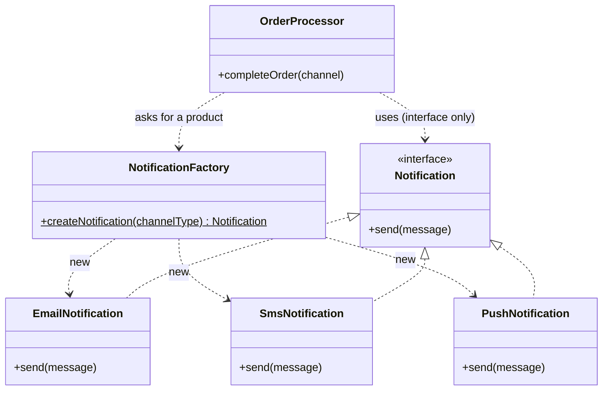

# Factory Pattern

> [!abstract] Centralize and encapsulate object creation so the `new` keyword is isolated from core business logic. The client asks for a product by context and gets back an interface, blind to which concrete class was built.

**External references:**
- [Refactoring.guru — Factory Method](https://refactoring.guru/design-patterns/factory-method)
- [Refactoring.guru — Factory Method in Java](https://refactoring.guru/design-patterns/factory-method/java/example)
- [Refactoring.guru — Factory Comparison](https://refactoring.guru/design-patterns/factory-comparison)

> [!info] Scope of this note
> This note favours the **Simple Factory** (a centralized `create()` with a switch) — the pragmatic, production-standard form. The strict **GoF Factory Method** (inheritance: an abstract creator with subclasses overriding `createX()`) is covered by the Refactoring Guru links above rather than transcribed here. The **Abstract Factory** (families of related products) gets its own note: [[Abstract Factory]].

## Part 1 — Core Framework

### Main Purpose

Define a place/method for creating an object, but delegate the decision of *which concrete class* to instantiate to a centralized location (or to subclasses). It isolates `new` from your core business logic so the client depends only on the product interface.

### Recognition Signal

> [!tip] The cue
> - Business logic is littered with `new` inside big if/else or switch statements.
> - The exact class to instantiate depends on dynamic context, user input, or config.
> - You expect to add new object types later and want [[01 - SOLID Principles/02 - Open-Close Principle]] — adding a type shouldn't force edits to business logic.

### How to Implement

1. Define a common **product interface** (e.g. `Notification`).
2. Write **concrete products** implementing it.
3. Create a **factory** that centralizes the `new` decision based on context (a `create()` method with a switch).
4. The **client** calls the factory and works only with the product interface.

### Key Code

```java
// 1. Common product interface
public interface Notification {
    void send(String message);
}

// 2. Concrete products
public class EmailNotification implements Notification {
    public void send(String msg) { System.out.println("Sending Email: " + msg); }
}
public class SmsNotification implements Notification {
    public void send(String msg) { System.out.println("Sending SMS: " + msg); }
}
public class PushNotification implements Notification {
    public void send(String msg) { System.out.println("Sending Push: " + msg); }
}

// 3. The Factory (Simple / parameterized factory) — centralizes 'new'
public class NotificationFactory {
    public static Notification createNotification(String channelType) {
        if (channelType == null) return null;
        return switch (channelType.toUpperCase()) {
            case "EMAIL" -> new EmailNotification();
            case "SMS"   -> new SmsNotification();
            case "PUSH"  -> new PushNotification();
            default -> throw new IllegalArgumentException("Unknown channel: " + channelType);
        };
    }
}

// 4. The Client — decoupled from object creation
public class OrderProcessor {
    public void completeOrder(String userPrefChannel) {
        Notification notification = NotificationFactory.createNotification(userPrefChannel);
        notification.send("Your order has been shipped!");
    }
}
```

Structure of the Simple Factory:



The factory owns all the `new` calls; the client depends only on the `Notification` interface and never sees the concrete classes.

### Beyond the Basics

The client (`OrderProcessor`) only ever touches the `Notification` interface. It is completely blind to how `SmsNotification` is structured or instantiated. That decoupling is the primary goal — not the switch statement itself.

### Anti-Patterns & When NOT to Use

- **The God Factory.** One massive `AppFactory` with `createUser()`, `createDatabase()`, `createCache()`... Factories should be scoped to a specific family/type of object.
- **Premature abstraction.** If an interface has one concrete implementation and likely always will, wrapping instantiation in a factory is needless over-engineering. Just use `new`.

## Part 2 — Architecture Deep Dive

### Pattern Synergy

- **Factory + Strategy.** The ultimate pair. The Factory is the *decider* that reads runtime context and creates the correct [[Strategy]] object, then hands it to the Context to execute. (This is where the "conservation of complexity" if/else from the Strategy note actually lives.)
- **Factory + Singleton.** The concrete factory is almost always a [[Singleton]] — you need one stateless routing utility, not many instances.
- **Factory vs Abstract Factory.** Factory Method creates exactly one product (a `Notification`). [[Abstract Factory]] creates *families* of related products (an AWS factory that makes an EC2 Instance **and** an S3 Bucket).

#### Factory Method vs Prototype — where the cost goes

Both hand you a new object without the client calling `new` directly, but they pay for it differently:

- **Factory Method is based on inheritance.** Each call just `new`s a fresh object — **no setup step** — but you need a parallel hierarchy of creator subclasses (the inheritance boilerplate/coupling).
- **[[Prototype]] avoids inheritance** (no creator subclasses), so it dodges that drawback — but it needs a **fully built, configured prototype instance ready in advance** plus a correct deep-`copy()`. That upfront setup is the "complicated initialization."

Neither is free — the cost just moves: Factory Method pays in **subclass hierarchy**, Prototype pays in **prototype setup + clone correctness**.

> [!warning] Does Prototype lose the factory's routing?
> A *bare* prototype with only `.copy()` **does** lose routing — it can only reproduce that one type, with no "pick which concrete class" decision. But in practice Prototype is paired with a **Registry**, and the routing moves there: the registry holds a `Map<key, prototype>` and you route by key, then clone — e.g. `registry.getToolContext("weather-api").copy()` (see [[Prototype]] → *Prototype + Registry*).
>
> So routing isn't lost, the *mechanism* changes:
>
> | Approach | Routing mechanism |
> |---|---|
> | Simple Factory | `switch` / if-else on a type |
> | Factory Method | which creator *subclass* you instantiate |
> | Prototype + Registry | **map lookup** (`key → prototype`), then `.copy()` |
>
> Bonus: with the registry, adding a new type = **registering a new prototype at runtime** — no switch edit, no new subclass. The routing table becomes data instead of code.

```java
// Factory Method — inheritance, no init step, but needs a subclass per product
abstract class ReportCreator {
    abstract Report createReport();          // subclass decides which to build
}
class SalesReportCreator extends ReportCreator {
    Report createReport() { return new SalesReport(); }  // just 'new', fresh each call
}

// Prototype — no subclass hierarchy, but the prototype must be set up first
class ReportFactory {
    private final Report prototype;          // must already be fully configured
    ReportFactory(Report prototype) { this.prototype = prototype; }
    Report createReport() { return prototype.copy(); }   // clone, no inheritance
}
// ...the "complicated initialization" you pay up front:
Report base = new SalesReport();
base.loadHeavyConfig();                      // build + configure the prototype once
ReportFactory factory = new ReportFactory(base);
```

### Confused With

| | Simple Factory | GoF Factory Method | Abstract Factory |
|---|---|---|---|
| Mechanism | One class, `static create()` with a switch | Inheritance — abstract creator, subclasses override `createX()` | Interface producing a **family** of related products |
| Adds a new type by | Editing the switch | Adding a new subclass (no edits) | Adding a new concrete factory |
| Products | One | One (per creator) | Many related, per factory |
| GoF pattern? | No (informal idiom) | Yes | Yes |

### Real-World Context

- **SLF4J** — `LoggerFactory.getLogger(MyClass.class)` is a textbook factory; it hides whether Logback, Log4j, or JUL is underneath.
- **Spring** — the entire IoC container (`BeanFactory` / `ApplicationContext`) is one giant advanced factory: it reads config/annotations and decides which objects to instantiate and wire.

### Advanced Nuances — Which to actually use

> [!tip] Interview / production default
> **Reach for the Simple Factory (switch-based) by default.** It's the pragmatic, production-standard form, and interviewers expect it unless they ask otherwise. Creating parallel `Creator` subclass hierarchies (strict GoF Factory Method) just to instantiate objects is usually excessive boilerplate.
>
> Escalate only when the context demands it:
> - **GoF Factory Method (inheritance)** — when you're building a framework/library that *other people* extend (explained in plain terms below).
> - **[[Abstract Factory]]** — when you need to create **families of related products** that must be used together (e.g. a whole UI toolkit, or a cloud provider's resource set).
>
> Rule of thumb: switch-based Simple Factory for app code; inheritance-based Factory Method for framework/library boundaries; Abstract Factory for product families.

#### Why "third-party extensibility" pushes you to inheritance — in plain terms

With a **Simple Factory**, adding a new product means **editing the switch** inside the factory. That's fine when *you own all the code* — you just open the file and add a case.

But imagine you ship a **library** that thousands of other developers use. They *cannot* edit your switch — it's inside your compiled library, not their codebase. If adding a new product type required editing your switch, then every new type anyone wants would have to go through *you*. That doesn't scale.

The **GoF Factory Method** solves this with inheritance. You ship an abstract creator with an abstract "make the product" method. Other developers **subclass it** and override that method to produce *their own* product — without ever touching (or even seeing) your source code.

```java
// You ship this in your framework:
abstract class Dialog {
    abstract Button createButton();      // the "factory method" — left open

    void render() {                      // your framework logic uses it
        Button b = createButton();
        b.paint();
    }
}

// A third-party developer, in THEIR OWN codebase, writes:
class WindowsDialog extends Dialog {
    Button createButton() { return new WindowsButton(); }  // their product
}
```

They plugged a brand-new button type into your framework by subclassing — your `Dialog` code never changed. That "extend without modifying" property is exactly [[01 - SOLID Principles/02 - Open-Close Principle]], and it's the whole reason frameworks use inheritance-based Factory Method instead of a switch.

**Decision cue for you:** if *you* control every place a new type gets added → Simple Factory (switch). If *strangers* need to add new types without editing your code → GoF Factory Method (inheritance).

## Field Notes

> [!note] The switch didn't disappear — it got a home
> The if/else that picked the type is still there, inside the factory. The point isn't to delete branching; it's to move it *out of business logic* into one owned place. Same "conservation of complexity" idea as in [[Strategy]].

## Principles Served

- [[01 - SOLID Principles/02 - Open-Close Principle]] — new product types via the factory, ideally without touching client code.
- [[01 - SOLID Principles/05 - Dependency Inversion Principle]] — clients depend on the product interface, not concrete classes.

## Sources

- [Refactoring.guru — Factory Method](https://refactoring.guru/design-patterns/factory-method) (external, primary reference for the GoF inheritance form)
