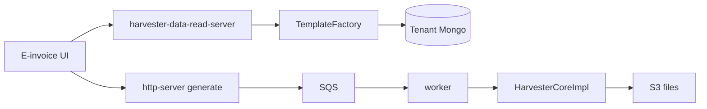

# ClearTax Ownership and How to Talk

> [!abstract] Intern on Global E-Invoicing. One service — Data-Harvester — two jobs: BFF for the UI, async reports to S3. Four resume lines. The 57% / 38% / 30→90% numbers are **not** in the repo. Singapore files are **not** in the snapshot you have. Fill the ownership table.

Source writeups: `Resume/ClearTax/docs/` — start at [[00-architecture-overview]].

## What the service is (30 seconds)

ClearTax Malaysia (and later other countries) needed one backend that could **show** invoices in a dashboard and **export** huge dumps without melting the API.

- **BFF** — `POST /{mode}/public/documents/v1/{templateType}/viewSummary|viewList|viewDetailed`. Sync-ish, low latency. `TemplateFactory` picks an `IDataReadSource`.
- **Reports** — accept a job, SQS, worker, `HarvesterCoreImpl`, strategy → Avro → CSV/Parquet/Excel → S3, poll + pre-signed download.
- **Stack:** Java 17, Spring Boot 2.7, WebFlux / Reactor, Mongo (reactive), SQS, S3, Avro, Temporal scheduler.

> [!tip] The sentence that saves the round: **Core never knows Malaysia vs recon vs sales. It talks to an interface. Country is JSON + an annotated class + a `MODE` env.**

## Ownership — fill before the interview

Docs describe `clear-data-harvester`. They do not say which PRs were yours.

| Area | I designed | I implemented | I on-called / operated | I only used |
|---|---|---|---|---|
| BFF plugin / `TemplateFactory` / `IDataReadSource` | | | | |
| Report plugin / `DataSourceGenerationStrategyFactory` | | | | |
| `HarvesterCoreImpl` (cache, force refresh, pre-sign) | | | | |
| Malaysia transactional recon (BFF + CSV) | | | | |
| Singapore templates / configs | | | | |
| On-call Malaysia + Global | | | | |
| JaCoCo + MY tests 30→90 | | | | |

Intern + "led on-call" will get a look. If the table is empty, weaken the verb.

## Number hygiene

| Claim | In the docs / snapshot | What you say if they press |
|---|---|---|
| Generic & configurable | **Yes** — two factories, JSON under `mode/{MODE}/{REPORT}`, env `MODE` | Walk add-a-report. That *is* the bullet. |
| −57% inconsistency | Docs **repeat the resume**. No before/after query | What was measured (mismatch count? customers fixing?). Window? If you cannot, walk the feature and do not invent 57. |
| Singapore templates | **No `SG/` folder** in this snapshot. MY is the blueprint | "I used the MY convention. SG lived on another branch / service. I can walk the exact file set I would add." |
| 6-week on-call, −38% MTTR | Docs = runbook of **this** service. No ticket stats | Which queue, what you actually owned. 38% needs a dashboard. Else drop the number. |
| Coverage 30% → 90% | JaCoCo aggregate is real. **Tests in the snapshot are mostly commented / `@Disabled`** | Which modules, which JaCoCo HTML, excludes (models/DTOs). If 90% is not on a report you can open, do not defend 90. |

> [!danger] Same rule as Delhivery: if the right column is empty, walk the design. Do not derive 57 / 38 / 90 on a whiteboard.

## Related Notes

- [[01 - Data Harvester]]
- [[02 - Transactional Reconciliation]]
- [[03 - Singapore Expansion]]
- [[04 - On Call]]
- [[05 - Automated Testing]]
