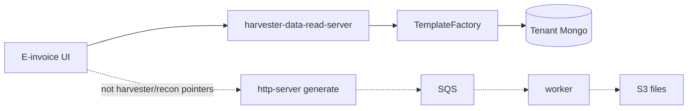

# ClearTax Ownership and How to Talk

> [!abstract]
> - Intern on Global E-Invoicing
> - Data-Harvester has **two planes**
> - Harvester + recon pointers = **BFF / data-retrieval** only
> - Async report generation (SQS → file → S3) is **not** those pointers
> - Four resume lines
> - 57% / 38% / 30→90% are **not** in the repo
> - Singapore files are **not** in this snapshot
> - Fill the ownership table

- Source writeups: `Resume/ClearTax/docs/` — start at [[00-architecture-overview]]
- Deep files still describe **both** planes
- Defence notes decide what you **say**

---

## What the service is (30 seconds)

- ClearTax Malaysia (and later other countries) needed one backend that could **show** invoices in a dashboard
- Same repo also **exports** huge dumps — that export is a sibling, not your harvester / recon claim
- **BFF (your pointers)**
    + `POST /{mode}/public/documents/v1/{templateType}/viewSummary|viewList|viewDetailed`
    + `TemplateFactory` picks an `IDataReadSource`
    + This is `resume:cleartax-harvester` and the recon **UI**
- **Reports (not those pointers)**
    + Accept a job, SQS, worker, `HarvesterCoreImpl`, strategy → Avro → CSV / Parquet / Excel → S3
    + You may **recognize** it on-call
    + You do **not** walk it as "I built Data-Harvester"
- **Stack**
    + Java 17, Spring Boot 2.7, WebFlux / Reactor, Mongo (reactive)
    + SQS / S3 / Avro / Temporal sit on the export plane

> [!tip] The sentence that saves the **harvester** round: **The BFF never knows Malaysia vs recon vs sales. It talks to `IDataReadSource`. Country is JSON + an annotated class + a `MODE` env.**

> [!warning] If they ask "walk the report job" on the harvester bullet: **"I didn't own report generation. I can show you the BFF factory."** Same park on recon CSV.

---

## Ownership — fill before the interview

- Docs describe `clear-data-harvester`
- They do not say which PRs were yours

| Area | I designed | I implemented | I on-called / operated | I only used |
|---|---|---|---|---|
| BFF plugin / `TemplateFactory` / `IDataReadSource` | | | | |
| Malaysia transactional recon **UI** (`viewSummary` / `viewList`) | | | | |
| Report plugin / `DataSourceGenerationStrategyFactory` / writers / S3 | — | — | maybe on-call | **not a pointer** |
| `HarvesterCoreImpl` (cache, force refresh, pre-sign) | — | — | maybe on-call | **not a pointer** |
| Singapore templates / configs | | | | |
| On-call Malaysia + Global | | | | |
| JaCoCo + MY tests 30→90 | | | | |

- Intern + "led on-call" will get a look
- If the table is empty, weaken the verb
- On-call **may** include "job stuck / no report generators found"
    + Operations on a plane you didn't claim as a feature
    + Don't let a night ticket become "I owned export"

---

## Number hygiene

| Claim | In the docs / snapshot | What you say if they press |
|---|---|---|
| Generic & configurable | **Yes** — `TemplateFactory`, JSON under `{COUNTRY}/{TEMPLATE}`, env `MODE` | Walk **add-a-template** (BFF). That *is* the harvester bullet. **Not** add-a-report. |
| −57% inconsistency | Docs **repeat the resume**. No before/after query | What was measured (mismatch count? customers fixing?). Window? If you cannot, walk the **UI flatten** and do not invent 57. Do not credit CSV. |
| Singapore templates | **No `SG/` folder** in this snapshot. MY is the blueprint | "I used the MY convention. SG lived on another branch / service. I can walk the exact file set I would add." Report *folders* on that checklist are configs, not "I owned generation." |
| 6-week on-call, −38% MTTR | Docs = runbook of **this** service. No ticket stats | Which queue, what you actually owned. 38% needs a dashboard. Else drop the number. |
| Coverage 30% → 90% | JaCoCo aggregate is real. **Tests in the snapshot are mostly commented / `@Disabled`** | Which modules, which JaCoCo HTML, excludes (models/DTOs). If 90% is not on a report you can open, do not defend 90. |

> [!danger] Same rule as Delhivery: if the right column is empty, walk the design. Do not derive 57 / 38 / 90 on a whiteboard.

---

## Related Notes

- [[01 - Data Harvester]]
- [[02 - Transactional Reconciliation]]
- [[03 - Singapore Expansion]]
- [[04 - On Call]]
- [[05 - Automated Testing]]
