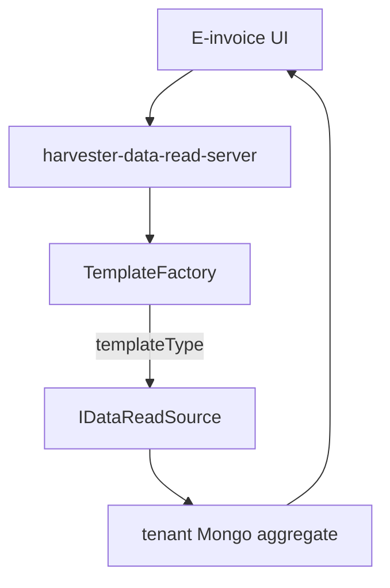

# Data Harvester

> [!abstract] `resume:cleartax-harvester`. This is the intern "I built a service" line — **data retrieval for the UI**, not file export. Generic = plugin registry. Configurable = JSON + env. **Report generation (SQS → worker → Avro → S3) is not this pointer.** Deep file: [[01-data-harvester-microservice]]. Overview: [[00-architecture-overview]].

## Resume line

Data-Harvester (Java, Spring Boot), generic & configurable data retrieval for Global-Einvoicing.

> [!warning] The service **also** has an async report plane. You do **not** own it. Do not walk `triggerReport`, SQS, `HarvesterCoreImpl.processTask`, writers, or S3 on this bullet. If they wander: "that's the export path; I didn't own it."

## Overview

Need: one backend that can **show** invoices (and recon, and later another country) in a dashboard without a Malaysia controller and a Singapore controller.

What this pointer is:

- **BFF** — `harvester-data-read-server`. `POST /{mode}/public/documents/v1/{templateType}/viewSummary|viewList|viewDetailed`.
- **`TemplateFactory`** — startup index of `@DataReadService(templatesSupported = …)` → `template → IDataReadSource`.
- **`IDataReadSource`** — `viewSummary` / `viewList` / `viewDetailed` (`Mono` / `Flux`). Core / controllers only see this.
- **JSON per country/template** — `einvoice-data-read-service/.../{COUNTRY}/{TEMPLATE}/` — field→Mongo path, display→enum, node-type ACL.
- **`MODE` env** — `@ConditionalOnExpression(MODE_INIT_CONDITIONAL_EINVOICE_MY)` so a MY pod does not load the wrong country's beans.
- **Tenant Mongo** — `@Qualifier("tenantReactiveMongoTemplate")`. Don't leak tenant A into B.

What this pointer is **not**:

- `http-server` generate + poll
- SQS `DataGenerationEvent` / `worker`
- `DataSourceGenerationStrategyFactory` / `@DataSourceGenerator`
- `HarvesterCoreImpl` cache / forceRefresh / pre-sign
- CSV / Parquet / Excel writers → S3

Those exist in the same Maven tree. Recon CSV is the same park: [[02 - Transactional Reconciliation]]. On-call may still *see* report tickets — that is [[04 - On Call]], not "I built export."

## Timeline

Internship **Jan – Jul 2025**. This bullet is the BFF plugin. Do not spend the round on the worker.

## Schema (BFF)

### `IDataReadSource`

Three methods. That is the contract.

| Method | Shape | Job |
|---|---|---|
| `viewSummary` | `Mono` | KPI / cards |
| `viewList` | `Flux` (or collected list) | Page of rows |
| `viewDetailed` | `Mono` | Drill-down — **recon throws**; don't promise it everywhere |

### BFF JSON (`…/resources/{COUNTRY}/{TEMPLATE}/`)

- field → Mongo path
- display → enum options
- `NodeTypeDBPathMapping` — TIN vs branch ACL

Malaysia templates in the snapshot: sales, sales B2C, sales conso, purchase, purchase conso, transactional recon.

### Factory map

`TemplateFactory`: `template → IDataReadSource`. Plain `put()` — **two services, same template, last one wins.** That is the ugly. (The report-side factory throws on collision — you can name the contrast; you do **not** own that factory.)

## Endpoints

**This pointer**

- `POST /{mode}/public/documents/v1/{templateType}/viewSummary`
- `POST /{mode}/public/documents/v1/{templateType}/viewList`
- `POST /{mode}/public/documents/v1/{templateType}/viewDetailed`

`TemplateFactory` picks the impl from `templateType`. Mode in the path + `MODE` env must agree or beans are missing.

**Not this pointer** — `POST .../reports` generate, poll `activityId`, download pre-sign. Don't walk them as yours.

## Architecture

### Flow 1 — a dashboard read

No SQS. Human waits. This is the "data retrieval" in the PDF.

### Flow 2 — add a country/template (say this out loud)

1. `TemplateType` (and `Mode` if new country).
2. Folder `{COUNTRY}/{TEMPLATE}/` JSON (field path, options, node ACL).
3. One `@DataReadService` class.
4. New collection? repository + the factory picks it up at startup.
5. `MODE` conditional + tenant Mongo qualifier if new country.

No change to the BFF controller. **Do not add** "and then `ReportType` + Avro + writer" on this bullet — that is the export checklist, not yours.

### The other plane (one sentence)

Same repo: generate → SQS → worker → strategy → file → S3. **Not this pointer.**

## One-minute pitch

I did not write a Malaysia controller and a Singapore controller. I wrote a BFF that asks a factory for "who handles this template." Malaysia sales is one class + a folder of JSON. Recon is another. Adding a type is enum + JSON + annotated class. The HTTP stay shut. File export lives in the same service; I did not own that path.

## Metrics

No Temple number on this line except "generic & configurable." That claim **is** the factory + JSON. Do not borrow 57% (recon) or 38% (on-call).

## Ugly questions

**How long?** Internship window. BFF plugin, not "I built SQS export."

**Why not if/else on country?** That's what we deleted. Finite family of **read** algorithms — [[Strategy]] + startup [[Factory Pattern]]. Not Abstract Factory.

**Did you own reports?** No. Same service, other plane. I will not walk writers.

**Why Reactor if you `.block()`?** Streaming + backpressure on the Mongo read. Some edges `.collectList().block()` because the controller wanted a list. Do not say "100% non-blocking end to end."

**How do you not leak tenant A into tenant B?** Per-tenant `MongoTemplate`. Mode gates which beans exist.

**TemplateFactory collision?** Last `put` wins. Silent. That's the ugly. I would throw like the report factory does — I didn't own that other factory.

**SQS vs Temporal?** Not this pointer. If they insist: SQS is "this export"; Temporal is periodic refresh. Park.

**What's in `harvester-core`?** Report runtime. Name the module if they open the pom. Don't claim `processTask`.

## HLD grill (this pointer)

| # | They ask | In this note? | One-line |
|---|---|---|---|
| 1 | Draw the read | Flow 1 | UI → BFF → factory → Mongo. |
| 2 | Why a factory? | Overview | New template = new class, not a new controller. |
| 3 | Multi-tenant | Schema | Qualifier per tenant. Mode env. |
| 4 | Why JSON not Mongo config? | Schema | Deploy with the jar. Change = release. Fair tradeoff. |
| 5 | Sync vs the SQS path | Warning | Reads are sync. Export is async — **not mine**. |
| 6 | Would SG beans load in MY? | Overview | No. Conditionals. Wrong `MODE` → missing template. |
| 7 | Scale the dashboard | New | Don't invent shard. Tenant Mongo + indexes. Don't quote QPS you don't have. |

## Agentic / LLD grill (this bullet)

They may treat this as an LLD. Stay on **Strategy + Factory**.

| # | They ask | In this note? | One-line |
|---|---|---|---|
| 1 | Walk add-a-template | Flow 2 | Enum, JSON, annotated class. |
| 2 | Strategy vs if-else | Ugly | Same retrieve shape, different Mongo. |
| 3 | Factory vs Spring `@Qualifier` only | Overview | Annotation index at startup so HTTP stays dumb. |
| 4 | Recon vs sales | 02 | Same interface, different JSON + flatten. |
| 5 | viewDetailed everywhere? | Schema | No. Recon throws. Contract. |
| 6 | Report factory throw vs this | Ugly | Contrast only. Not ownership. |

## Related Notes

- [[00 - ClearTax Ownership]]
- [[02 - Transactional Reconciliation]]
- [[03 - Singapore Expansion]]
- [[04 - On Call]]
- [[Strategy]]
- [[Factory Pattern]]
- [[01-data-harvester-microservice]]
