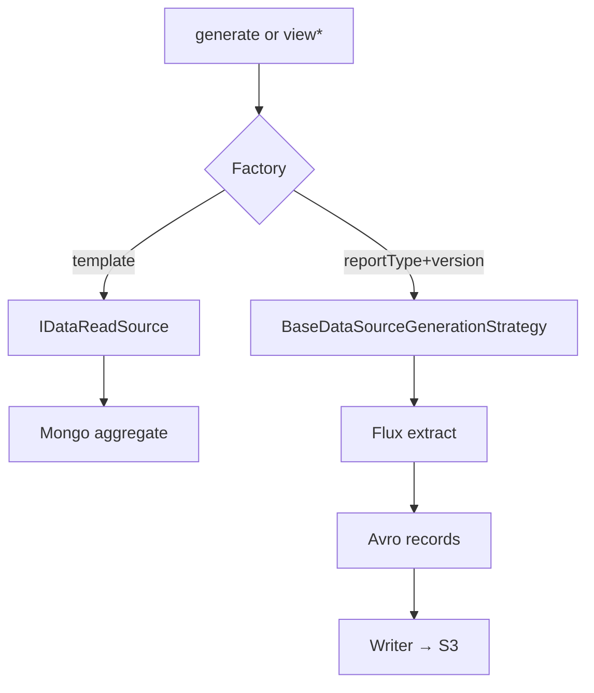

# Data Harvester

> [!abstract] `resume:cleartax-harvester`. This is the intern "I built a service" line. Generic = plugin registries. Configurable = JSON + env. Deep file: [[01-data-harvester-microservice]]. Overview: [[00-architecture-overview]].

## Resume line

Data-Harvester (Java, Spring Boot), generic & configurable data retrieval for Global-Einvoicing.

## Truth

Maven multi-module. The ones you must name:

| Module | Job |
|---|---|
| `data-read-service` | BFF contracts, `@DataReadService`, `TemplateFactory` |
| `einvoice-data-read-service` | Malaysia BFF impls + query builder |
| `harvester-data-read-server` | Public BFF HTTP |
| `harvester-core` | `HarvesterCoreImpl`, report factory, writers, mode DB |
| `read-data-source` | Per-mode report strategies |
| `worker` | SQS consumer |
| `http-server` | Internal generate + poll |
| `harvester-scheduler` | Temporal refresh |
| `test-report` | Aggregated JaCoCo |

**Generic:** new country/report is an annotated class, not a fork of the core.

- BFF: `@DataReadService(templatesSupported = …)` → `TemplateFactory` builds `template → IDataReadSource`.
- Reports: `@DataSourceGenerator(reportTypes, version)` → `DataSourceGenerationStrategyFactory` keys `reportType + version`.

`IDataReadSource`: `viewSummary` / `viewList` / `viewDetailed` (`Mono` / `Flux`). Report side: `extractDataStream` / `transformDataStream` on `BaseDataSourceGenerationStrategy`. `HarvesterCoreImpl` only sees those.

> [!warning] `TemplateFactory` is a plain `put()` — two services, same template, last one wins. Report factory **throws** on collision. If they ask "what's ugly in your factory," this is it.

**Configurable:**

- Report JSON: `read-data-source/.../mode/{MODE}/{REPORT_TYPE}/` — `output-schema.json` (Avro), `report-config.json` (filter path + CSV headers), `SCHEMA_MAPPING/`.
- BFF JSON: `einvoice-data-read-service/.../{COUNTRY}/{TEMPLATE}/` — field→Mongo path, display→enum, node-type ACL.
- `application.yml` is almost all `${ENV}` — `MODE`, `DB_TYPE`, tenant Mongo, S3, SQS.
- Writers: `WriterStrategyFactory` — CSV / Parquet / Excel. Same core.

**Core loop (`processTask`):** resolve strategy → `validateRequest` → if `forceRefresh` generate; else optional `DataChangeChecker` vs `requestHash` / `getLastUpdateAt` → write → maybe pre-sign S3 URLs.

**Reactive:** Mongo streams as `Flux`. Some BFF edges `.collectList().block()` because the controller wanted a list. Do not say "100% non-blocking end to end."

**Multi-tenant:** `@Qualifier("tenantReactiveMongoTemplate")` on BFF. Mode beans behind `@ConditionalOnExpression(MODE_INIT_CONDITIONAL_EINVOICE_MY)`.

## One-minute pitch

I did not write a Malaysia controller and a Singapore controller. I wrote a core that asks a factory for "who handles this template / report type." Malaysia sales is one class + a folder of JSON. Recon is another. Adding a type is enum + JSON + annotated class. Controllers and `HarvesterCoreImpl` stay shut.

## Boxes

This is [[Strategy]] plus a startup [[Factory Pattern]] that indexes annotations. Not Abstract Factory — one product type per factory, not families of widgets.

## Add a report (say this out loud)

1. `ReportType` / `TemplateType` enum.
2. Folder `mode/{MODE}/{REPORT}/` with schema + `report-config.json`.
3. One `@DataSourceGenerator` or `@DataReadService` class.
4. New collection? repository + factory register.

No change to core / writers / HTTP.

## Ugly questions

**Why not if/else on country?** That's what we deleted. Finite family of retrieve/export algorithms — [[Strategy]].

**Why Reactor if you `.block()`?** Streaming + backpressure on the Mongo read. Block is a seam, not the whole story.

**How do you not leak tenant A into tenant B?** Per-tenant `MongoTemplate`. Mode gates which beans exist.

**Cache stale?** `isCachingEnabled` + last-update vs hash. `forceRefresh` skips. If they want a bug: cache key wrong → silent stale export.

**SQS vs Temporal?** SQS = "this export." Temporal = periodic refresh (`harvester-scheduler`). Don't mix them.

**Duplicate generate clicks?** `AsyncTaskLifeCycleService.acceptRequest` — existing task id reused, no second SQS publish.

## Related Notes

- [[00 - ClearTax Ownership]]
- [[02 - Transactional Reconciliation]]
- [[Strategy]]
- [[Factory Pattern]]
- [[01-data-harvester-microservice]]
