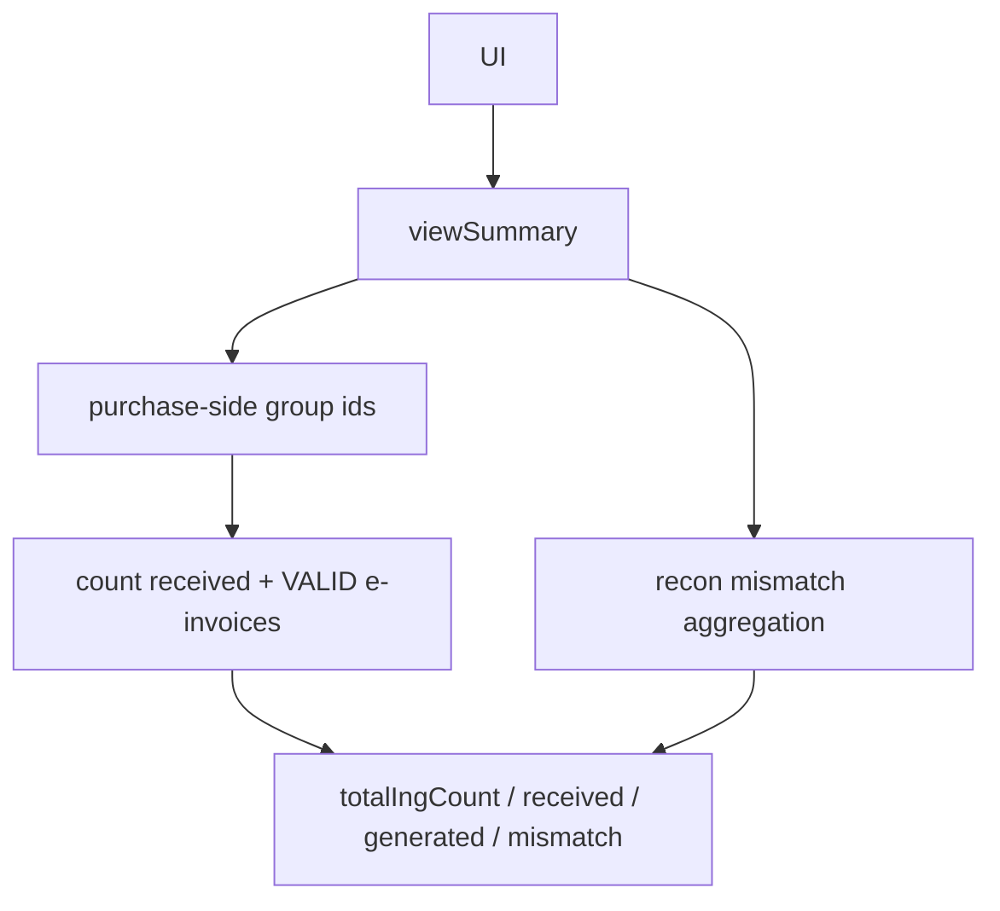
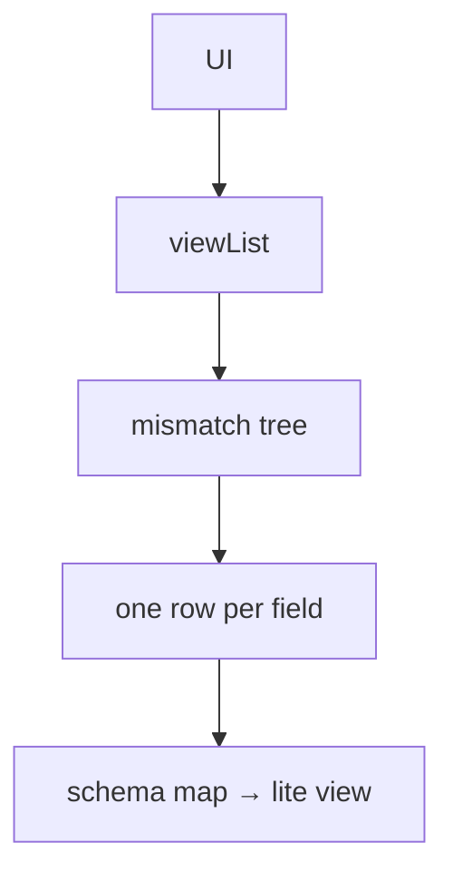

# Transactional Reconciliation

> [!abstract] `resume:cleartax-recon`. Malaysia: ClearTax copy vs LHDN copy, field by field, **on the dashboard**. 57% is a business number. **CSV / report generation is not this pointer.** Deep file: [[02-transactional-reconciliation]]. Plugin shape: [[01 - Data Harvester]].

## Resume line

Shipped Transactional Reconciliation in Malaysia, −57% data inconsistency. (Same PDF line as Singapore — [[03 - Singapore Expansion]].)

> [!warning] The repo has a `MyTransactionalReconDataSource` export class. You do **not** own that path. This pointer is `EinvoiceTransactionalReconReadService` — `viewSummary` + `viewList`. If they ask "and the CSV?" — "same flatten idea, other plane, not mine."

## Overview

Every invoice goes to ClearTax **and** to **LHDN** (Malaysia tax authority). They drift. A tax person needs cards + a table of **which fields** disagree.

What this pointer is:

- One more `@DataReadService` on the Harvester BFF. Not a new microservice.
- Template `einvoice_my_transactional_recon` / `TemplateType.EINVOICE_MY_TRANSACTIONAL_RECON`.
- Mongo tree of mismatches → **flatten to one UI row per field**.
- Summary KPIs that mix purchase-side counts with recon counts.

What this pointer is **not**:

- `ReportType.EINVOICE_MY_TRANSACTIONAL_RECON`
- `MyTransactionalReconDataSource` / Avro / SQS / S3
- "I shipped the download button"

## Timeline

Internship feature on Malaysia. Same Harvester BFF as 01. Do not steal Singapore's sentence into this walk.

## Schema

### `TransactionalReconDataMismatch`

- `fieldValueCt` / `valueInFile` — what we have.
- `fieldValueLhdn` / `valueAtLhdn` — what LHDN has.
- **Document-level:** `documentLevelMisMatches.fieldLevelMisMatchList[]`
- **Line-level:** `lineLevelMisMatches[]` each with its own field list + `serialNumber` / `productDescription`

### BFF JSON

Constructor of `EinvoiceTransactionalReconReadService` loads MY maps. List mapping: `EINVOICE_TRANS_RECON_DB_SCHEMA` → `TRANS_RECON_LITE_VIEW_SCHEMA`.

### ACL (in-query)

`NodeType.TIN` → `taxpayerOrgId`. `BRANCH_L2` → taxpayer + `branchOrgId`. Else illegal node.

Mismatch `$match`: non-empty document-level list **OR** `elemMatch` non-empty line-level list, then `group().count()`. Large reads: `allowDiskUse(true)`.

Mongo: `@Qualifier("tenantReactiveMongoTemplate")`. (The export path uses a mode-qualified template — not yours.)

## Endpoints

Same BFF three as 01, this `templateType`:

- **`viewSummary`** — you own this.
- **`viewList`** — you own this.
- **`viewDetailed`** — throws `NoSuchElementException`. **Intentional.** Do not promise a drill-down. If the UI calls it, that's a contract bug, not a mystery 500.

No generate / download on this pointer.

## Architecture

### Flow 1 — summary cards

KPI map: `totalIngCount`, `receivedInvoiceCount`, `eInvoiceGeneratedCount`, `eInvoiceMismatchCount`. So a tax person sees "how many invoices" next to "how many are wrong."

### Flow 2 — list (the interesting bit)

Flatten: document-level rows have **empty** line fields. Line-level rows carry serial + product. That is why this is not "just another sales list."

### The CSV (park)

Same flatten into Avro, then the report worker. **Not this pointer.** Deep file §5 if you need to *recognize* it. Do not walk `extractDataStream`.

## One-minute pitch

Recon is not a new product. It is one more BFF strategy on Harvester. Mongo stores a **tree** of mismatches; the UI wants a **spreadsheet**. I flatten document + line fields into rows. Summary cards mix purchase counts and recon counts. 57% is a business number — I shipped the mismatch surface. File export of the same rows is a sibling path I did not own.

## Metrics

- **−57% data inconsistency** — docs **repeat the resume**. No before/after query in the tree. Invoices with ≥1 mismatch? Fields? After customers used the screen? If you have the dashboard, say it. Else: "I shipped the mismatch UI; I will not invent 57."
- Do not attach 57 to "because we added CSV."

## Ugly questions

**57% — of what?** See Metrics. Walk the flatten if they lock on the number.

**Why flatten in Java not `$unwind`?** We did both — aggregation to fetch, Java to build the row the schema expects (especially line context). If they prefer unwind, say you could, watch cardinality.

**Why two code paths (UI vs CSV)?** They will ask because the repo has both. **CSV is not this pointer.** One sentence: BFF is a page; export is a file on another plane.

**Wrong tenant sees mismatches?** Node-type criteria. Empty / wrong `nodeIds` → exception or empty. Fill what you actually tested.

**viewDetailed crash?** It's a throw. Client must not call it.

**Is this a new service?** No. Annotated class + MY JSON. [[01 - Data Harvester]].

**Did you write the LHDN sync that *creates* mismatches?** Fill. This pointer is **reading** the mismatch collection for the UI. Don't claim the ingest job unless you did it.

## HLD grill (this pointer)

| # | They ask | In this note? | One-line |
|---|---|---|---|
| 1 | Draw the screen | Flow 1–2 | Summary KPIs + flattened list. |
| 2 | Where does data live? | Schema | Mismatch collection, tree shape. |
| 3 | Multi-tenant | Schema | Node type + tenant template. |
| 4 | Why not a download API here? | Warning | Export exists. Not mine. |
| 5 | Indexes / `allowDiskUse` | Schema | Large mismatch scans. Don't invent QPS. |
| 6 | 57% as a metric pipeline | Metrics | Not in this repo. |

## Agentic / LLD grill (this bullet)

| # | They ask | In this note? | One-line |
|---|---|---|---|
| 1 | Why a new template not a flag on sales? | Overview | Different document, different flatten. |
| 2 | Walk viewList | Flow 2 | Tree → one row per field. |
| 3 | Line vs document | Schema | Line rows carry serial/product. |
| 4 | Why no viewDetailed? | Endpoints | Contract throw. |
| 5 | Same factory as sales? | 01 | Yes. `@DataReadService`. |
| 6 | CSV flatten copy-paste? | Park | Sibling class. Don't defend it. |

## Related Notes

- [[00 - ClearTax Ownership]]
- [[01 - Data Harvester]]
- [[03 - Singapore Expansion]]
- [[02-transactional-reconciliation]]
