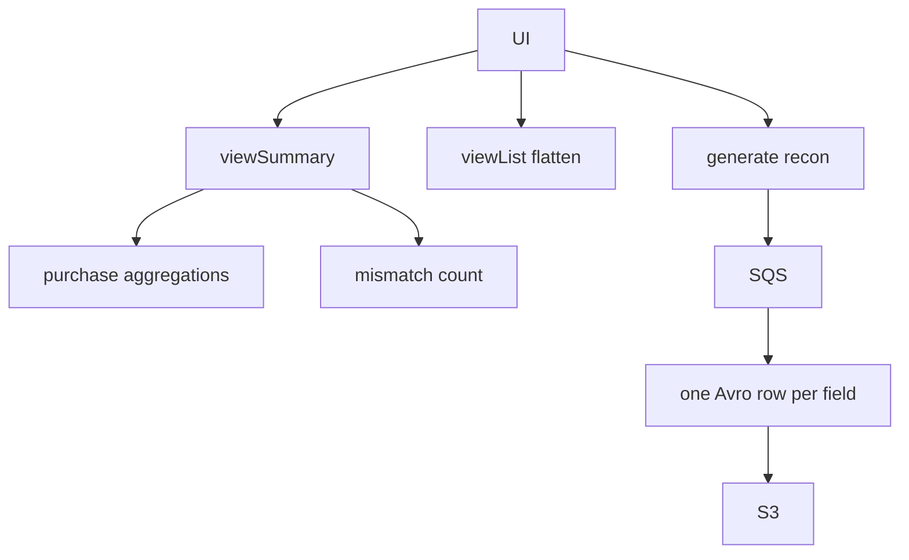

# Transactional Reconciliation

> [!abstract] `resume:cleartax-recon`. Malaysia: ClearTax copy vs LHDN copy, field by field. UI + CSV. 57% is a business number. Deep file: [[02-transactional-reconciliation]].

## Resume line

Shipped Transactional Reconciliation in Malaysia, −57% data inconsistency. (Same PDF line as Singapore — [[03 - Singapore Expansion]].)

## Truth

Every invoice goes to ClearTax **and** to **LHDN** (Malaysia tax authority). They drift.

- `fieldValueCt` / `valueInFile` — what we have.
- `fieldValueLhdn` / `valueAtLhdn` — what LHDN has.

Doc `TransactionalReconDataMismatch`:

- document-level: `documentLevelMisMatches.fieldLevelMisMatchList[]`
- line-level: `lineLevelMisMatches[]` each with its own field list + `serialNumber` / `productDescription`

Enums: `TemplateType.EINVOICE_MY_TRANSACTIONAL_RECON`, `ReportType.EINVOICE_MY_TRANSACTIONAL_RECON`.

### BFF — `EinvoiceTransactionalReconReadService`

`@DataReadService(templatesSupported = "einvoice_my_transactional_recon")`. Constructor loads MY JSON maps.

**`viewSummary`:** purchase-side group ids for the hierarchy → count received + VALID e-invoices → recon collection mismatch aggregation → KPI map (`totalIngCount`, `receivedInvoiceCount`, `eInvoiceGeneratedCount`, `eInvoiceMismatchCount`).

**`viewList`:** flatten nested mismatches to **one row per field**. Document-level rows have empty line fields. Line-level rows carry serial + product. Schema map `EINVOICE_TRANS_RECON_DB_SCHEMA` → `TRANS_RECON_LITE_VIEW_SCHEMA`.

**`viewDetailed`:** throws `NoSuchElementException`. Intentional. Do not promise a drill-down.

### Report — `MyTransactionalReconDataSource`

`@DataSourceGenerator` + MY mode conditional. `extractDataStream` = criteria + helper aggregation, `flatMap` grouped `documents`. `transformDataStream` = same flatten into Avro (`fileName`, `documentNumber`, CT vs LHDN, line cols).

ACL in-query: `NodeType.TIN` → `taxpayerOrgId`; `BRANCH_L2` → taxpayer + `branchOrgId`; else illegal node.

Mismatch `$match`: non-empty document-level list **OR** `elemMatch` non-empty line-level list, then `group().count()`. Large reads: `allowDiskUse(true)`.

Two repos, two templates: BFF `tenantReactiveMongoTemplate`; report mode qualifier `MONGO_TEMPLATE_MODE_EINVOICE_MY`.

## One-minute pitch

Recon is not a new product. It is one more strategy on Harvester. The interesting bit is the **shape**: Mongo stores a tree of mismatches, the UI and the CSV want a spreadsheet. I flatten document + line fields into rows. Summary cards mix purchase counts and recon counts so a tax person sees "how many invoices" next to "how many are wrong."

## Boxes

## Ugly questions

**57% — of what?** Docs do not compute it. Invoices with ≥1 mismatch? Fields? After customers used the screen? If you have the dashboard, say it. Else: "I shipped the mismatch surface; I will not invent 57."

**Why flatten in Java not `$unwind`?** We did both — aggregation to fetch, Java to build the row the schema expects (especially line context). If they prefer unwind, say you could, watch cardinality.

**Why two code paths?** BFF wants KPIs + a page. Export wants a file and must not hold the HTTP thread. Same flatten idea, different factory.

**Wrong tenant sees mismatches?** Node-type criteria. If `nodeIds` empty / wrong type → exception or empty. Fill what you actually tested.

**viewDetailed crash?** It's a throw. Client must not call it. That's a contract, not a 500 mystery — unless the UI does call it.

## Related Notes

- [[00 - ClearTax Ownership]]
- [[01 - Data Harvester]]
- [[02-transactional-reconciliation]]
