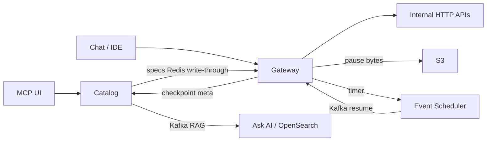

# Ownership and How to Talk

> [!abstract] One platform, seven resume lines. The architecture is control plane vs data plane. The numbers are mixed: some you can derive from the repos, some the docs only **repeat from the resume**. Fill the ownership table before Temple or they will do it for you.

Source docs: [[01-system-overview]] and the rest of `Resume/docs/`.

## What the platform is (30 seconds)

Delhivery's internal APIs (Express, FMS, WMS, HR, …) need to be callable by LLMs, IDEs, a chat UI, and a drag-and-drop workflow builder. We did **not** wrap each API by hand forever.

- **Catalog** stores definitions (OpenAPI tools, agents, workflow DAGs, versions). FastAPI. Mongo + some Postgres. **Never executes a business API.**
- **Gateway** resolves those definitions and **runs** them: FastMCP tools in memory, LangGraph agents, LangGraph workflows, HTTP out to backends. Starlette + FastMCP + LangGraph.
- **Static `*_MCP` servers** are the older hand-written FastMCP microservices (the "100+ tools" seed).
- **Event Scheduler** (Postgres + Kafka) wakes paused workflows.
- **Ask AI** is a separate FastAPI + worker on the `ask-ai` branch that searches the registry.

> [!tip] The sentence that saves the round: **Catalog is the system of record. Gateway is the runtime. LangGraph `interrupt()` does not live in Catalog — grep it, it is only in the gateway.**

> [!warning] Playground `v2/chat` and `/run` stay **sync**. Production is `POST /trigger` → Kafka `acks=all` → **202** (else **503**). **No GET** — runs are traces on Langfuse, not a table. S3+Catalog is pause only. Depth: [[02 - Catalog and Gateway]].

## Calendar (locked — say this, do not improvise)

Join **21 Oct 2025**. First team: almost no work through **Dec**. Agentic from **Jan 2026**. Interview **28 Sep 2026**.

| Window | What you say you shipped |
|---|---|
| 21 Oct 2025 – Dec 2025 | Other team. Low bandwidth. One sentence, no trash-talk. |
| **Jan – Mar 2026** | **Standalone MCP servers only.** Pointer 1 (domain FastMCP). Pointer 2 (`INTEGRATION_MCP`) lives here too — still an MCP microservice, not Catalog. |
| **Apr – mid-May 2026** (~1.5 mo) | **Catalog + Gateway** (registry + OpenAPI → tool execute). Pointer 3. Agents are *not* in this window. |
| **Mid-May – end Jun 2026** (~1.5 mo) | **Agents** (LangGraph, children, Orion indent). Pointers 4–5. |
| **Jul 2026** (1 mo) | **Workflows — first cut.** Canvas compile/run. Not "pause/resume + scheduler finished and perfect." |
| **Aug – Sep 2026** | Fixes: harden workflows (pause/resume), Ask AI, whatever else. No new "I built X from scratch for a quarter." |

> [!warning] Gateway in April–mid-May means the **tool path** (resolve spec, flatten, HTTP out). LangGraph **agent** runtime is the next 1.5 months. Canvas is July. If they collapse all three into "I architected the Gateway," you ate the calendar.

Ask AI has **no dedicated window** — it sits in Aug–Sep / "fixes" unless you later give it dates.

## Ownership — fill before the interview

Docs describe the **codebase**, not your PRs. Until this table is honest, do not say "I architected" for a box you only used.

| Area | I designed | I implemented | I on-called / operated | I only used |
|---|---|---|---|---|
| Static `*_MCP` servers | | | | |
| Token-optimised IDE MCP | | | | |
| Catalog registry / enricher / versions | | | | |
| Gateway OpenAPI → tool | | | | |
| Agent v2 / child agents | | | | |
| Orion indent agent + enricher | | | | |
| Canvas workflow DSL + validator | | | | |
| Pause/resume + scheduler | | | | |
| Ask AI hybrid + TAZS | | | | |
| RBAC / transformers / SOP compiler | | | | |

"Spearheaded / architected / delivered" on the PDF must match a row. If a row is empty, weaken the verb in your mouth even if the PDF stays.

## Number hygiene

| Claim | In the repos / docs | What you say if they press |
|---|---|---|
| 100+ tools | README tally **133–136** on ~7 static servers | "Hand-built FastMCP tools; I can walk Express 73 + FMS 40 + …" |
| 11+ domains | **14** `VALID_DOMAINS` in the enricher | List a few: Express, Freight, Fulfillment, Fleet, … |
| 600+ tools | Stated as catalog size, no query in the notes | "Registry of OpenAPI operations. I will not invent how we counted unless I re-run the list query." |
| 72k /day | Temple PDF, Catalog+Gateway bullet. **Defend as production `POST .../v2/trigger`** (agent workers). Playground `v2/chat` is humans iterating — not this counter. ~50 RPM. | Do not move the number off the PDF. Do not say Catalog serves it. Do not say Orion 1k indents. 124k is workflows. |
| 124k /day | Workflows bullet. | If 72k is agent `/trigger`, 124k cannot be the same counter. Split or drop one. Don't mix playground chat into 72k. |
| 20+ workflows | Stated, then "migrated onto the canvas" | Name 2–3 you touched (Orion indent is one). |
| 1,000+ indents/day | Stated | Orion team volume — source? |
| ₹28 → ₹4 → ₹1.5 | `cost_handling.py` exists; **the rupees are not in code** | LLM/token cost accounting is real. The 28/4/1.5 are a **business number**. How computed? |
| ~70% less search noise | Stated | What was the eval set? Before/after metric? |
| Zero relevant dropout | **Code**: TAZS empty → fall back to top-20 | That is an engineering guarantee, not an offline eval unless you ran one. |
| 3 weeks → 5 days | Mechanism in [[10-client-integration-mcp]] (smart load, not a study) | Name the client/pilot or say "cycle we designed to collapse; I will not invent the calendar." |

> [!danger] If you cannot fill the right column, do not spend the round deriving the left column. Walk the design. Correct the number in one sentence if they lock on.

## Related Notes

- [[01 - MCP Servers]]
- [[02 - Catalog and Gateway]]
- [[03 - Agents and Orion]]
- [[04 - Workflows]]
- [[05 - Pause Resume]]
- [[05 - Ask AI Search]]
- [[06 - Supporting Modules]]
- [[07 - Langfuse]]
