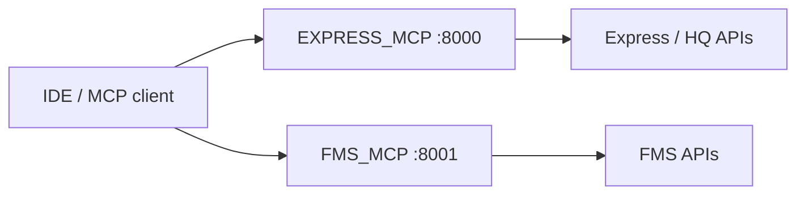
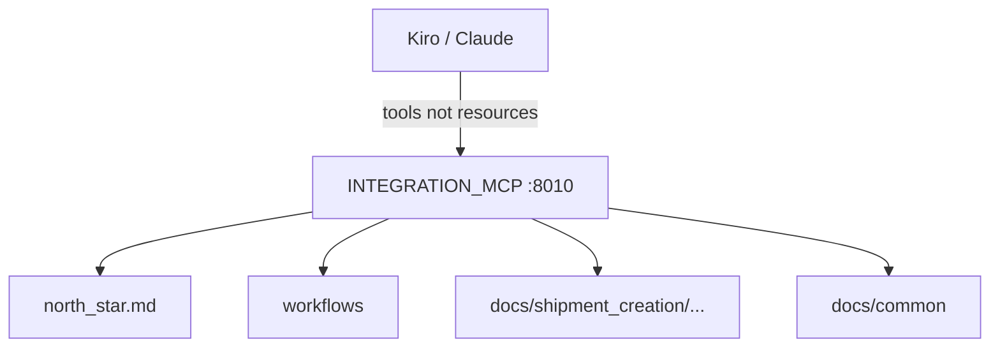

# MCP Servers

> [!abstract] Pointer 1 = domain FastMCP wrappers. Pointer 2 = `INTEGRATION_MCP` docs KB for the Client IDE. Not Catalog/Gateway. Docs: [[07-mcp-servers]] · [[10-client-integration-mcp]].

## Resume lines

- `resume:mcp-servers` — 100+ tools, Python, FastMCP, microservices, bridge internal systems.
- `resume:dev-productivity` — token-optimised MCP for Client IDE / Delhivery One API, 3 weeks → 5 days.

---

## Pointer 1 — domain MCP servers

Static servers live in `mcp_collection/*_MCP`. Each is its own container, own port, `@mcp.tool()` per HTTP API. Converted from Postman / old scripts.

| Server | Tools (README) | Domain |
|---|---|---|
| EXPRESS_MCP | 73 | tracking, dispatch, pincodes, billing |
| FMS_MCP | 40 | fleet, contracts, routes |
| HRMS_MCP | 11 | users, vendors, attendance |
| WMS_MCP | 5 | warehouse |
| UCID_MCP | 3 | address / phone lookup |
| FAAS_MCP | 1 | facility |
| JARVIS_MCP | 3 | helpdesk |

Headline **133–136 tools**. `INTEGRATION_MCP` is **pointer 2**, not in this tally.

Auth per tool: client token param → else env `EXPRESS_TOKEN` etc → else fail. `.env` not in images.

### Timeline (pointer 1)

Joined 21 Oct 2025, idle-ish until Jan, then agentic. **Jan–Mar 2026** this was the main work.

> [!warning] Do **not** say "it took three months to write a hundred tools." Each tool is `@mcp.tool` → `make_request`. Say: **three months standing up the MCP layer**. The ~130 is the **output of that window**.

If they do the math (133 / ~60 weekdays ≈ 2 wrappers/day): agree, and move the time to pattern + domain APIs + seven processes.

### Pitch (pointer 1)

I joined 21 Oct, first team had almost no work till January, then I moved to the agentic team. First job: get internal APIs (Express, FMS, …) callable from an IDE/agent. **Jan through about March** I was on that — FastMCP microservices, one container per domain, convert Postman into `@mcp.tool` → `make_request`, auth, Compose. By the end of that window the collection was ~130 tools across seven servers. That is why the resume says 100+. After that we stopped adding wrapper `server.py` files and went Catalog + Gateway — except pointer 2, which is a different kind of MCP.

### Ugly questions (pointer 1)

**How long?** ~3 months (Jan–Mar) for the **project**. Not 3 months because 100 functions are hard.

**100+ — exact number?** 133–136 on the seven named servers. Not 600. Not INTEGRATION_MCP.

**How does a tool call work?** `@mcp.tool` → `make_request(url, params, token)`.

**Secret in the image?** No. `env_file` / client-supplied token.

**Why both static and dynamic?** Seed vs scale. Same agents can consume both.

**What if the backend 500s?** Tool returns the error body; retry is upstream.

---

## Pointer 2 — Client IDE MCP (`resume:dev-productivity`)

Deep file: [[10-client-integration-mcp]]. Branch `mcp-client-graviton`. `INTEGRATION_MCP/`, port **8010**.

Not Express-style wrappers. Product is a **Delhivery One / B2C knowledge base** for an IDE assistant (Kiro, Claude Desktop). Client engineer integrates shipping APIs from the editor instead of hunting public docs.

**Token-optimized** = never dump the corpus. Docs pre-chunked (`workflows/` + per-API `spec/auth/errors/quirks/retry` + `common/`). Loader **override** (API auth/errors beat common) and **hybrid** (append quirks/retry). `north_star.md` always first — do not google, this server is source of truth, complete files not snippets.

Three tiers, each as **prompt + tool** (Kiro only discovers tools):

| Tier | Tool | Loads |
|---|---|---|
| Architect | `get_integration_guide` | north_star + workflow overview + forward/reverse |
| Engineer | `get_api_documentation` | smart mix for one of ~18 APIs |
| Diagnostician | `get_diagnostic_info` | spec + errors + quirks, fix not design |

`list_available_apis` first. `get_doc` escape hatch. URI `delhivery://{category}/{topic}` — reject `..`.

**Evolution:** `server2.py` (~5.5k lines) had docs **inside Python dicts**. `server.py` v2 is thin — add an API = add Markdown. That is the token/maintainability work.

**3 weeks → 5 days:** mechanism is real. The **weeks are still a business claim**. Name a client/pilot or walk back.

**Calendar:** slice of **Jan–Mar**, or immediately after pointer 1. Not a new quarter.

> [!warning] Do not point at Catalog `count_tokens`. That is registry token budgets. This server trims **which markdown files enter the IDE context**.

### Pitch (pointer 2)

Same MCP family, different job. After the domain servers, clients still spent weeks reading One API docs. I shipped `INTEGRATION_MCP`: FastMCP on 8010 that **loads only the docs for the current phase** — plan the journey, implement one API, debug one error. Auth/errors override common; quirks append. Assistant is forbidden from the public internet. First version baked docs in code (`server2`); we pulled them into markdown so updating shipment-create is a file, not a 5k-line Python module.

### Ugly questions (pointer 2)

**How is it token-optimised?** Chunked markdown + override/hybrid load. Not a tokenizer. Not dumping 18 specs.

**Why tools and prompts?** Most IDE MCP clients only call `@mcp.tool`. Tools are the real API.

**Why not RAG / Ask AI?** Closed curated corpus with a loading policy. Ask AI searches the 600-tool registry. Different problem.

**Why not one giant prompt?** That is `server2`. Context blows up; every API change is a code change.

**Path traversal?** Reject `..` in category/topic.

**3→5 days — which client?** Fill or walk back to mechanism.

**Did you write all 18 API folders?** Loader vs content. Be honest.

**Live API calls?** `server2` had `make_request`. v2 is docs. Don't mix.

**How long did *this* take?** A slice of the Jan–Mar window, not another three months. Fill weeks if you remember.

## Related Notes

- [[00 - Ownership and How to Talk]]
- [[02 - Catalog and Gateway]]
- [[07-mcp-servers]]
- [[10-client-integration-mcp]]
