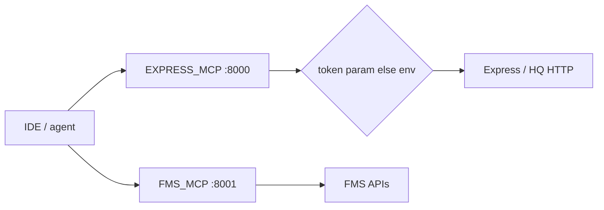
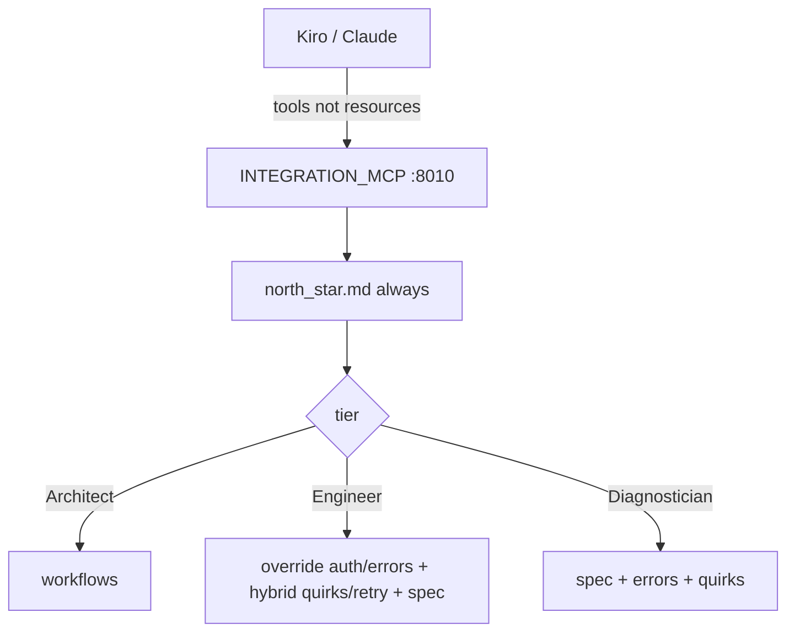

# MCP Servers

> [!abstract] Pointer 1 = domain FastMCP wrappers (`resume:mcp-servers`). Pointer 2 = `INTEGRATION_MCP` docs KB for the Client IDE (`resume:dev-productivity`). **Not** Catalog/Gateway. Docs: [[07-mcp-servers]] · [[10-client-integration-mcp]].

## Resume lines

- `resume:mcp-servers` — 100+ tools, Python, FastMCP, microservices, bridge internal systems.
- `resume:dev-productivity` — token-optimised MCP for Client IDE / Delhivery One API, 3 weeks → 5 days.

Two products. Same quarter. Same MCP family. **Different job.**

## Overview

Need (Jan 2026): internal APIs (Express, FMS, WMS, HR, …) are HTTP. An IDE / agent cannot call them until someone wraps them. Catalog does **not** exist yet.

What we built:

- **Pointer 1 — static `*_MCP`** — one container per domain, own port, `@mcp.tool()` per HTTP API. Converted from Postman / old scripts. `make_request(url, params, token)`. This is the **100+** seed.
- **Pointer 2 — `INTEGRATION_MCP`** — **not** another wrapper farm. Curated Delhivery One / B2C **markdown KB** on port **8010**. IDE assistant (Kiro, Claude Desktop) loads **only the docs for this phase**. Token-optimised = **which files enter context**, not Catalog `count_tokens`.
- **Auth** — client token param → else env `EXPRESS_TOKEN` / `INTEGRATION_TOKEN` → else fail. `.env` never in the image.
- **Transport** — HTTP / streamable-http (`/mcp`). Compose brings the collection up.

Why both later exist with Catalog: static servers **seeded** the ecosystem. Dynamic Gateway (`{owner}/c/{slug}/mcp`) **scaled** it to 600+. Same agents can consume both. April is Catalog — not this file.

## Timeline

- **21 Oct 2025 – Dec** — other team. One sentence.
- **Jan – Mar 2026** — **this whole quarter.** Pointer 1 **and** pointer 2. Still MCP microservices. Catalog does **not** start until April.

> [!warning] Do **not** say "it took three months to write a hundred tools." Each tool is `@mcp.tool` → `make_request`. Say: **three months standing up the MCP layer**. The ~130 is the **output of that window**. Pointer 2 is **inside** the same quarter, not a fourth month.

If they do 133 / ~60 weekdays ≈ 2 wrappers/day: agree, and move the time to pattern + domain APIs + seven processes + the IDE KB.

## Schema

### Pointer 1 — one folder per server

```
<NAME>_MCP/
  Dockerfile
  server.py          # @mcp.tool() per endpoint
  config.py
  requirements.txt
  env.example        # EXPRESS_TOKEN, …
  README.md
```

Not Mongo. No versions. No live pointer. The "schema" is the function signature + the backend URL in `config`.

README tally (the **100+**):

| Server | Tools | Port | Domain |
|---|---|---|---|
| `EXPRESS_MCP` | 73 | 8000 | tracking, dispatch, pincodes, billing |
| `FMS_MCP` | 40 | 8001 | fleet, contracts, routes |
| `HRMS_MCP` | 11 | 8002 | users, vendors, attendance |
| `WMS_MCP` | 5 | 8003 | warehouse |
| `UCID_MCP` | 3 | 8004 | address / phone |
| `FAAS_MCP` | 1 | 8005 | facility |
| `JARVIS_MCP` | 3 | 8006 | helpdesk |

Headline **133–136**. `INTEGRATION_MCP` is **pointer 2**, not in this tally. Extra folders exist (`HYPERLOCAL_MCP`, `FM_MCP`, `epod_lm`, …) — don't add them to 100+ unless you counted them.

Backends behind the adapters: Express/HQ, Echo, Bird, FMS, VCUS, VCCS, WMS, HRMS, UMS, DAS, UCID, FaaS, Jarvis/Narad.

### Pointer 2 — docs corpus (`INTEGRATION_MCP/docs/`)

Three-tier taxonomy. Pre-chunked **on disk** so the loader can pull a subset.

- **Workflows** — `docs/workflows/`: `overview.md` (11-step order), `forward_journey.md`, `reverse_journey.md`.
- **Per-API** (~18 folders) — `spec.md` (raw OpenAPI = SoT), `auth.md`, `errors.md`, `quirks.md`, `retry.md`. APIs: pincode / bulk pincode / bulk waybill / cancel / edit / shipment_creation / tracking / expected_tat / warehouse create+edit / pickup / packing slip / invoice / document_download / ewaybill / ndr_status+update / rvp_qc.
- **Common** — auth, errors, config, request_construction, logging, checklist, labels-and-pricing.
- **Behavior** — `north_star.md` **always first**. Do not google. This server is SoT. Complete files, not snippets.

URI scheme: `delhivery://{category}/{topic}` → `docs/{category}/{topic}.md`. Reject `..`.

### Two implementations (don't mix)

| File | What |
|---|---|
| `server.py` v2.0.0 | **Current.** Thin. Docs in markdown. Add an API = add files. |
| `server2.py` (~5.5k lines) | Docs **inside Python dicts** + `make_request` for live calls. The thing we left. |

## Endpoints

**Pointer 1**

- `{host}:{port}/mcp` — FastMCP HTTP. Example: Express `:8000/mcp`.
- Client `mcp.json`: `{"url": "http://localhost:8000/mcp", "transport": "http"}`.

**Pointer 2** (`Delhivery-Integration-Copilot`, `:8010`, `stateless_http=True`)

| Surface | Name | Loads |
|---|---|---|
| Tool + prompt | `get_integration_guide` / `plan-integration` | north_star + workflow overview + forward/reverse |
| Tool + prompt | `get_api_documentation` / `integrate-api` | smart mix for **one** API |
| Tool + prompt | `get_diagnostic_info` / `diagnose-issue` | spec + errors + quirks — **fix**, not design |
| Tool | `list_available_apis` | **"CALL THIS FIRST"** |
| Tool | `get_doc` | one file (escape hatch) |
| Resource | `delhivery://{category}/{topic}` | same files; most IDEs **ignore** resources |

Also `/health`, `/ping` → `{status: healthy, service: INTEGRATION_MCP, version: 2.0.0}`. `/.well-known/oauth-authorization-server` → `{}` to silence client auth probes.

> [!tip] Most MCP clients only discover **`@mcp.tool`**. That is why every tier is a tool **and** a prompt. Tools are the real API. Kiro does not browse resources.

**Not these URLs:** Catalog `{gateway}/{owner}/c/{slug}/mcp` is **April**. Don't walk it on this pointer.

## Architecture

### Flow 1 — domain tool call



1. Client calls `tool_name(token=?)`.
2. `make_request(url, params, token=token)`.
3. Backend 500 → tool returns the **error body**. Retry is **upstream** (model / human). Don't retry POST inside the wrapper unless you wrote that.

Compose: `docker compose up -d`. `env_file` per service. Images have no secrets.

### Flow 2 — smart load (the token work)



Engineer mix (heart of "token-optimised"):

- `north_star.md` always first.
- **Auth / errors: OVERRIDE** — `{api}/auth.md` if it exists, else `common/`.
- **Quirks / retry: HYBRID** — append API file if present.
- Append common config / request_construction / logging / checklist.
- **Spec always last among docs** — raw YAML wins if summary conflicts.
- Then: inspect their repo, one round of questions, plan, complete runnable files, STOP.

Diagnostician: no design speech. Spec + errors + quirks + retry.

`north_star` rules they may poke: no internet; consultation vs diagnostic; don't hardcode base URLs (`track.delhivery.com` vs staging from config); **every** spec field; never dump the corpus.

### Flow 3 — why v2 left `server2`

`server2` = 18 APIs as Python dicts. Every doc change is a code change. Context blows up if you concatenate dicts. v2 = markdown + compose-at-request-time. That **is** the maintainability / token story.

`server2` also had **live** `make_request`. v2 is **docs**. Don't say INTEGRATION_MCP "calls shipment-create" unless you're on `server2`.

## One-minute pitch

I joined 21 Oct, almost no work till January, then agentic. **January through March** I stood up the MCP layer: FastMCP microservices, one container per domain, Postman → `@mcp.tool` → `make_request`, auth, Compose. ~130 tools across seven servers by end of March. Same quarter I shipped `INTEGRATION_MCP`: an IDE KB that loads **only the docs for the current phase** — plan the journey, implement one API, debug one error. First version baked docs in Python (`server2`); we pulled them into markdown so updating shipment-create is a file. April is Catalog. Not before.

## Metrics

- **100+** — say **133–136** on the seven named servers. Not 600. Not INTEGRATION_MCP's 18 API folders.
- **3 weeks → 5 days** — mechanism is real (smart load). The **weeks are a business claim**. Name a client/pilot or walk back to "cycle we designed to collapse."
- **~18 APIs** — folder count on the KB. Don't say you personally wrote every `spec.md` if you didn't.

## Ugly questions

**How long?** Jan–Mar, the whole quarter, MCP only. Not 3 months because 100 functions are hard.

**100+ — exact?** 133–136. Walk Express 73 + FMS 40 + ….

**How does a tool call work?** `@mcp.tool` → `make_request`. Token param else env.

**Secret in the image?** No. `env_file` / client token.

**Why both static and Catalog Gateway?** Seed vs scale. Same agents can consume both. Calendar: this quarter vs April.

**Backend 500?** Error body back. Retry upstream.

**How is it token-optimised?** Chunked markdown + override/hybrid. **Not** a tokenizer. **Not** Catalog `count_tokens`.

**Why tools and prompts?** IDEs only call tools.

**Why not RAG / Ask AI?** Closed curated corpus + loading policy. Ask AI searches the **600-tool registry**. Different problem. [[05 - Ask AI Search]].

**Why not one giant prompt?** That is `server2`.

**Path traversal?** Reject `..` in category/topic.

**3→5 — which client?** Fill or walk back.

**Did you write all 18 folders?** Loader vs content. Be honest.

**Live API calls on 8010?** `server2` had them. v2 is docs.

**How long did *pointer 2* take?** Inside Jan–Mar. Fill weeks if you remember. Not April.

## HLD grill (new for this pointer)

Catalog Redis / Kafka 202 / Mongo — **02**. This table is **static MCP + IDE KB**.

| # | They ask | In this note? | One-line |
|---|---|---|---|
| 1 | Draw the collection | Flow 1 | One process per domain, Compose, `/mcp`. |
| 2 | Why microservices not one process? | Overview | Blast radius + deploys. Express 73 shouldn't share FMS secrets. |
| 3 | How do you scale Express? | New | Replicas of **that** container. Don't invent a mesh. |
| 4 | Auth model | Schema | Param → env → fail. No secret in image. |
| 5 | Config in git? | Auth | `env.example` only. |
| 6 | Why HTTP transport? | Endpoints | IDE / Cursor / Claude Desktop. |
| 7 | INTEGRATION vs EXPRESS | Overview | Docs KB vs live HQ calls. |
| 8 | Path traversal | Ugly | Reject `..`. `_safe_read`. |
| 9 | Why not put docs in Catalog? | Timeline | Catalog is April. This is a standalone server. |
| 10 | SPOF | New | Each server is its own process. IDE points at URLs. Don't claim a global LB you didn't draw. |
| 11 | Rate limit backends? | New | Wrapper does not invent a limiter. Upstream / API gateway. Don't claim one. |
| 12 | 3→5 days as HLD? | Metrics | Product claim. Architecture is the loader. |

## Agentic grill (this bullet)

| # | They ask | In this note? | One-line |
|---|---|---|---|
| 1 | Why MCP not "just REST"? | Overview | IDE/agent needs a tool schema + host. MCP is that contract. |
| 2 | Why 130 wrappers then Catalog? | Timeline | Hand-build doesn't scale past a hundred. April = registry. |
| 3 | Don't dump 18 specs | Flow 2 | Tiers + override/hybrid. |
| 4 | Why north_star? | Flow 2 | Behavior, not an API. Forbids google. |
| 5 | Tools vs resources | Endpoints | Clients only call tools. |
| 6 | Hallucinated field? | north_star | Trust raw YAML; every key. Still an LLM — don't claim solved. |
| 7 | Why not Ask AI on One API docs? | Ugly | Closed corpus, phase loader. Search is for the **registry**. |
| 8 | Token budget vs `count_tokens` | Warning | Different knobs. This one is **files loaded**. |
| 9 | Agent calling EXPRESS_MCP | Flow 1 | Same as any MCP client. Later Gateway can also expose Catalog tools. |
| 10 | server2 live calls + docs | Flow 3 | Mixed concerns. v2 split them. |

If **IDE / DX round**: pointer 2, rows 3–7. If **backend**: pointer 1, HLD 1–5.

## Related Notes

- [[00 - Ownership and How to Talk]]
- [[02 - Catalog and Gateway]]
- [[05 - Ask AI Search]]
- [[07-mcp-servers]]
- [[10-client-integration-mcp]]
