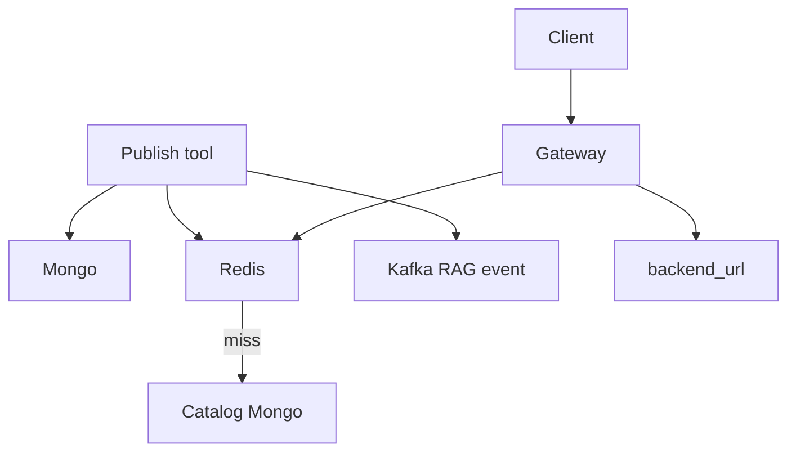

# Catalog and Gateway

> [!abstract] `resume:catalog-gateway`. Control plane (Catalog) stores OpenAPI tools and versions. Data plane (Gateway) flattens the spec and hits the backend. 600+ / 11+ / 72k — see number hygiene in [[00 - Ownership and How to Talk]]. Docs: [[02-tool-registry]] · [[06-mcp-gateway]].

## Resume line

Catalog API registry, 600+ tools, 11+ domains. Gateway translates OpenAPI → executable tools for UI and chat. 72,000+ daily requests.

> [!warning] PDF says **"MCP Gateway (LangChain)"**. Runtime is Starlette + FastMCP + LangGraph (`langchain-core` for LLM bits). Say FastMCP/LangGraph. Do not defend "we built it in LangChain."

## Truth

A **tool** is an OpenAPI operation: `namespace`, `backend_url` from `servers[0]`, paths/methods. Enricher (no LLM) sets:

- **domain** — keyword map into 14 `VALID_DOMAINS` (Express, Freight, Fulfillment, Sorting, Serviceability, Tracking, Billing, Customer Support, Employee, Address, Client, Hyperlocal, Fleet Management, Platform). Resume "11+" is this set. Stored as an array for `$in`.
- **has_pii** — `x-pii: true` on params/schemas.
- **spec_fingerprint** — SHA-256 of `(base_url, METHOD, path)` for dupes.
- **token_count** — for budget.

Durable store: Mongo `registry_resources` + `registry_versions`. Publish `draft → published`, set active version, **write-through Redis** for the Gateway (`mcp_server_{slug}` = enabled tool ids). **Catalog reads never use Redis** — avoids the control plane believing a stale cache.

MCP server in catalog = named bundle of tool ids. Endpoint `{gateway}/{owner}/c/{slug}/mcp`. Client gets a paste-ready `mcp.json`.

Gateway path: resolve spec (Redis TTL, Catalog fallback) → flatten `$ref` into a Pydantic / function-calling schema → in-memory FastMCP tool → `api_executor` HTTP → optional transformer.

Auth: inbound UMS bearer; outbound OS1 client-credentials or forwarded headers.

72k/day: docs **repeat the resume**. The *path* every UI/chat/workflow tool node shares is this resolve→execute. The *count* needs a dashboard you can name.

## Timeline

Pointer 1–2 ate **Jan–Mar**. This bullet lives in **Apr–Sep**, overlapping agents / Orion / canvas. You did **not** get a clean quarter to "architect Catalog and Gateway from scratch."

Say: after wrapping APIs by hand, the next problem was **scale** — register OpenAPI once, Gateway builds the tool. You worked on that **from ~April**, same time as the rest of the platform. If you only owned enricher + publish, or only Gateway execute, say that — "Architected" on the PDF is the word they will hang you on.

Do not add "another three months of Catalog" on top of MCP.

## One-minute pitch

Hand-built FastMCP does not scale past a hundred endpoints. From ~April the work was: **Catalog is the registry, Gateway is the runtime.** Register an OpenAPI operation once — enricher stamps domain / PII / fingerprint, versions go `draft → published`, Redis write-through for the Gateway. Gateway resolves, flattens `$ref`, builds an in-memory FastMCP tool, `api_executor` hits `backend_url`. UI, chat, and workflow Tool nodes all go through that. Stack is Starlette + FastMCP, not "we built it in LangChain."

## Boxes

## Schema (say these collections)

`registry_resources`, `registry_versions`, `mcp_servers`, `mcp_server_tools`. Redis key `mcp_server_{slug}`.

## Why Mongo + Redis, why not "just Postgres"

Tools are JSON specs with messy shapes — document store. Redis is **only** the Gateway's hot list of ids / specs, filled on write. If Redis dies, Gateway falls back to Catalog (docs: degrades). Catalog itself stays on Mongo so authors never read a lie.

## Ugly questions

**SQL vs NoSQL?** Specs and versions are documents. Postgres is used where we needed it (SOP repos, scheduler). Don't say "Mongo scales."

**How do you not serve a draft?** Active version pointer; Gateway `get_tools_by_slug` 404s if server not `active`.

**Duplicate APIs?** Fingerprint. Same server+method+path.

**Hallucinated tool in an SOP?** `tool_resolver` checks `domains.yaml`. Unknown `operationId` dropped. Fail-open on parser errors (input unchanged) — say that tradeoff.

**Publish and search?** Kafka `tool` / `mcp_server` events → Ask AI ingest ([[05 - Ask AI Search]]).

**72k — peak, which route?** Only if you have it. Else: "shared execute path; I will not invent QPS."

**Gateway stateful?** Per-request build. Horizontal. Pause state is S3, not the pod ([[04 - Workflows and Pause Resume]]).

**What if Catalog is down mid-call?** Cached spec may still run; resolve miss fails the call. Write-through means a brand-new publish is in Redis only after Catalog write succeeded.

## Related Notes

- [[00 - Ownership and How to Talk]]
- [[01 - MCP Servers]]
- [[02-tool-registry]]
- [[06-mcp-gateway]]
